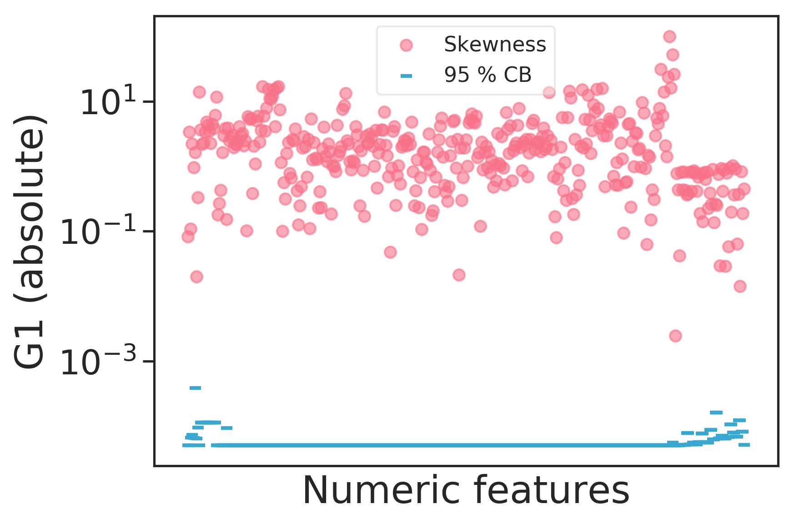

# Data
```{python data-specs, echo=F, results='hide', cache=F}
date_features = dh.DATE_FEATURES
binary_features = dh.BINARY_FEATURES
data_provider = dh.KDD98DataProvider("cup98LRN.txt")
raw_data = data_provider.raw_data
cleaned = data_provider.cleaned_data
numeric = data_provider.numeric_data
all_relevant = data_provider.all_relevant_data

int_features = raw_data["data"].select_dtypes(include="integer").columns.values.tolist()
float_features = raw_data["data"].select_dtypes(include="float").columns.values.tolist()
category_features = raw_data["data"].select_dtypes(include="category").columns.values.tolist()
object_features = raw_data["data"].select_dtypes(include="object").columns.values.tolist()

stats = pd.DataFrame({"Integer": ["Discrete features, no missing values", len(int_features)],
                      "Float": ["Continuous features and discrete features with missing values", len(float_features)],
                      "Categorical": ["Nominal and ordinal features", len(category_features)],
                      "Object": ["Features with alphanumeric values", len(object_features)],
                      "Total": [" ", raw_data["data"].shape[1]]}).transpose()
stats.columns = ["Data content", "Number of features"]
stats.index.name = "Data type"
```

The data set, which is freely available online^[See [https://archive.ics.uci.edu/ml/datasets/KDD+Cup+1998+Data](https://archive.ics.uci.edu/ml/datasets/KDD+Cup+1998+Data)], contains data on all members of the organization with a *lapsed* donation status (last donation 13 -- 24 months ago) relative to the promotion sent out in June 1997.

The data is provided split in two sets, of which one is intended for learning, the other for validation. The features are identical between the two except for the target features that have been separated from the validation set.

In this section, the *learning* data set will be characterized.


## General Structure

The input data with $n = `r nrow(py$raw_data$data)`$ rows and $m= `r ncol(py$raw_data$data)+1`$ columns is structured as follows: $\mathbf{D} = \{\{\mathbf{x}_i,\mathbf{y}_i\}\}, i = 1 ... n, \mathbf{x} \in \mathbb{R}^{m-3}, \mathbf{y} \in \mathbb{R}^2$.

Each $i$ represents one example. We have $m-3 = `r ncol(py$raw_data$data)-2`$ explanatory features, two targets and one unique identifier for each example.

The features are grouped into four blocks of information:

* Member database with personal particulars, interests and organization-internal information on examples: 79 features
* Characteristics of example's neighborhood from the US census 1990: 286 features
* Promotion history: History of past promotions sent to an example and the examples responses, per promotion and summary statistics: 54 features
* Giving history of an example's past donations, per promotion and summary statistics: 57 features


## Exploratory Data Analysis

Below, the data is characterized with some key insights.

(ref:jupyter-3-eda) `r make_github_link("notebooks", "3_EDA.ipynb")`

The detailed analysis can be studied online in the corresponding Jupyter notebook `3_EDA.ipynb`^[see (ref:jupyter-3-eda)].

### Data Types

An analysis of the data set dictionary (Section \@ref(data-set-dictionary)) reveals the following data types. 

- Index: CONTROLN, unique record identifier
- Dates: 48 features in yymm format.
- Binary: 30 features
- Categorical: 90 features
- Numeric: 286

Data was imported through `pandas.read_csv()`. The data types present after import are shown in Table \@ref(tab:data-desc). It is evident that several transformations are necessary to encode the features in their correct types.

```{r data-desc, results="asis", echo=F}
kable(py$stats,
    booktabs = T,
    caption="Data types after import of raw csv data") %>%
  kable_styling(latex_options=c("hold_position", position="center")) %>%
  column_spec(2, width="6cm")
```

### Targets

Of the two targets, one is binary (TARGET_B), the other continuous (TARGET_D). The former indicates whether an example has donated in response to the current promotion. The latter represents the dollar amount donated in response to the current promotion.

As can be seen in Figure \@ref(fig:target-ratio), the binary target is imbalanced. Of all examples, only 5 % have donated. Extra care will have to be taken during model training to obtain a model with a low generalization error.

(ref:targ-b-legend) Ratio of examples who donated out of all examples sent a promotion. Only 5 % donated.


```{r target-ratio, fig.cap="(ref:targ-b-legend)", echo=F}
knitr::include_graphics("figures/eda/ratio-binary.png")
```

The distribution of the continuous target, including all  examples with a donation amount > 0.0 \$, is shown in Figure \@ref(fig:target-d-distrib). Evidently, most donations are smaller than 25 \$, the 50-percentile lying at 13 \$ and the mean at 15.62 $. There are a few outliers for donations above 100 \$, making the distribution right-skewed. Being monetary amounts, the observed values are discrete rather than continuous.

(ref:targ-d-legend) Distribution of TARGET_D, the donation amount in \$ US (only amounts > 0.0 \$ are shown). Most donations are below 25 \$, peaks are visible at 50, 75 and 100 \$, while the maximum donation amount is 200 \$.

```{r target-d-distrib, fig.cap="(ref:targ-d-legend)", echo=F}
knitr::include_graphics("figures/eda/target-distribution.png")
```

### Skewness

Most of the numerical features are skewed. Due to the high dimensionality, individual assessment of the features through boxplots or histograms was not feasible. Instead, skewness was measured with `pandas.skew()`, which uses the Fisher-Pearson standardized moment coefficient $G_1 = \frac{\sqrt{n(n-1)}}{n-2} \frac{1}{n} \frac{\sum_{i=1}^n (x_i-\bar{x})^3}{s^3}$ and plotted together with the $\alpha=5 \%$ confidence bound for a normal distribution (see Figure \@ref(fig:skew-all)). Evidently, no feature was found to be strictly normally distributed.

(ref:skew-all-legend) Fisher-Pearson standardized moment coefficient (G1) for all numeric features contained in the dataset. The confidence bound indicates the $\alpha = 5 \%$  bound for the skewness of a normal distribution for any given feature. Absolute values were chosen to display the results on a log scale.

```{r skew-all, fig.cap="(ref:skew-all-legend)", echo=F}

```

 Looking at the 6 least skewed features (Figure \@ref(fig:least-skewed)), we find distributions that resemble normal or uniform, or binary features that are balanced.
```{r least-skewed, fig.cap="The 9 least skewed features. Skewness metric: adjusted Fisher-Pearson standardized moment coefficient.", echo=F}
knitr::include_graphics("figures/eda/least-skewed.png")
```

The 6 most skewed features (Figure \@ref(fig:most-skewed)) show heavily right-skewed distributions which are the result of outliers.

```{r most-skewed, fig.cap="The 9 most skewed features. Skewness metric: adjusted Fisher-Pearson standardized moment coefficient.", echo=F}
knitr::include_graphics("figures/eda/most-skewed.png")
```

### Correlations

As for the assessment of skewness, the high dimensionality makes it hard to assess correlations in the data. A heatmap (see \@ref(fig:heatmap-all)) was nevertheless produced to gain a high-level insight on correlations present in the data. From left to right, three regions can be distinguished: First, there are member database features, followed by a large center region comprised of the U.S. census features, and rightmost, there are promotion and giving history features. Between these blocks, only few features are correlated. Within each block however, we can see some quite strongly correlated data.

(ref:heatmap-legend) A heatmap showing correlations between all features in the data. Green means negative correlation, pink means positive correlation. Perfect correlation occurs at -1.0 and 1.0. Not all features are labelled due to display problems.

```{r heatmap-all, fig.cap="(ref:heatmap-legend)", echo=F}
include_graphics("figures/eda/correlations-all.png")
```

### Donation Patterns

The data set documentation states that donation amounts are positively correlated with the time since the last donation. This means that the longer an example goes without donating, the higher the donation amount if it can be enticed into donating again. Figure (\@ref(fig:donations-vs-time)) confirms this assumption. We see that starting from 15 months, the number of donations above 50 $ increases.

There is another insight gained when considering the number of donations an example has made, indicated by the point size, and donation amount: Frequent donors give relatively small sums, while the largest donations come from examples who rarely donate.

(ref:don-vs-time-legend) Donation amount for the current promotion against months since last donation. The dot size indicates the number of times an example has donated.

```{r donations-vs-time, fig.cap="(ref:don-vs-time-legend)", echo=F}
include_graphics("figures/eda/donations-vs-time-since-last-size-nbr-donations.png")
```

When looking at the recency-frequency-amount (RFA) features for the current promotion (which are typically used to model customer response in direct marketing), we can support the insights above. Since the data set contains only lapsed donors, the recency feature is constant and not of interest. Regarding the frequency of donations (number of donations 13 - 24 months prior to the promotion), shown in Figure \@ref(fig:rfa-f), we see a clear trend. With increasing donation frequency, donation amounts decrease.

```{r rfa-f, fig.cap="Frequency of donations in the 13-24 months prior to current promotion against amount donated. Frequent donors give smaller amounts.", echo=F}
include_graphics("figures/eda/frequency-past-donatios-vs-donations.png")
```

From the amount classes of the last donation, we can see that most examples follow their habits and usually donate the same amounts across promotions (Figure \@ref(fig:rfa-a)).

```{r rfa-a, fig.cap="Amount of last donation prior to promotion against donation amount. Donors largely give equal donations across promotions.", echo=F}
include_graphics("figures/eda/amount-past-donatios-vs-donations.png")
```

Figure \@ref(fig:donations-geo) shows the geographical distribution of donations. The large urban centers like San Francisco, Los Angeles, Miami, Chicago and Detroit are clearly visible. To a lesser extent, cities like Houston, Dallas, Minneapolis, Atlanta, Tampa, Seattle and Phoenix can be made out. Examples living there give small amounts. Big donors (large total donations with a high average) can be made out in rural areas in the Midwest and Texas. Interestingly, only very few donations come from the north-eastern states.

(ref:donations-geo-legend) Geographical distribution of donations by zip code. Point size indicates total donations for a zip code while the hue shows average donation amount.

```{r donations-geo, fig.cap="(ref:donations-geo-legend)", out.width="100%", echo=F}
include_graphics("figures/eda/donations-geographical.png")
```

We can also see that examples living in rural areas tend to donate larger sums when looking at Figure \@ref(fig:donations-le). Shown are the living environments in progressively more rural settings against the donation amount in the current promotion.

(ref:donations-by-le) Average cumulative donation amount per capita by living environment (C = city, U = urban, S = suburban, T = town, R = rural). The more rural, the higher the average donations.

```{r donations-le, fig.cap="(ref:donations-by-le)", echo=F}
include_graphics("figures/eda/avg-donations-per-capita-by-living-environment.png")
```