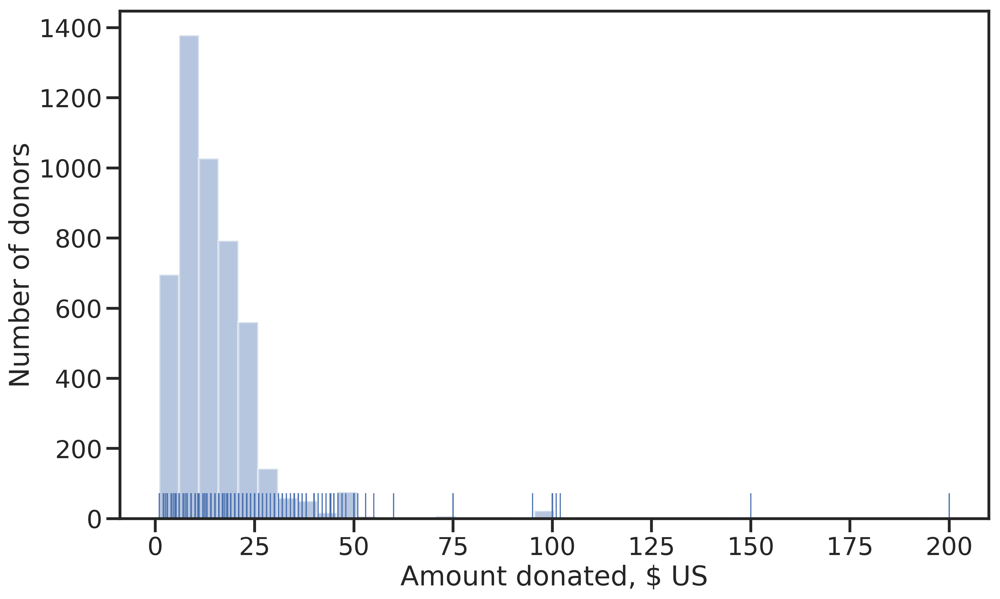
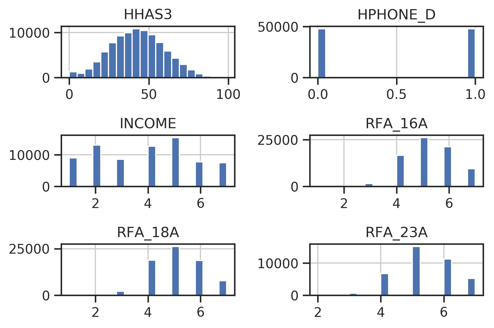
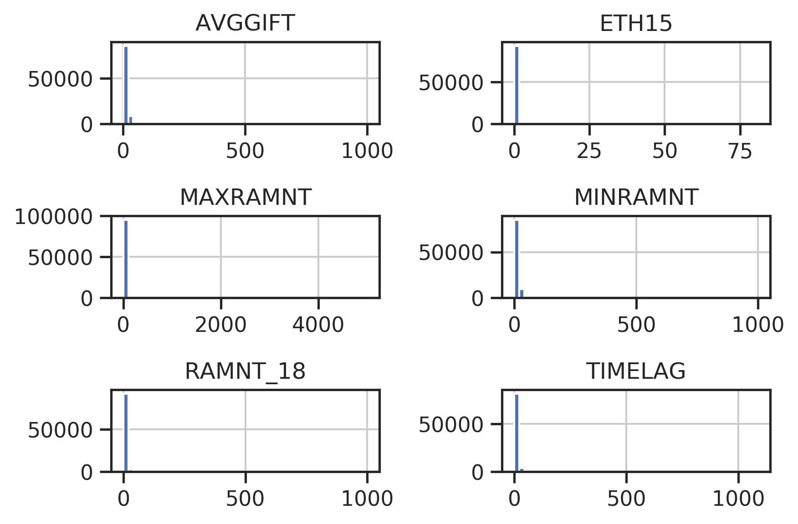

# Data
```{python data-specs, echo=F, results='hide', cache=F}
date_features = dh.DATE_FEATURES
binary_features = dh.BINARY_FEATURES
data_provider = dh.KDD98DataProvider("cup98LRN.txt")
raw_data = data_provider.raw_data
cleaned = data_provider.cleaned_data
numeric = data_provider.numeric_data
all_relevant = data_provider.all_relevant_data

int_features = raw_data["data"].select_dtypes(include="integer").columns.values.tolist()
float_features = raw_data["data"].select_dtypes(include="float").columns.values.tolist()
category_features = raw_data["data"].select_dtypes(include="category").columns.values.tolist()
object_features = raw_data["data"].select_dtypes(include="object").columns.values.tolist()

stats = pd.DataFrame({"Integer": ["Discrete features, no missing values", len(int_features)],
                      "Float": ["Continuous features and discrete features with missing values", len(float_features)],
                      "Categorical": ["Nominal and ordinal features", len(category_features)],
                      "Object": ["Features with alphanumeric values", len(object_features)],
                      "Total": [" ", raw_data["data"].shape[1]]}).transpose()
stats.columns = ["Data content", "Number of features"]
stats.index.name = "Data type"
```

The data set contains data on all 191'779 members of the organization with a *lapsed* donation status (last donation 13 -- 24 months ago) relative to the promotion sent out in June 1997 (named *current* promotion hereafter).

The data is provided^[See [https://archive.ics.uci.edu/ml/datasets/KDD+Cup+1998+Data](https://archive.ics.uci.edu/ml/datasets/KDD+Cup+1998+Data), accessed on 30.5.2019] split in two sets, of which one is intended for learning (95'412 examples), the other for validation and final prediction (96'367 examples). The features are identical between the two except for the target features that have been separated from the validation set.

In this section, the *learning* data set will be characterized.


## General Structure

The input data with $n = `r nrow(py$raw_data$data)`$ rows and $p= `r ncol(py$raw_data$data)+1`$ columns is structured as follows: $\mathbf{D} = \{\{\mathbf{x}_i,\mathbf{y}_i\}\}, i = 1 ... n, \mathbf{x} \in \mathbb{R}^{p-3}, \mathbf{y} \in \mathbb{R}^2$.

We have $m = p-3 = `r ncol(py$raw_data$data)-2`$ explanatory features, two targets and one unique identifier for each example.

The $m$ features are grouped into four blocks of information:

* Member database with personal particulars, interests and organization-internal information on examples: 81 features
* Characteristics of example's neighborhood from the US census 1990: 286 features
* Promotion history: 54 features
	* Summary of promotions sent to an example in the 12 months prior to the current promotion
	* Sending dates and RFA status of promotions 13-36 months prior to current promotion
* Giving history: 57 features
	* Summary statistics
	* Responses to promotions 13-36 months prior to current promotion


## Exploratory Data Analysis

Key insights from the exploratory data analysis are shown below. The detailed analysis can be studied online in the corresponding Jupyter notebook *3_EDA.ipynb*^[`r make_github_link("notebooks", "3_EDA.ipynb")`].

### Data Types

An analysis of the data set dictionary (Appendix \@ref(data-set-dictionary)) reveals the following data types:

- Index: CONTROLN, unique record identifier
- Dates: 73 features in yymm format.
- Binary: 48 features
- Categorical: 46 features
- Numeric: 309

The data types present after import with the python package `pandas`' `read_csv()` are shown in Table \@ref(tab:data-desc). Two things are worth noting: There are many integer features, meaning that most numeric data is discrete. Few categorical features and no date features were automatically identified. The missed categoricals and dates are most likely in the group of `Object` features, which is `pandas`' catch-all type, and will have to be transformed during preprocessing.

```{r data-desc, results="asis", echo=F}
kable(py$stats,
    booktabs = T,
    caption="Data types after import of raw csv data") %>%
  kable_styling(latex_options=c("hold_position", position="center")) %>%
  column_spec(2, width="6cm")
```

### Targets

Of the two targets, one is binary (TARGET_B), the other continuous (TARGET_D). The former is a binary response indicator for the current promotion. The latter represents the dollar amount donated in response to the current promotion and is 0.0 $ in case of non-response.

As can be seen in Figure \@ref(fig:target-ratio), the response rate is 5.1 %. This means the binary target is highly imbalanced. Extra care will have to be taken during model training to obtain a model with a low generalization error.

(ref:targ-b-legend) Distribution of the binary target TARGET_B.


```{r target-ratio, fig.cap="(ref:targ-b-legend)", echo=F}
knitr::include_graphics("figures/eda/ratio-binary.png")
```

The distribution of the continuous target for TARGET_D > 0.0 \$ is shown in Figure \@ref(fig:target-d-distrib). Evidently, most donations are smaller than 25 \$, the 50-percentile lying at 13 \$ and the mean at 15.62 $. There are a few outliers for donations above 100 \$, making the distribution right-skewed. Being monetary amounts, the observed values are discrete rather than strictly continuous.

(ref:targ-d-legend) Distribution of TARGET_D, the donation amount in \$ US (only amounts > 0.0 \$ are shown).

```{r target-d-distrib, fig.cap="(ref:targ-d-legend)", echo=F}

```

### Skewness

Most of the numerical features are skewed. Due to the high dimensionality, individual assessment of the features through boxplots or histograms was not feasible. Instead, skewness was measured with the Fisher-Pearson standardized moment coefficient $G_1 = \frac{\sqrt{n(n-1)}}{n-2} \frac{1}{n} \frac{\sum_{i=1}^n (x_i-\bar{x})^3}{s^3}$ and plotted together with the $\alpha=5 \%$ confidence bound (CB) for a normal distribution (see Figure \@ref(fig:skew-all)). Since G1 is symmetric around zero, absolute values were chosen to display the results on a log scale. Evidently, no feature was found to be strictly normally distributed.

(ref:skew-all-legend) Fisher-Pearson standardized moment coefficient (G1) for all numeric features contained in the dataset. The confidence bound indicates the $\alpha = 5 \%$  bound for the skewness of a normal distribution for any given feature.

```{r skew-all, fig.cap="(ref:skew-all-legend)", echo=F}
include_graphics('figures/eda/skewness-numeric-features.png')
```

 Looking at the 6 least skewed features (Figure \@ref(fig:least-skewed)), we find distributions that resemble normal (respectively binomial) or discrete uniform.
```{r least-skewed, fig.cap="Least skewed features by G1 (adjusted Fisher-Pearson standardized moment coefficient).", echo=F}

```

The 6 most skewed features (Figure \@ref(fig:most-skewed)) show heavily right-skewed poisson-like distributions which are the result of outliers.

```{r most-skewed, fig.cap="Most skewed features by G1 (adjusted Fisher-Pearson standardized moment coefficient).", echo=F}

```

### Correlations

The high dimensionality makes it hard to assess correlations in the data between individual features. A heatmap (see Figure \@ref(fig:heatmap-all)) provides a high-level view. From left to right, three regions can be distinguished: First, there are member database features, followed by a large center region comprised of the U.S. census features, and rightmost, there are promotion and giving history features. Between these blocks, only few features are correlated. Within each block however, we can see some quite strongly correlated data.

(ref:heatmap-legend) Heatmap of feature correlations. Green means positive correlation, magenta means negative correlation. Perfect correlation occurs at 1.0 and -1.0.

```{r heatmap-all, fig.cap="(ref:heatmap-legend)", echo=F}
include_graphics("figures/eda/correlations-all.png")
```

### Donation Patterns

When looking at the all-time recency-frequency-amount (RFA) fetures for donors (Figure \@ref(fig:rfa-alltime)), no clear trend is visible to discern current donors from non-donors. Current donors are found across the whole range of recency values, although slightly concentrated at the lower end (low recency is better). A slight correlation between frequency and current donation status is also discernible: Current donors tend to "float" on top of the "sedimented" non-donors. Those examples with the highest yearly donation amount did not donate in the current promotion.

(ref:rfa-alltime-legend) Analysis of all-time RFA values by response to current promotion. *Recency* is the time in months since the last donation, *Frequency* the average number of donations per year and *Amount* the average yearly donation amount.

```{r rfa-alltime, fig.cap="(ref:rfa-alltime-legend)", echo=F}
include_graphics("figures/eda/rfa-alltime-current-donors.png")
```

The data set documentation states that donation amounts are positively correlated with recency, the time since the last donation. This means that the longer an example goes without donating, the higher the donation amount if it can be enticed into donating again. Figure (\@ref(fig:donations-vs-time)) gives some evidence for this assumption. We see that starting from 15 months, the number of donations above 50 $ increases.

There is another insight gained when considering the number of donations an example has made, indicated by the point size, and donation amount: Frequent donors give relatively small sums, while the largest donations come from examples who rarely donate.

(ref:don-vs-time-legend) Donation amount for the current promotion against months since last donation. The dot size indicates the number of times an example has donated.

```{r donations-vs-time, fig.cap="(ref:don-vs-time-legend)", echo=F}
include_graphics("figures/eda/donations-vs-time-since-last-size-nbr-donations.png")
```

There are many examples who donated within the last 12 months prior to the current promotion ( Figures \@ref(fig:rfa-alltime) and \@ref(fig:donations-vs-time)). This is a surprising observation.  The data set should contain *lapsed* donors only, so there should be no donations recorded for that period. An explanation could be that the recency status is considered strictly for direct responses to promotions. Examples who donate regularly (i.e. monthly, yearly), irrespective of the promotions mailed out, would not be evaluated in terms of RFA under that assumption.

The data contains RFA features for each of the 24 promotions in the promotion history data, giving example's status per a given promotion. Considering the RFA features for the current promotion, we can support the insights above. Since the data set contains only lapsed donors, the recency feature is constant and not of interest (it is a nominal feature, *lapsed* being one of the levels). Regarding the frequency of donations (number of donations 13 - 24 months prior to the promotion), shown in Figure \@ref(fig:rfa-f), we see a clear trend. With increasing donation frequency, donation amounts decrease.

```{r rfa-f, fig.cap="Frequency of donations in the 13-24 months prior to current promotion against amount donated. Frequent donors give smaller amounts.", echo=F}
include_graphics("figures/eda/frequency-past-donatios-vs-donations.png")
```

Figure \@ref(fig:donations-geo) shows the geographical distribution of donations. The large urban centers like San Francisco, Los Angeles, Miami, Chicago and Detroit are clearly visible. To a lesser extent, cities like Houston, Dallas, Minneapolis, Atlanta, Tampa, Seattle and Phoenix can be made out. Examples living there give small amounts. Big donors (large total donations with a high average) can be made out in rural areas in the midwest and Texas. Interestingly, only very few donations come from the north-eastern states.

(ref:donations-geo-legend) Geographical distribution of donations by zip code. Point size indicates total donations for a zip code while the hue shows average donation amount.

```{r donations-geo, fig.cap="(ref:donations-geo-legend)", out.width="100%", echo=F}
include_graphics("figures/eda/donations-geographical.png")
```

We can also see that examples living in rural areas tend to donate larger sums when looking at Figure \@ref(fig:donations-le). Shown are the living environments in progressively more rural settings against the average all-time donation amount per capita.

(ref:donations-by-le) Average cumulative donation amount per capita by living environment (C = city, U = urban, S = suburban, T = town, R = rural). The more rural, the higher the average donations.

```{r donations-le, fig.cap="(ref:donations-by-le)", echo=F}
include_graphics("figures/eda/avg-donations-per-capita-by-living-environment.png")
```

Socio-economic status by living environment reveals that examples with the highest status are rarely among the low-dollar donors. The median donation amount for the highest status is always higher than other status groups, but examples in the lowest status donate more than those in the medium level (Figure \@ref(fig:donations-le-socioec)). The highest donations come from the medium status group.

(ref:donations-le-socioec-legend) Donation amount for current promotion by living environment and socio-economic status of examples. The violin plot shows the distribution of values similar to a kernel density estimation. Median values are indicated by white dots, the bold regions give the inner quartile range.

```{r donations-le-socioec, fig.cap="(ref:donations-le-socioec-legend)", echo=F}
include_graphics("figures/eda/donations-vs-living-environment-hue-socioecon.png")
```


