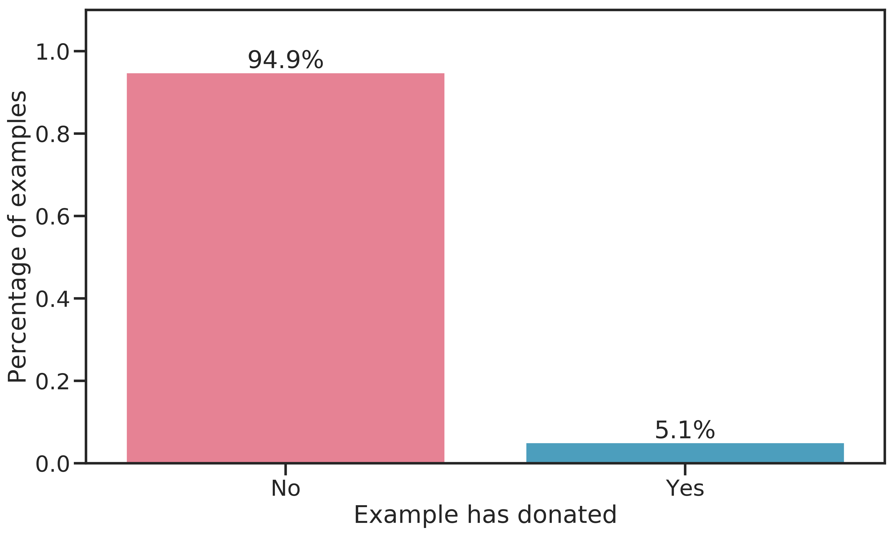

# Data

The data set, which is freely available online^[See [UCI Machine Learning Repository: KDD Cup 1998 Data](https://archive.ics.uci.edu/ml/datasets/KDD+Cup+1998+Data)] contains information on a subset of the turnout of a direct mailing addressed to 3.5 million members of a US American veterans organisation for the purpose of a fundraising campaign that was conducted in 1997. The data set contains all donors with a *lapsed* donation status, meaning their last donation was made between 13 and 24 months prior to the 1997 campaign.

The data is provided in two sets, of which one is intended for learning, the other for validation. The features are identical between the two except for the target that has been stripped from the validation set.

In this section, the *learning* data set will be characterized.


## General Structure

The dimension of the input data $\mathbf{D}$ is $n=$ `r nrow(py$raw_data)` examples by $m=$ `r ncol(py$raw_data)+1` features. The target $y$ is of dimension $n \text{ x } 2$. Of the features, one was used as the index, resulting in $\mathbf{X_{learn}}$ with $m^{*}=$ `r ncol(py$raw_data)-2` explanatory features.

There are four blocks of related information in the data:

* Member database: Personal particulars, member status features, 85 features
* US census 1990, 286 features
* Promotion history: History of past mailings sent to a member and response patterns, 97 features
* Giving history: History of past donations from a member (summary statistics), 13 features


## Exploratory Data Analysis

The detailed analysis can be studied online in the corresponding jupyter notebook^[[KDD-CUP98: EDA notebook](https://github.com/datarian/master-thesis-code/blob/development/notebooks/eda.ipynb)]. The findings are shown here.

### Data types

An analysis of the dataset dictionary (see \@ref(dataset-dictionary)) reveals the following data types:

- Index: CONTROLN, unique record identifier
- Dates: 48 features in yymm format.
- Binary: 30 features
- Categorical: 90 features
- Numeric: 286

The data set structure after import into a `pandas.DataFrame` object is shown in Table \@ref(tab:data-desc). Since these numbers do not match with the documented data types, it is evident that several features will need to be transformed.

```{r data-desc, results="asis", echo=F}
kable(py$stats,
    booktabs = T,
    caption="Data types after import of raw csv data") %>%
  kable_styling(latex_options=c("hold_position", position="center")) %>%
  column_spec(2, width="6cm")
```

### Targets

Of the two targets, one is binary (TARGET_B), the other discrete (TARGET_D). The former indicates whether an example has donated in response to the current promotion. The latter represents the dollar amount donated in response to the current promotion.

The distribution of *TARGET_D*, excluding non-donors, is shown in Figure \@ref(fig:target-distrib). Evidently, most donations are small. The range of donations is between 1 and 200 $ with the 50-percentile at 13 $. The most frequent donation amount is 10 $. There are a few outliers for donations above 100 $.

```{r target-distrib, fig.cap="Distribution of TARGETD. The donation amount in US dollar has a discrete distribution. Most donations are below 20 dollar, peaks are visible at 50, 75 and 100 dollar, while the maximum donation amount is 200 dollar.", echo=F}
knitr::include_graphics('figures/eda/target-distribution.png')
```

As can be seen in Figure \@ref(fig:target-ratio), the target is imbalanced. Only about 5 % of examples have donated. This poses a challenge in model training because there is a high risk of overfitting.

```{r target-ratio, fig.cap="Ratio of donating examples. Less than 6 percent have made a donation.", echo=F}

```

### Skewness

Most features are skewed, although several are relatively symmetric. 

Figure \@ref(fig:skew-all) gives an abstract idea of the skewness of (numerical) features. The confidence bound gives the $\alpha=5 \%$ bound for a normal distribution. Evidently, no feature was found to be strictly normally distributed, although several features are relatively symmetric.

 Skewness was measured with `pandas.skew()`, which uses the Fisher-Pearson standardized moment coefficient $G_1 = \frac{\sqrt{n(n-1)}}{n-2}\frac{1}{n}\frac{\sum_{i=1}^n (x_i-\bar{x})^3}{s^3}$. Here, the term in the denominator is the sample standard deviation.

```{r skew-all, fig.cap="Absolute values of the Fisher-Pearson standardized moment coefficient (G1) for all numeric features contained in the dataset. The confidence bound indicates the $\\alpha$ = 5 %  bound for the skewness of a normal distribution for any given feature. It is evident that no feature passes.", echo=F}
include_graphics('figures/eda/skewness-numeric-features.png')
```

 Looking at the 9 least skewed features (Figure \@ref(fig:least-skewed)), we find distributions that resemble normal or uniform distributions, or balanced binary features.
```{r least-skewed, fig.cap="The 9 least skewed features. Skewness metric: adjusted Fisher-Pearson standardized moment coefficient.", echo=F}
knitr::include_graphics("figures/eda/least-skewed.png")
```

The 9 most skewed features (Figure \@ref(fig:most-skewed)) show heavily right-skewed distributions which are the result of outliers.

```{r most-skewed, fig.cap="The 9 most skewed features. Skewness metric: adjusted Fisher-Pearson standardized moment coefficient.", echo=F}
knitr::include_graphics("figures/eda/most-skewed.png")
```


## Preprocessing

The dataset contains input errors (noisyness), features with datatypes that are impractical to work with (dates, categorical features) and redundant information. Furhtermore, many features contain missing values.

Noisy and categorical features were processed by the author manually before furhter evaluation of the data.
Handling of missing values, zero variance and sparse features was carried out through scikit-learn preprocessors.


### Noisy data

There were two types of noisyness that were treated manually:

- Binary features with a mixture of 0, 1 and other codes
        Binary features were all recoded to $\{\text{True},\text{False}\}$, preserving missing values. $1$ was always set to $\text{True}$ and $0$ was coded $\text{False}$. Specific mappings for $\text{True} / \text{False}$ values given in the data dictionary per binary field were respected accordingly. As per the data dictionary, $\text{' '}$ was interpreted as $\text{False}$ for some features. For all other features, $\text{' '}$ was interpreted as missing.
- Dates are expected in *mmyy* as per the dataset dictionary. For several date features, one digit was missing [EXPLAIN HOW FIXED].
        
- Zip codes: Input errors, inconsistent data (alphanumeric values)


### Constant features
- Per the cup's documentation, features with zero variance have to be excluded. 


### Missing values / sparse features

- Character features: ' ', ''
- Numeric features: ' ', '', '.'
- Missing values are to be kept in the dataset for learning. Approriate methods for imputation are to be employed (median, mean, mode, modeled, ...)
- Exception: Features with more than 99.5 \% missing values are to be dropped
- Features with a sparse distribution are to be dropped [DEFINITION???]


### Categorical features

Several variables are aggregated into byte-wise codes (referred to as *symbolic* fields in the data dictionary) that need to be spread out across separate variables.

Most machine-learning methods require strictly numerical data [REFERENCE]. Several methods exist to transform categorical (string-) values into a usable format. These include:

- One-hot tranformation: Creating dummy variables for each category level.
This approach greatly increases dimensionality, which is both more resource-intensive and prone to overfitting.
- Ordinal encoding: The categorical targets are transformed to ordinal values (integer numbers). This preserves dimensionality, but the algorithm chosen to assign the ordinal levels can introduce unwanted effects (an implied similarity based on closeness of the ordinal variables)
    Feature hashing: The individual values are hashed into a value of fixed length.
- Hashing: [DEFINITION]

### Feature Engineering
    
### Feature Selection

-> Selecting the most useful features
    
### Feature Extraction 

-> Trying to group correlated features into one (dimensionality reduction). Unsupervised learning.
