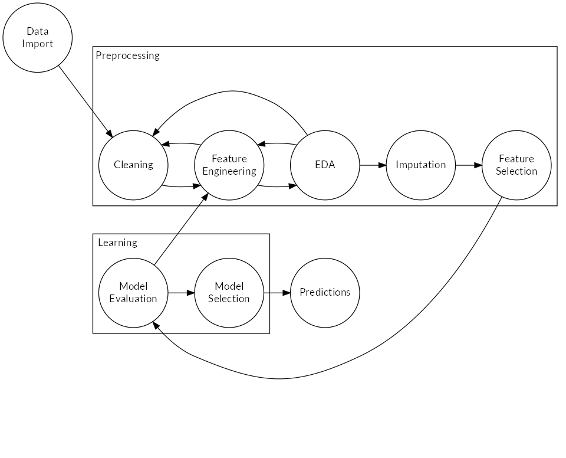
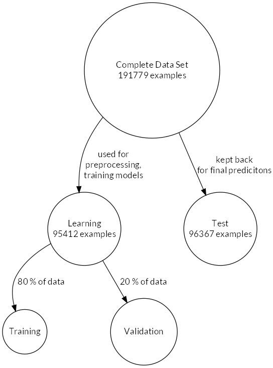

# Experimental Setup and Methods


The general work flow with which the problem was solved is shown in Figure \@ref(fig:workflow). Several iterations through the individual steps were necessary. The Jupyter notebooks^[see `r make_github_link("notebooks")`] corresponding to each step in the process are meant to be run in the order indicated by their numbering. This ensures that persisted data and models are available when required.

(ref:workflow-legend) General work flow during preprocessing and model learning. Several iterations between atomic steps were necessary.

```{r workflow, fig.cap="(ref:workflow-legend)", echo=F, out.width="80%"}

workflow_graph <- grViz(
  " 
    digraph workflow {

      labeljust='l';

      graph [overlap=false,
             fontname=Lato,
             fonsize=18,
             layout=dot,
             nodesep=1.1,
             rankdir=LR]

      node [fontname=Lato, fonsize=18, fillcolor=white, shape=circle, width=1.3]
      
      dataimport[label='Data\nImport']

      edge[style='invis', color=red, fontsize=12];

      { rank=same;
          z0 [group='a', label='.', style = invis];
          z1 [group='b', label='.', style = invis];
          z2 [group='c', label='.', style = invis];
          z0 -> z1;
          z1 -> z2;
      }
      
      subgraph cluster_preprocessing {
        cleaning[group='a', label='Cleaning'];
        featureengineering[group='a',label='Feature\nEngineering'];
        eda[group='a', label='EDA'];
        imputation[group='a', label='Imputation'];
        featureselection[group='a',label='Feature\nSelection'];
        label = 'Preprocessing'
        cleaning -> featureengineering [style=solid, color = black]
        featureengineering -> eda  [style=solid, color=black]
        featureengineering -> cleaning [style=solod, color=black]
        eda -> cleaning  [style=solid, color=black]
        eda -> featureengineering [style=solid,color=black]
        eda -> imputation -> featureselection [style=solid, color = black]
      }
      
      subgraph cluster_learning {
        modelevaluation[group='b', label='Model\nEvaluation'];
        modelselection[group='b',label='Model\nSelection'];
        label = 'Learning'
        modelevaluation -> modelselection [style=solid, color = black, penwidth=0.95]
      }

      predictions[group='b', label='Predictions'];

      z0 -> cleaning;
      z1 -> modelevaluation;

      edge [style=solid, color = black, penwidth=0.95]
      dataimport -> cleaning
      featureselection -> modelevaluation
      modelselection -> predictions
      modelevaluation -> featureengineering
    }
  ")

rsvg_pdf(charToRaw(DiagrammeRsvg::export_svg(workflow_graph)),
         file="figures/preprocessing/workflow.pdf")
rsvg_png(charToRaw(DiagrammeRsvg::export_svg(workflow_graph)),
         file="figures/preprocessing/workflow.png")

```


## Tools Used

The problem itself was solved using the python language, making use of established packages: `numpy`: @oliphant2006guide, `scipy`:  @mckinney-proc-scipy-2010, `pandas`: @mckinney2011pandas, `scikit-learn`: @scikit-learn, `matplotlib`: @hunter2007matplotlib, `seaborn`: @waskom2014seaborn.

Except for the development of a helper packge, most programming was performed in interactive Jupyter notebooks (see @Kluyver:2016aa).

The report was written in `rmarkdown`: @allaire2016rmarkdown using `knitr`: @xie2015 and `bookdown`: @xie2016bookdown to render the document into several output formats.

All work was tracked in version control.


## Data Handling

The complete data is distributed pre-split into a learning and validation data set.

The learning data set was used to establish the complete analysis pipeline, i.e. determining necessary preprocessing, exploratory data analysis, model evaluation and -selection and establishing the  prediction method. Only then was the test data set used to make the final prediction.

In accordance with recommendations in @friedman2001elements, the learning data set was split 80/20 into training and validation sets (see Figure \@ref(fig:data-splitting)). The training set was used to train different models while the validation set served to tune hyper-parameters. The split was performed using a stratified sampling algorithm to preserve the target class frequencies.

The validation data set (named *test* data set hereafter) was treated as unseen data. Once the analysis pipeline was established, the validation data was used to make the final prediction, subjecting the data to the pipeline trained on the learning data set.

```{r data-splitting, fig.cap="Data set use for training and predictions.", echo=F, results='asis', out.width="50%"}
data_graph <- grViz(
  "
  digraph d_split {
  
    graph [overlap=false, fonsize=18, layout=dot, nodesep=1.4]
    
    node [fontname=Lato, fillcolor=white, shape=circle]
    C [label='Complete Data Set\n191779 examples', width=3.0]
    L [label='Learning\n95412 examples', width=2.0]
    T [label='Test\n96367 examples', width=2.0]
    LT [label='Training', width=1.5]
    LV [label='Validation', width=0.5]
    
    edge [color = black, penwidth=0.95, fontname=Lato]
    C -> L [label='used for\npreprocessing,\n training models']
    C -> T [label='kept back\n for final predicitons']
    L -> LT [label='  80 % of data']
    L -> LV [label='  20 % of data']
  }
  ")

rsvg_pdf(charToRaw(DiagrammeRsvg::export_svg(data_graph)),
         file="figures/preprocessing/data-splitting.pdf")
rsvg_png(charToRaw(DiagrammeRsvg::export_svg(data_graph)),
         file="figures/preprocessing/data-splitting.png")

```


## Data Preprocessing

The necessary preprocessing was guided by practical necessity (input errors, inconsistent categories), the requirements of the algorithms that were examined (Section \@eval-and-select) and the requirements set out in the cup documentation:

* Only numeric features (required by some algorithms)
* Imputation of missing values (required by cup documentation)
* Removal of *sparse* features (required by cup documentation)

The transformations were established interactively in Jupyter notebooks. Once finalized, transformations were implemented in the python package `kdd98`^[Available from `r make_github_link("kdd98")`].


### Cleaning

The transformations applied can be studied in the Jupyter notebook *1_Preprocessing.ipynb*^[see `r make_github_link("notebooks", "1_Preprocessing.ipynb")`].

The cleaning stage of preprocessing encompassed the following transformations:

* Removing *noise*: Input errors, inconsistent encoding of binary / categorical features
* Dropping constant and sparse (i.e. those where only few examples have a value set) features
* Imputation of values missing at random (MAR)

MAR values in the sense of @rubin1976inference are missing conditionally on other features in the data. For example, there are three related features from the promotion and giving history: *ADATE*, the date of mailing a promotion, *RDATE*, the date of receiving a donation in response to the promotion and *RAMOUNT*, the amount received. For missing *RAMOUNT* values, we can check if *RDATE* is non-missing. If *RDATE* is missing, then the example most likely has not donated and we can set *RAMOUNT* to zero. If, on the other hand, both date features have a value, *RAMOUNT* is truly missing.


### Feature Engineering {#methods-feature-engineering}

During feature engineering, all non-numeric (i.e. categorical) features were encoded into numeric values. Also, several features were transformed to better usable representations. Care was taken to keep the dimensionality of the data set as low as possible. The result of this transformation step was an all-numeric data set usable for downstream learning. The transformations applied in feature engineering are described in detail in the Jupyter notebook *2_Feature_Engineering.ipynb*^[see `r make_github_link("notebooks", "2_Feature_Engineering.ipynb")`].

For ordinal features, manual mappings from alphanumeric levels to integer numbers were specified.

For nominal features, two encoding techniques were employed, depending on the number of levels:

* One-hot encoding for $\leq 10$ levels: For each level of a categorical feature, a new feature is created. An additional feature may be added to indicate missing values. Exactly one of these new features is set to $1$, indicating the original level.

* Binary encoding, $> 10$ levels: The levels of the categorical are first transformed ordinally (i.e. to a sequence of integer numbers). Then, these numbers are taken to the base of 2. (A $5$, for example, becomes `101`). According to the number of levels, new features for the binary digits are created. As an example: To represent 60 levels, 6 features are required ($2^6=64$).


### Imputation

Three different approaches were evaluated. The details are shown in Jupyter notebook *4_Imputation.ipynb*^[see `r make_github_link("notebooks", "4_Imputation.ipynb")`].

#### K-Nearest Neighbors

The kNN algorithm by @troyanskaya2001missing works approximately as follows:

1. Construct the distance matrix $D$ with distances between examples
2. Order all features with missing values descending by number of missing values
3. Starting with the feature with most missing, use the $k$ nearest neighbors of each example with a missing value that have a value for the current feature to impute using either the mean or median. 

The algorithm runs until all values are imputed.

While very attractive because of the intuitive approach and because it preserves data types in the features, the distance matrix is very memory-intensive for large data sets. Also, all features with more than 80 % missing values have to be removed from the data first.

#### Iterative imputation

Iterative imputation, implemented in package `fancyimpute`^[Available at: [https://pypi.org/project/fancyimpute/](https://pypi.org/project/fancyimpute/), accessed on 30.06.2019], works similar to the R-package `mice` (see @buuren2011mice). Before imputation, all features have to be transformed to numerical data types. Categorical features were therefore encoded first, using a one-hot or binary encoding and preserving missing values.

1. Features are ordered by the fraction of missing values
2. Starting with the feature with most missing values, use the other features to build a model, using the current feature as the dependent variable and predict missing values.
3. Repeat step 2 until all features are complete
4. Repeat steps 2 -- 3 $n$ times, $n=5$ was chosen

#### Median Imputation and Categorical Indicator

The 'sklearn.impute.SimpleImputer' was used on all numerical features. Since many features are skewed and have outliers, the median strategy was used. The missing values in each feature are imputed by the feature's median value.

As this implementation only supports numerical data types, categorical features were treated separately during feature engineering (Section \@ref(methods-feature-engineering)): The one-hot or binary encoded categoricals had one more feature added, indicating missing values. 


### Feature Selection {#methods-feature-selection}

One of the biggest caveats in machine learning is the infamous "Curse of Dimensionality" coined by @bellman1966dynamic. The curse comes from the fact that with an increasing number of dimensions of the feature space, the number of possible combinations grows exponentially. In order to cover all possible combinations with several examples, a huge amount of examples would be required as a result. @hughes1968mean showed that for a fixed number of examples, model performance first increases with increasing number of dimensions but then decreases again. In the area of machine learning, high dimensionality frequently manifests in the form of overfitting, which leads to an unacceptably big generalization error @Goodfellow-et-al-2016.

It is therefore beneficial to reduce the data set dimensionality while preserving as much relevant information as possible. A method to deal with the problem is called boruta, introduced by @kursa2010boruta. The algorithm was found to perform very well regarding selection of relevant features in @kursa2011boruta. It works sequentially and removes features found to be less relevant at each iteration. By doing so, it solves the so-called all-relevant feature problem.
The algorithm is actually a wrapper function around a random forest classifier. A random forest classifier is fast, can usually be run without parameters and returns an importance measure for each feature.

In short, the alogrithm works as follows:

1. The input matrix $\mathbf{X}$ of dimension $n \times p$ is extended with $p$ so-called *shadow features*. The shadow features are permuted copies of the features in $\mathbf{X}$. They are therefore decorrelated with the target.
2. On the resulting matrix $\mathbf{X^*}$, a random forest classifier is trained and  the Z-scores ($\frac{\bar{loss}}{sd}$) for each of the $2p$ features calculated.
3. The highest Z-score among the shadow features $MZSA$ is determined.
4. All original features are compared against $MZSA$ and those features with a higher score selected as important.
5. With the remaining features, a two-sided test for equality of the Z-scores with $MZSA$ is performed and all features with significantly lower score are deemed unimportant.
6. All shadow copies are removed, go to step 1.

The algorithm terminates when all attributes are marked as either important or not important or when the maximum number of iterations is reached.

For this thesis, a python implementation^[see [scikit-learn-contrib/boruta_py](https://github.com/scikit-learn-contrib/boruta_py)] was used. In effect, it is a port of the original R package by @kursa2010boruta which conveniently implements `scikit-learn`'s API.


## Prediction {#methods-prediction}

The desired quantity to predict is net profit. In order to predict this quantity, a two-step prediction procedure is applied, utilizing the binary target *TARGET_B* and the continuous target *TARGET_D*, respectively. For each step, a model is trained. One is a classifier, predicting $\hat{y}_b$, the probability of donating. The other is a regressor, predicting the donation amount $\hat{y}_d$. The classifier is trained on the complete learning data set, while the regressor is only trained on $\mathbf{X}_d = \{\mathbf{x_i}|y_{b,i} = 1, i=1...n\}$. By using the non-random sample $\mathbf{X}_d$, bias is introduced, which has to be corrected. This approach resembles the two-stage Heckman procedure.

The quantity estimated is the *expected profit*. For unseen data (without information on the true response), it is calculated by:

\begin{equation}
E(Z) = \sum_{i=1}^n \hat{y}_{i,b} * \hat{y}_{i,d} *\alpha^*
(\#eq:expected-profit)
\end{equation}

where $\hat{\mathbf{y}}_b$ is the probability of donating, $\hat{\mathbf{y}}_d$ is the conditionally predicted donation amount of an estimator trained on the non-random sample $\mathbf{X}_d$ and $\alpha^* \in [0,1]$ is a factor to correct for bias introduced due to the non-randomness of $\mathbf{X}_d$, learned beforehand.

The decision of whether to include example $i$ in the promotion is governed by the following indicator function. Every example that has a predicted donation amount of more than the unit cost is included.

\begin{equation}
 \mathbb{1}_{\hat{y}_{i,b} * \exp(\hat{y}_{i,dt}) * \alpha > \exp(u_t)}(\hat{y}_{i,dt})
(\#eq:indicator)
\end{equation}

During model learning, the following profit optimization function was used to determine $\alpha^*$, as well as making predictions for net profit with the learning and test data sets. The changes in the indicator function are due to technical reasons. Because linear models were used for predicting $\hat{y}_d$, the target was transformed to achieve better results. The exponential was introduced to deal with negative values resulting from the transformation.

\begin{equation}
\Pi_\alpha = \sum_{i=1}^n  \mathbb{1}_{\hat{y}_{i,b} * \exp(\hat{y}_{i,dt}) * \alpha > \exp(u_t)}(\hat{y}_{i,dt})*(y_{i,d} - u)
(\#eq:pi-alpha)
\end{equation}

with $\mathbb{1}$ the indicator function, $\hat{y}_{i,dt}$ the predicted donation amount, Box-Cox transformed, $y_{i,d}$  the true donation amount for example $i$ and $u_t$ the unit cost in \$, transformed with the same parameter $\lambda$ utilized to transform $\hat{\mathbf{y}}_{d}$.


### Optimization of $\alpha^*$

With equation \@ref(eq:pi-alpha), the estimated profit $\Pi$ is calculated for a grid of $\alpha$ values, $\alpha \in [0,1]$. The optimal value is then $\alpha^{*} = \underset{\alpha}{\operatorname{argmax}} f(\alpha)$ where $f$ is a function that is fit to $\Pi$.

For $f$, a cubic spline $s$ was used. $\alpha^*$ is then calculated as follows:

1. Fit $s(\Pi)$, the cubic spline on the estimated profits for the grid of $\alpha$ values
2. Derive $ds = \frac{\delta}{\delta \alpha} s$
3. Find the finite roots of $ds$, $\alpha_{\text{candidates}}$, representing candidates for $\alpha^*$
4. Determine $\alpha^* = \underset{\alpha}{\operatorname{argmax}} s(\alpha_{\text{candidates}})$


## Model Evaluation and -Selection {#eval-and-select}

During model evaluation, several algorithms were trained and their performance compared using a metric in order to select the best estimator. This was done independently for classifiers (predicting the binary target) and regressors (predicting the continuous target).

One of the powerful tools provided by `scikit-learn` are pipelines. They enable chaining transforming steps and estimators together. Pipelines were used to re-sample and scale data before model learning. Fitted pipelines can be persisted on disk and then be used later for predictions on other data.

### Evaluation

Randomized grid search with 10-fold cross-validation (CV) was used for model evaluation. A python dictionary was used to store the best-performing pipeline per algorithm evaluated. The dictionary was persisted to disk and only updated when during a learning iteration, an algorithm produced a better score than the previous best score. This ensured that the best hyperparameter settings and sampling strategies were always retained for each of the algorithms evaluated.

#### Randomized Grid Search
In randomized grid search, distributions for hyperparameter values are specified instead of defining a fixed grid of values to search over (as in grid search cross-validation). The algorithm then runs a defined number of random combinations of the parameters (10 were used). Compared to the usual grid search, this can greatly speed up the learning process because good hyperparameter settings are identified with less iterations.

After one round of learning, the hyperparameter distributions are adjusted before the next iteration as follows: When the best value is found near the limits of the domain, the distribution is shifted in this direction. For values falling inside the domain of the distribution, the distribution is narrowed down towards the found value. This procedure is repeated until the hyperparameters converge.

#### Cross-Validation
CV splits the training data into several *folds* of equal size. The algorithm is trained as many times as there are folds, holding back one of the folds at each training step for validation using some specified performance metric and training with the rest of the data. This procedure enables quantification of the generalization error and the calculation of statistics that indicate the variance of the model.

#### Performance Metrics

For classification problems, the confusion matrix (see Figure \@ref(fig:conf-mat-def)) can be used to construct various performance metrics.

(ref:conf-mat-cap) Definition of the confusion matrix for a two-class negative / positive (0 / 1) problem. If we predict "1" correctly, it is a *true positive* (TP), predicting "1" falsely is a *false positive* (FP). A *false negative* (FN) occurs when predicting "0" falsely and a *true negative* (TN) occurs when "0" was predicted correctly.

```{python conf-mat-def, fig.cap="(ref:conf-mat-cap)", echo=F, results="hide", out.width="40%"}

cm = np.array([[0.8, 0.2],[0.4, 0.6]])
labs = np.array([["TP", "FN"],["FP", "TN"]])
classes = ["1", "0"]

fig, ax = plt.subplots()
im = ax.imshow(cm, interpolation='nearest', cmap=sns.light_palette(sns.husl_palette(8)[4], n_colors=256, as_cmap=True))
# We want to show all ticks...
ax.set(xticks=np.arange(cm.shape[1]),
       yticks=np.arange(cm.shape[0]),
       # ... and label them with the respective list entries
       xticklabels=classes, yticklabels=classes,
       ylabel='True',
       xlabel='Predicted')

# Loop over data dimensions and create text annotations.
fmt = 's'
for i in range(labs.shape[0]):
    for j in range(labs.shape[1]):
        ax.text(j, i, format(labs[i, j], fmt),
                ha="center", va="center",
                color="black")
fig.tight_layout()
plt.show()
```

The definitions of some often-used metrics are given below^[taken from [https://en.wikipedia.org/wiki/Confusion_matrix](https://en.wikipedia.org/wiki/Confusion_matrix), accessed on 28.05.2019]. The choice of metric depends on the goal of the prediction. Accuracy is often used, but in the case of imbalanced targets, as is the case here, it is not a desirable metric because the majority class dominates the metric.

\begin{align*}
\text{Recall / Sensitivity / True Positive Rate TPR} &= \frac{TP}{TP + FN} \\
\text{Specificity / True Negative Rate TNR} &= \frac{TN}{TN+FP} \\ 
\text{Precision / Positive Predictive Value PPV} &= \frac{TP}{TP + FP}\\
\text{Negative Predictive Value NPV} &= \frac{TN}{TN+FN}\\
\text{False Negative Rate FNR} &= \frac{FN}{FN+TP}\\
\text{False Positive Rate FPR} &= \frac{FP}{FP+TN}\\
\text{Accuracy} &= \frac{TP + TN}{TP + FP + FN + TN} \\
\text{F1 score} &= \frac{2TP}{2TP+FP+FN}
\end{align*}

The goal for our model is to maximize net profit. To achieve this, we have to find a balance between predicting as many TP's as possible while keeping the number of FN's and FP's low. FN's are kept low by training a model that is good at predicting TP, at the cost of performing worse for TN. Likewise, a low FP means a high rate of TN at the cost of predicting TP.

The metrics that could be used beneficially are F1, recall and precision. One FP costs 0.68 $. Keeping in mind the distribution of profit (Section \@ref(targets)), one FN means loosing at least 0.32 $ of possible profit. The expected loss in profit for one FN is approximately 15 $, which means that with each TP, we can balance `r floor(15/0.68)` FP's on average. Nevertheless, it is beneficial to keep FP as low as possible.

Therefore, *F1* was chosen as the performance metric for classification. It is the harmonic mean of recall and precision and presents a good compromise, especially for imbalanced data.

For regression, $R^2(y, \hat{y}) = 1- \frac{\sum_{i=1}^n(y_i-\hat{y}_i)^2}{\sum_{i=1}^n(y_i-\bar{y})^2}$ was used. $R^2$ has the drawback of depending on the variance of the data used to fit the model and therefore is different for other data. It was however assumed that because learning and test data have the same generating function, $R^2$ can be used to select a regression model.

### Dealing With Imbalanced Data

Several different approaches were explored:

* Random oversampling of the minority class
* Random undersampling of the majority class
* SMOTE (synthetic minority oversampling technique), variant borderline-1
* Explicitly specifying class weights
* Specifying sample weights using the true donation amount

The under-/oversampling algorithms in package `imblearn` by @lemaitre2017imblearn were used.

### Algorithms

A short introduction of each algorithm is given below. For each algorithm, the hyperparameters that were considered during learning are given. The choice of algorithms was made so as to cover a wide range of underlying concepts.

#### Random Forest

Random forest (RF), @breiman2001rf, belongs to the family of so-called ensemble learners. RF can be used for classification and regression tasks. An ensemble of estimators cast their votes and the prediction is made by the majority vote. In the case of a random forest, the ensemble is made up of decision trees. RF's are insensitive towards scale differences in the individual features. The input data therefore does not have to be scaled before learning.

The algorithm learns classification and regression trees (CART, see @breiman1984classification). For each tree in the forest, a random sample of the available features is drawn with replacement (bagging, or bootstrap aggregating, see @breiman1996bagging). By randomly selecting features for each tree, the variance of the ensemble estimator can be reduced. Furthermore, splits are made on a random subset of the features selected to grow the tree. These sources of randomness tend to increase the bias of the forest, yet the decrease in variance due to the averaging through majority vote outweighs the bias increase. @breiman2001rf shows that as the forest grows, the generalization error converges almost surely. This means that random forests are insensitive to overfitting.

An interesting aspect of RF is the out of bag (OOB) sample mechanism. It resembles CV by using all trees for prediction in which an example $z_i = (\mathbf{x_i}, y_i)$ did not appear during tree growth. It can be used for early stopping, terminating learning once OOB error stabilises.

Another important feature of RF is the assessment of *variable importance*. By summing the improvement for each split in every tree per feature, the importance for all features is calculated (see @friedman2001elements).

The `RandomForestClassifier` and `RandomForestRegressor` included in `scikit-learn` were used for learning.

**Hyperparameters**

* `max_depth`, $\{1,2,3, ...\}$: depth of the trees, $2^n$ leafs maximum. Controls the interaction order of features.
* `min_samples_split`, $\{2,3,4,...\}$: Minimum number of samples required for a split.
* `max_features`, $\{1, 2, ..., m\}$: Maximum number of the $m$ features to consider when searching for a split. @friedman2001elements recommend values in  $m = \{1, 2, ... \sqrt{m}\}$, but for high dimensional data with few relevant features, larger $m$ can lead to better results because the probability of including relevant features increases.
* `n_estimators`, $\{1, 2, ...\}$: Number of trees to grow. In combination with early stopping, this can be set to a high value since learning will stop when the loss converges.
* `class_weight` $\{\text{balanced}, 1,2,...\}$: Weights on target classes: "balanced" calculates weights according to class frequencies, integer values specify weight on majority class relative to minority


#### Gradient Boosting Machine

Boosting is a method that can be applied to any learning algorithm. The main idea behind boosting is to sequentially train an ensemble of weak learners which on their own are only slightly better than a random decision. The predictions of the individual weak learners are then combined into a majority vote. The idea was first mentioned by @kearns1988thoughts. The first algorithm that gained widespread popularity was introduced by @freund1997decision in the form of the algorithm AdaBoost.M1, intended for classification problems.

Gradient boosting machine (GBM) extends on this idea. Like a random forest, GBM learns many trees which form an ensemble. However, trees are learned in an additive manner. At each iteration, the tree that improves the model most (i.e. in the direction of the gradient of the loss function) is added. For this thesis, the package `XGBoost` by @chen2016xgboost was used.

Assume we have a data set with $n$ examples and $m$ features: $D = \{\{\mathbf{x_i}, y_i\}\} ( |D| = n, \mathbf{x}_i \in \mathbb{R}^m, y_i \in \mathbb{R})$. The implementation uses a tree ensemble using $K$ regression trees to predict the outcome for an example in the data by summing up the weights predicted by each tree:

\begin{equation}
\hat{y}_i = \phi(\mathbf{x_i}) = \sum_{k=1}^K f_k(\mathbf{x_i}), f_k \in F
(\#eq:gbm-ensemble)
\end{equation}

where $F = \{f(\mathbf{x}) = w_{q(x)}\} (q: \mathbb{R}^m \rightarrow T, w \in \mathbb{R}^T)$ is the space of regression trees. $T$ is the number of leaves in a tree, $q$ is the structure of each tree, mapping an example to the corresponding leaf index. Each tree $f_k$ has an independent structure $q$ and weights $w$ at the terminal leafs. An example is classified on each tree in $F$ and the weights of the corresponding leafs are summed up to calculate the final prediciton.

For learning the functions in $F$, the following loss function is minimized:

\begin{equation}
L(\phi) = \sum_{i=1}^n l(y_i, \hat{y_i}) + \sum_k^K \Omega(f_k)
(\#eq:gbm-loss)
\end{equation}

Here, $l$ is a differentiable, convex loss function that measures the difference between predictions and true values. Since $l$ is convex, we are guaranteed to find a local minimum. $\Omega(f) = \gamma T + \frac{1}{2}\lambda||w||^2$ is a penalty on the complexity of the trees to counter over-fitting. The algorithm thus features integrated regularization. 

Now, at each iteration $t$, the tree $f_t$ that improves the model most is added. For this, we add $f_t(\mathbf{x_i})$ to the predictions at $t-1$. 

\begin{equation}
L^{(t)} = \sum_{i=1}^n l(y_i, \hat{y_i}^{t-1} + f_t(\mathbf{x_i})) +\Omega(f_t)
(\#eq:gbm-iterate)
\end{equation}

To find the best $f_t$ to add, the gradients finally come into play. With $g_i$ and $h_i$ the first- and second-order gradient statistics of $l$, the loss function becomes:

\begin{equation}
\tilde{L}^{(t)} = \sum_{i=1}^n l(y_i, \hat{y_i}^{t-1} + g_if_t(\mathbf{x_i}) + h_i f_t^2(\mathbf{x_i})) +\Omega(f_t)
(\#eq:gbm-grad)
\end{equation}


A neat feature of XGBoost is it's ability to deal with missing values. This means that no imputation is necessary during preprocessing, reducing the risk of introducing additional noise through imputation and implicitly allowing to pick up patterns due to the presence of missing values.

**Hyperparameters**

* `learning_rate`, $[0, 1]$: *Shrinkage*, decreases step size for the gradient descent when $\eta < 1.0$, helping convergence. The number of estimators $f_k$ has to be increased for small learning rates in order for the algorithm to converge.
* `n_iter_no_change`, $\{0,1,2,3, ...\}$: Early stopping. Based on an evaluation set, learning stops when no improvement on the performance metric (misclassification error was chosen) is made for a fixed number of steps.
* `subsample`, $[0, 1]$: A random sample from the $n$ examples of size $s, s < n$ is drawn for each iteration, countering overfitting and speeding up learning.
* `colsample_by_tree`, $[0, 1]$: A random sample of the $m$ features is drawn for growing each tree.


#### GLMnet

The GLMnet is an implementation of a generalized linear model (GLM) with penalized maximum likelihood by @hastie2014glmnet. Regularization is achieved through $L^2$ and $L^1$ penalties (i.e. ridge and the lasso or their combination known as elastic net @zou2005regularization).

For learning, glmnet tries many different $\lambda$ values for a given $\alpha$. Each $\lambda$ is then evaluated through cross validation. The data (features and target) was transformed to mean zero and unit variance before learning.

For the binary classification task at hand, a logistic regression was performed.
The logistic regression model for a two-class response $G = \{0,1\}$ with target $y_i = I(g_i=1)$:

$P(G=1|X=x) = \frac{e^{\beta_0+\beta^Tx}}{1+e^{\beta_0+\beta^Tx}}$ or, in the log-odds transformation: $log\frac{P(G=1|X=x)}{P(G=0|X=x)}=\beta_0+\beta^Tx$.

The loss function is:

\begin{equation}
\min_{\beta_0,\beta} \frac{1}{N} \sum_{i=1}^{N} w_i l(y_i,\beta_0+\beta^T x_i) + \lambda\left[(1-\alpha)||\beta||_2^2/2 + \alpha ||\beta||_1\right]
(\#eq:glmnet-logit)
\end{equation}

where $w_i$ are individual sample weights, $l()$ the (negative) log-likelihood of the parameters $\mathbf{\beta}$ given the data, $\lambda$ the amount of penalization and $\alpha \in [0,1]$ the elastic net parameter, for $\alpha=0$ pure ridge and for $\alpha=1$ pure lasso.

For the regression task, a gaussian family model was used, having loss function:

\begin{equation}
\min_{(\beta_0, \beta) \in \mathbb{R}^{p+1}}\frac{1}{2N} \sum_{i=1}^N (y_i -\beta_0-x_i^T \beta)^2+\lambda \left[ (1-\alpha)||\beta||_2^2/2 + \alpha||\beta||_1\right]
(\#eq:glmnet-gaussian)
\end{equation}

where $l()$ the (negative) log-likelihood of the parameters $\mathbf{\beta}$ given the data, $\lambda$ the amount of penalization and $\alpha \in [0,1]$ the elastic net parameter, for $\alpha=0$ pure ridge and for $\alpha=1$ pure lasso.


**Hyperparameters**

* `n_splits`, $\{3,4,5, ...\}$: Number of CV-splits. Typical values are 3, 5 and 10.
* $\alpha$, $[0, 1]$: parametrizes the elastic net. For $\alpha = 0$ pure ridge, for $\alpha = 1$ pure lasso.
* `scoring`: Scoring method for cross-validation (log-loss, classification error, accuracy, precision, recall, average precision, roc-auc)


#### Multilayer Perceptron

The multilayer perceptron (MLP) is a so-called feedforward neural network. The term feedforward means that information flows from the input layer through intermediary steps and then to the output.

The goal is to approximate the function $f^*$. For a classifier, $y = f^*(\mathbf{x})$ maps an example $\mathbf{x}$ to a category $y$. A feedforward network defines a mapping $\mathbf{y}=f(\mathbf{x}, \mathbf{w})$ and learns the weights $w$ by approximating the function $f$.

The MLP consists of at least three layers: an input layer, an arbitrary number of hidden layers and an output layer. For a binary classification problem on a dataset with $n$ examples and $m$ features $D = \{\{\mathbf{x_i}, y_i\}\}, \mathbf{x}_i \in \mathbb{R}^m, y_i \in \{0,1\}, i = 1...n$, the input layer has $m$ units, the output layer has $1$ unit. The hidden layers each have an arbitrary number of units.

Each unit, except for the input layer, consists of a perceptron, which is in effect a linear model with some non-linear activation function applied:

\begin{equation}
y = \phi(\mathbf{w}^T\mathbf{x}+b)
(\#eq:perceptron)
\end{equation}

where $\phi$ is a non-linear activation function, $\mathbf{w}$ is the vector of weights, $\mathbf{x}$ is the vector of inputs and b is the bias. For $\phi$, typical functions are the hyperbolic tangens $tanh(\cdot)$, the logistic sigmoid $\sigma(x) = \frac{1}{1+e^{-x}}$, or, more recently, the rectified linear unit $relu(x) = max(0,x)$ proposed by @hahnloser2000digital.

For learning, the weights in each unit are initialized first (typically random, near-zero). Then, the training examples are fed to the network sequentially. For each example, the prediction error is calculated using a loss function, which is typically the negative log-likelihood.

Then, the partial derivatives of the loss function with respect to the weights are computed for each unit and the parameters updated using stochastic gradient descent through backpropagation.

For this thesis, the scikit-learn implementation `sklearn.neural_network.MLPClassifier` was used. The network topology was determined by trying several variants. Best results were achieved with a network featuring two hidden layers with 50 and 10 hidden units, respectively.

The complete network is a chain of functions, for the network trained here, it is:
\begin{equation}
\mathbf{y} = \phi^{(3)}(\mathbf{W}^{(3)T} \mathbf{\phi}^{(2)}(\mathbf{W}^{(2)T} \mathbf{\phi}^{(1)}(\mathbf{W}^{(1)T} \mathbf{x} + \mathbf{b}^{(1)}) + \mathbf{b}^{(2)}) + \mathbf{b}^{(3)})
\end{equation}
where  $\mathbf{x}$ is the vector of input features, $\mathbf{y}$ is the vector of predicted outputs, $\mathbf{W}^{(1)}, \mathbf{W}^{(2)}, \mathbf{W}^{(3)}$ are the weight matrices for each layer and $\mathbf{b}^{(1)}, \mathbf{b}^{(2)}, \mathbf{b}^{(3)}$ are the bias vectors for each layer and $\mathbf{\phi}^{(1)}, \mathbf{\phi}^{(2)}, \mathbf{\phi}^{(3)}$ are the sets of perceptrons in the corresponding layer.


(ref:mlp-g-legend) Neural network topology used. Two hidden layers $\mathbf{h^{(1)}, h^{(2)}}$ are contained. $\mathbf{b^{(2)}, b^{(3)}}$ and $\mathbf{b^{(4)}}$ are the bias vectors for the respective layers.

```{r mlp-graph, fig.cap="(ref:mlp-g-legend)", echo=F, results="asis"}
data_graph <- grViz(
  "
  digraph G {

    graph [overlap=false,
           fontname=Lato,
           fontsize=24,
           nodesep=1.1,
           rankdir=LR,
           ranksep= 1.4;]

    node [fontname=Lato, fonsize=24, fillcolor=white, shape=circle, height=0.8]

    splines=false;
    edge [color=red, style=invis]
    rankdir = LR;
    {
      rank=same;
        labels [group='l', label='.', style = invis];
        network [group='n', label='.', style = invis];
        labels -> network
    }

    subgraph layer_labels{
      l0 [shape=plaintext, label='layer 1 (input layer)', group='l'];
      l1 [shape=plaintext, label='layer 2 (hidden layer)', group='l'];
      l2 [shape=plaintext, label='layer 3 (hidden layer)', group='l'];
      l3 [shape=plaintext, label='layer 4 (output layer)', group='l'];
      l0->l1->l2->l3;
    }

    labels->l0;

    subgraph network_nodes{
      node [shape=circle];
      b1 [label=<b<sup>(2)</sup>>, group='n'];
      b2 [label=<b<sup>(3)</sup>>, group='n'];
      b3 [label=<b<sup>(4)</sup>>, group='n'];

      x1 [label=<x<sub>1</sub>>, group='n'];
      x2 [label=<x<sub>2</sub>>, group='n'];
      x3 [shape=plain, label='...', fontsize=36, group='n']
      x4 [label=<x<sub>n</sub>>, group='n'];
      h12 [label=<h<sub>1</sub><sup>(2)</sup>>, group='n'];
      h22 [label=<h<sub>2</sub><sup>(2)</sup>>, group='n'];
      h32 [label=<h<sub>3</sub><sup>(2)</sup>>, group='n'];
      h42 [shape=plain, label='...', fontsize=36, group='n'];
      h52 [label=<h<sub>n</sub><sup>(2)</sup>>, group='n'];
      h13 [label=<h<sub>1</sub><sup>(3)</sup>>, group='n'];
      h23 [label=<h<sub>2</sub><sup>(3)</sup>>, group='n'];
      h33 [label=<h<sub>3</sub><sup>(3)</sup>>, group='n'];
      h43 [shape=plain, label='...', fontsize=36, group='n']
      h53 [label=<h<sub>n</sub><sup>(3)</sup>>, group='n'];
      O1 [label=y, group='n'];

      h12->h13;
      {
          rank=same;
          l0->b1->x1->x2->x3->x4;
      }
      {
          rank=same;
          l1->b2->h12->h22->h32->h42->h52;
      }
      {
          rank=same;
          l2->b3->h13->h23->h33->h43->h53;
      }
      {
        rank=same;
        l3->O1
      }

      edge[color=black, style=solid, tailport=e, headport=w, arrowhead=vee];
      
      {x1;x2;x3;x4} -> {h12;h22;h32;h42;h52};
      {h12;h22;h32;h42;h52} -> {h13;h23;h33;h43;h53};
      {h13;h23;h33;h43;h53} -> {O1};

      edge[style=dashed]
      b1 -> {h12;h22;h32;h42;h52};
      b2 -> {h13;h23;h33;h43;h53};
      b3 -> O1;
    }

    network -> x1
  }
")
rsvg_pdf(charToRaw(DiagrammeRsvg::export_svg(data_graph)),
         file="figures/preprocessing/mlp-structure.pdf")
rsvg_png(charToRaw(DiagrammeRsvg::export_svg(data_graph)),
         file="figures/preprocessing/mlp-structure.png")
knitr::include_graphics("figures/preprocessing/mlp-structure.png")
```


#### Support Vector Machine

(Boser et al.,1992; Vapnik,1998; Schölkopf et al.,1999a)

\begin{equation}
y(\mathbf{x}, \mathbf{w}) = \sum_{i=1}^n w_i K(\mathbf{x},\mathbf{x_i}) + w_0
(\#eq:svm-model)
\end{equation}


#### Bayesian Ridge Regression

Bayesian Ridge Regression (BR) can be seen as a Bayesian approach to $l_2$ regularization. The scikit-learn implementation was used. The algorithm implements @tipping2001sparse. We have the linear regression model for ordinary linear regression (see @albert2009bayesian), where we assume $\{y_i\}$ are conditionally independent, $var(y_i|\mathbf{\beta},\mathbf{X}) = \sigma^2$ and the errors $\epsilon_i = y_i - E(y_i|\beta,X) \sim$ iid with mean 0 and variance $\sigma^2$:

\begin{equation}
p(\mathbf{y}|\mathbf{\beta},\sigma^2,\mathbf{X}) \sim N_n(\mathbf{X \beta},\sigma^2 \mathbf{I})
(\#eq:bayesian-linear-model)
\end{equation}

where $\mathbf{y}$ is the vector of observed target values, $X$ is the design matrix with $\mathbf{x}_1, ... \mathbf{x}_n$ examples and $N_k(\mu, A)$ is a multivariate normal distribution of dimension $k$ with mean $\mu$ and variance-covariance matrix $A$.

We now put the following prior distribution on the coefficients $\beta$:

\begin{equation}
p(\beta|\lambda) = N(\beta|0, \lambda^{-1}\mathbf(I))
(\#eq:br-prior)
\end{equation}

For $\alpha$ and $\lambda$, gamma distributions are chosen as prior distributions. The parameters of the gamma distributions $\alpha_1, \alpha_2, \lambda_1$ and $\lambda_2$ are chosen non-informative and are set to $\alpha_1 = \alpha_2 = \lambda_1$ = $\lambda_2 = 10^{-6}$.
