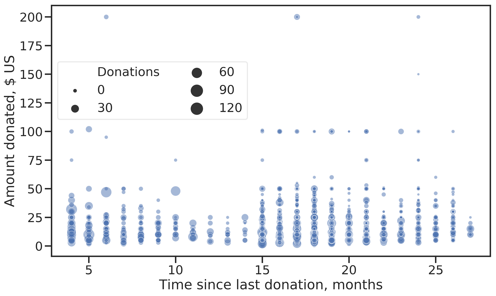

# Introduction {#intro}
```{r load_libraries, include=FALSE,results='hide'}
library(tidyverse)
library(reticulate)
reticulate::use_condaenv('mathesis', required=T)
library(knitr)
library(kableExtra)
library(DiagrammeR)
library(DiagrammeRsvg)
library(rsvg)
library(stringr)
library(readtext)
options(scipen=999)
```

```{r global-helpers, include=FALSE,results='hide'}

github_base_url = "https://github.com/datarian/thesis-msc-statistics/tree/master/code/"

make_github_link <- function(..., text = ""){
  subdirs <- list(...)
  
  if (length(subdirs) == 0) {
    directory = ""
  } else {
    directory = paste(...,sep="/")
  }
  url = paste(github_base_url, directory, sep="/")
  
  if (text == ""){
    link_text = url
  } else {
    link_text = text
  }
  sprintf("[%s](%s)", link_text, url)
}

```

```{r setup_knitr, include=F, results='hide'}

options(bookdown.clean_book = TRUE)
options(knitr.graphics.auto_pdf = TRUE)

knitr::opts_chunk$set(error=TRUE,
                      warning=TRUE,
                      message=FALSE,
                      echo=FALSE,
                      cache=TRUE,
                      dpi=300,
                      fig.width=7, # Default figure widths
                      fig.asp=0.618,
                      fig.align="center",
                      fig.path = "./figures/",
                      out.width = "70%",
                      crop = TRUE,
                      tidy=TRUE)

knitr::opts_knit$set(eval.after='fig.cap',
                     verbose=TRUE)

# Setup reticulate as the python enginge
knitr::knit_engines$set(python = reticulate::eng_python)

source_hook = function(x, options) {
    paste("\\begin{lstlisting}[language=Python,stepnumber=2,basicstyle=\\footnotesize]\n", x, 
        "\\end{lstlisting}\n", sep = "")
}

output_hook = function(x, options) {
    paste("\\begin{lstlisting}[basicstyle={\\ttfamily},basicstyle=\\footnotesize]\n", x, 
        "\\end{lstlisting}\n", sep = "")
}

hook_inline = knitr::knit_hooks$get('inline')
inline_hook <- function (x) {
  if (is.numeric(x)) {
    res <- ifelse(x == round(x),
      prettyNum(x, big.mark="'"),
      prettyNum(x, big.mark="'", digits=3)
    )
    paste(res, collapse = ", ")
  } else {
    hook_inline(x)
  } 
}

## a common hook for messages, warnings and errors
hook_lst_bf = function(x, options) {
    paste("\\begin{lstlisting}[basicstyle={\\bfseries}]\n", x, 
        "\\end{lstlisting}\n", sep = "")
}


knit_hooks$set(inline = inline_hook,
               rgl = rgl::hook_rgl,
               crop = knitr::hook_pdfcrop,
               optipng = knitr::hook_optipng,
               source = source_hook,
               output = output_hook,
               warning = hook_lst_bf,
               message = hook_lst_bf,
               error = hook_lst_bf)
```


```{python python-init, results="hide", echo=F, cache=F}
import os
os.environ['QT_QPA_PLATFORM_PLUGIN_PATH'] = 'C:/Users/flori/Anaconda3/Library/plugins/platforms'
import numpy as np
import pandas as pd
import seaborn as sns
import matplotlib as mpl
import matplotlib.pyplot as plt
import glmnet_python as glmnet

# Load custom code
import kdd98.data_handler as dh
from kdd98.config import Config
import pathlib
import pickle
import pathlib

Config.set("model_store", pathlib.Path("models"))

plt.rc('font',**{'family':'sans-serif','sans-serif':['Lato']})
plt.rc('font',**{'family':'serif','serif':['Times']})
#plt.rc('text', usetex=True)

sns.set_palette(Config.get("qual_palette"))
sns.set(color_codes=True)
sns.set_style('ticks')
sns.axes_style({'spines.right': False,
                'axes.spines.top': False})

plt.rcParams['axes.labelsize'] = 20
plt.rcParams['xtick.labelsize'] = 18
plt.rcParams['ytick.labelsize'] = 18
plt.rcParams['figure.figsize'] = (7*1.618, 7)
plt.rcParams['figure.dpi'] = 300
plt.rcParams['image.interpolation'] = "none"
plt.rcParams['savefig.bbox'] = "tight"
plt.rcParams['lines.linewidth'] = 2
plt.rcParams['legend.numpoints'] = 1
plt.rcParams['legend.fancybox'] = True
plt.rcParams['legend.framealpha'] = 0.4

sns.set_palette(Config.get("qual_palette"))
sns.set_context("talk")

IMAGES_PATH = pathlib.Path(pathlib.Path.cwd()/'figures')

pathlib.Path(IMAGES_PATH).mkdir(parents=True, exist_ok=True)
pathlib.Path(IMAGES_PATH,'methods').mkdir(parents=True, exist_ok=True)


def save_fig(fig_id, tight_layout=True, fig_extension=["pdf", "png"], resolution=300):
    if tight_layout:
        plt.tight_layout()
    [
        plt.savefig(pathlib.Path(IMAGES_PATH, fig_id + "." + f),
                    format=f,
                    dpi=resolution,
                    transparent=True,
                    bbox_inches='tight') for f in fig_extension
    ]

```

Customer segmentation techniques are used in marketing to identify certain groups of customers in order to produce offers tailored to these groups. The ultimate goal is to maximize profit, which is achieved also through customer retention. In the case of direct marketing, especially when unit costs (the cost associated with addressing a customer) are significant, employing some customer segmentation technique is highly beneficial in terms of profit.

Historically, the RFM (Recency, Frequency, Monetization) model has been employed with success in designing direct marketing campaigns @kohavi2004visualizing. While definitions vary, generally recency refers to when the last purchase was made. Frequency denotes number of purchases in a certain time period. Monetization can represent the amount of the last purchase, cumulative spending or the average amount spent per purchase.

The RFM model proposed by @hughes-rfm-boost-response is often used: Customers are binned into 5 segments for each of the RFM features individually and labeled ordinal, resulting in 125 cells that can then be used to identify customers most likely to respond. The best customers have a high score for each of the 3 features. The drawback of this approach is that generally, marketing efforts go towards the best customer segment.

Over time, different extensions of RFM [@fader2005rfmclv; @yeh2009] and, increasingly, machine learning models such as Na\{¨i}ve Bayes, Random Forests [@stubseid2018; durango2013], Chi-squared automatic interaction detection and logistic regression were proposed. While in some situations, these alternatives outperformed RFA [@MCCARTY2007656], RFA remains popular because of its intuitive interpretation.

In this work, a radically data-driven approach was chosen. Several machine learning algorithms were employed and compared to predict potential donors and the net profit generated instead of building on previously developed, specialized models.


## Task Background

A U.S. American veterans organization regularly conducts direct marketing campaigns, asking their members for donations (called gifts in the documentation) for the treatment of veterans with spinal injuries. The goal for the organization is to maximize net profit from their campaigns.

Only a small proportion of the members donate in reply to a campaign, while each letter sent out has a unit cost of 0.68 $US. In order to maximize profit, it is therefore desirable to only mail members who are likely to donate.

The members are grouped, among other criteria, by the recency of their last gift. Of these groups, the so-called *lapsed* donors are of particular interest. These are members who made their last gift to the organization 13 to 24 months prior to a given campaign.
This group is important for two reasons: Firstly, the probability of a member donating decreases with the time the member has not donated. Enticing these lapsed donors to give again therefore maintains an active member base. Secondly, the organization has found that there is a negative correlation between the dollar amount donated and the probability to respond to a campaign. This means it is important to include the most unlikely donors in future mailings because if they donate, the net revenue is particularly large. If these unlikely donors would be suppressed from future campaigns, the gains from additional *small dollar* lapsed donors would not offset the losses from the potential *high dollar* donors.

The data at hand was distributed for the purpose of the KDD-CUP of the year 1998^[For an archive of past cups, see [SIGKDD - KDD Cup](http://www.kdd.org/kdd-cup)]. The cup was until recently held yearly under the aegis of the special interest group on Knowledge Discovery and Data Mining (SIGKDD), which itself is part of the Association for Computing Machinery^[https://acm.org](ACM).


## Goals and Requirements

* The ultimate goal is to beat the winner of the original cup in terms of predicted net profit for the promotion. A complete data analysis including data preprocessing, model evaluation and -selection and final prediction has to be performed.
* Furthermore, the thesis should support future work on the data set by providing a solid basis especially on the preprocessing of the data.
* The supervisor of this thesis requested that the solution be demonstrated using Python as programming environment.

## Conventions and Notes

* A member of the organization will be referred to as an *example*. Each example is described by a set of *features* (explanatory variables) and has two *targets* (dependent variables) associated.

* The *current* promotion refers to the most recent promotion made, *current* donors are those examples who donated in response to the promotion.

* A *lapsed* donor is an example who made their last donation between 13 and 24 months prior to the current promotion.

* Software packages are denoted as `package` with specific modules contained in packages written as `package.module.Class`. Where available, software used is cited with the article in which it was published. Less established packages are cited by giving their public source code repositories.

* All self-written code, including the reproducible analysis process, is published online at [https://github.com/datarian/master-thesis-msc-statistics](https://github.com/datarian/master-thesis-msc-statistics). These resources, especially the folder `notebooks`, form an integral part of this thesis.

<!--chapter:end:index.Rmd-->

# Data
```{python data-specs, echo=F, results='hide', cache=F}
date_features = dh.DATE_FEATURES
binary_features = dh.BINARY_FEATURES
data_provider = dh.KDD98DataProvider("cup98LRN.txt")
raw_data = data_provider.raw_data
cleaned = data_provider.cleaned_data
numeric = data_provider.numeric_data
all_relevant = data_provider.all_relevant_data

int_features = raw_data["data"].select_dtypes(include="integer").columns.values.tolist()
float_features = raw_data["data"].select_dtypes(include="float").columns.values.tolist()
category_features = raw_data["data"].select_dtypes(include="category").columns.values.tolist()
object_features = raw_data["data"].select_dtypes(include="object").columns.values.tolist()

stats = pd.DataFrame({"Integer": ["Discrete features, no missing values", len(int_features)],
                      "Float": ["Continuous features and discrete features with missing values", len(float_features)],
                      "Categorical": ["Nominal and ordinal features", len(category_features)],
                      "Object": ["Features with alphanumeric values", len(object_features)],
                      "Total": [" ", raw_data["data"].shape[1]]}).transpose()
stats.columns = ["Data content", "Number of features"]
stats.index.name = "Data type"
```

The data set contains data on all 191'779 members of the organization with a *lapsed* donation status (last donation 13 -- 24 months ago) relative to the promotion sent out in June 1997 (named *current* promotion hereafter).

The data is provided^[See [https://archive.ics.uci.edu/ml/datasets/KDD+Cup+1998+Data](https://archive.ics.uci.edu/ml/datasets/KDD+Cup+1998+Data), accessed on 30.5.2019] split in two sets, of which one is intended for learning (95'412 examples), the other for validation and final prediction (96'367 examples). The features are identical between the two except for the target features that have been separated from the validation set.

In this section, the *learning* data set will be characterized.


## General Structure

The input data with $n = `r nrow(py$raw_data$data)`$ rows and $p= `r ncol(py$raw_data$data)+1`$ columns is structured as follows: $\mathbf{D} = \{\{\mathbf{x}_i,\mathbf{y}_i\}\}, i = 1 ... n, \mathbf{x} \in \mathbb{R}^{p-3}, \mathbf{y} \in \mathbb{R}^2$.

We have $m = p-3 = `r ncol(py$raw_data$data)-2`$ explanatory features, two targets and one unique identifier for each example.

The $m$ features are grouped into four blocks of information:

* Member database with personal particulars, interests and organization-internal information on examples: 81 features
* Characteristics of example's neighborhood from the US census 1990: 286 features
* Promotion history: 54 features
	* Summary of promotions sent to an example in the 12 months prior to the current promotion
	* Sending dates and RFA status of promotions 13-36 months prior to current promotion
* Giving history: 57 features
	* Summary statistics
	* Responses to promotions 13-36 months prior to current promotion


## Exploratory Data Analysis

Key insights from the exploratory data analysis are shown below. The detailed analysis can be studied online in the corresponding Jupyter notebook *3_EDA.ipynb*^[`r make_github_link("notebooks", "3_EDA.ipynb")`].

### Data Types

An analysis of the data set dictionary (Appendix \@ref(data-set-dictionary)) reveals the following data types:

- Index: CONTROLN, unique record identifier
- Dates: 73 features in yymm format.
- Binary: 48 features
- Categorical: 46 features
- Numeric: 309

The data types present after import with the python package `pandas`' `read_csv()` are shown in Table \@ref(tab:data-desc). Two things are worth noting: There are many integer features, meaning that most numeric data is discrete. Few categorical features and no date features were automatically identified. The missed categoricals and dates are most likely in the group of `Object` features, which is `pandas`' catch-all type, and will have to be transformed during preprocessing.

```{r data-desc, results="asis", echo=F}
kable(py$stats,
    booktabs = T,
    caption="Data types after import of raw csv data") %>%
  kable_styling(latex_options=c("hold_position", position="center")) %>%
  column_spec(2, width="6cm")
```

### Targets

Of the two targets, one is binary (TARGET_B), the other continuous (TARGET_D). The former is a binary response indicator for the current promotion. The latter represents the dollar amount donated in response to the current promotion and is 0.0 $ in case of non-response.

As can be seen in Figure \@ref(fig:target-ratio), the response rate is 5.1 %. This means the binary target is highly imbalanced. Extra care will have to be taken during model training to obtain a model with a low generalization error.

(ref:targ-b-legend) Distribution of the binary target TARGET_B.


```{r target-ratio, fig.cap="(ref:targ-b-legend)", echo=F}
knitr::include_graphics("figures/eda/ratio-binary.png")
```

The distribution of the continuous target for TARGET_D > 0.0 \$ is shown in Figure \@ref(fig:target-d-distrib). Evidently, most donations are smaller than 25 \$, the 50-percentile lying at 13 \$ and the mean at 15.62 $. There are a few outliers for donations above 100 \$, making the distribution right-skewed. Being monetary amounts, the observed values are discrete rather than strictly continuous.

(ref:targ-d-legend) Distribution of TARGET_D, the donation amount in \$ US (only amounts > 0.0 \$ are shown).

```{r target-d-distrib, fig.cap="(ref:targ-d-legend)", echo=F}
knitr::include_graphics("figures/eda/target-distribution.png")
```

### Skewness

Most of the numerical features are skewed. Due to the high dimensionality, individual assessment of the features through boxplots or histograms was not feasible. Instead, skewness was measured with the Fisher-Pearson standardized moment coefficient $G_1 = \frac{\sqrt{n(n-1)}}{n-2} \frac{1}{n} \frac{\sum_{i=1}^n (x_i-\bar{x})^3}{s^3}$ and plotted together with the $\alpha=5 \%$ confidence bound (CB) for a normal distribution (see Figure \@ref(fig:skew-all)). Since G1 is symmetric around zero, absolute values were chosen to display the results on a log scale. Evidently, no feature was found to be strictly normally distributed.

(ref:skew-all-legend) Fisher-Pearson standardized moment coefficient (G1) for all numeric features contained in the dataset. The confidence bound indicates the $\alpha = 5 \%$  bound for the skewness of a normal distribution for any given feature.

```{r skew-all, fig.cap="(ref:skew-all-legend)", echo=F}
include_graphics('figures/eda/skewness-numeric-features.png')
```

 Looking at the 6 least skewed features (Figure \@ref(fig:least-skewed)), we find distributions that resemble normal (respectively binomial) or discrete uniform.
```{r least-skewed, fig.cap="Least skewed features by G1 (adjusted Fisher-Pearson standardized moment coefficient).", echo=F}
knitr::include_graphics("figures/eda/least-skewed.png")
```

The 6 most skewed features (Figure \@ref(fig:most-skewed)) show heavily right-skewed poisson-like distributions which are the result of outliers.

```{r most-skewed, fig.cap="Most skewed features by G1 (adjusted Fisher-Pearson standardized moment coefficient).", echo=F}
knitr::include_graphics("figures/eda/most-skewed.png")
```

### Correlations

The high dimensionality makes it hard to assess correlations in the data between individual features. A heatmap (see Figure \@ref(fig:heatmap-all)) provides a high-level view. From left to right, three regions can be distinguished: First, there are member database features, followed by a large center region comprised of the U.S. census features, and rightmost, there are promotion and giving history features. Between these blocks, only few features are correlated. Within each block however, we can see some quite strongly correlated data.

(ref:heatmap-legend) Heatmap of feature correlations. Green means positive correlation, magenta means negative correlation. Perfect correlation occurs at 1.0 and -1.0.

```{r heatmap-all, fig.cap="(ref:heatmap-legend)", echo=F}
include_graphics("figures/eda/correlations-all.png")
```

### Donation Patterns

When looking at the all-time recency-frequency-amount (RFA) fetures for donors (Figure \@ref(fig:rfa-alltime)), no clear trend is visible to discern current donors from non-donors. Current donors are found across the whole range of recency values, although slightly concentrated at the lower end (low recency is better). A slight correlation between frequency and current donation status is also discernible: Current donors tend to "float" on top of the "sedimented" non-donors. Those examples with the highest yearly donation amount did not donate in the current promotion.

(ref:rfa-alltime-legend) Analysis of all-time RFA values by response to current promotion. *Recency* is the time in months since the last donation, *Frequency* the average number of donations per year and *Amount* the average yearly donation amount.

```{r rfa-alltime, fig.cap="(ref:rfa-alltime-legend)", echo=F}
include_graphics("figures/eda/rfa-alltime-current-donors.png")
```

The data set documentation states that donation amounts are positively correlated with recency, the time since the last donation. This means that the longer an example goes without donating, the higher the donation amount if it can be enticed into donating again. Figure (\@ref(fig:donations-vs-time)) gives some evidence for this assumption. We see that starting from 15 months, the number of donations above 50 $ increases.

There is another insight gained when considering the number of donations an example has made, indicated by the point size, and donation amount: Frequent donors give relatively small sums, while the largest donations come from examples who rarely donate.

(ref:don-vs-time-legend) Donation amount for the current promotion against months since last donation. The dot size indicates the number of times an example has donated.

```{r donations-vs-time, fig.cap="(ref:don-vs-time-legend)", echo=F}

```

There are many examples who donated within the last 12 months prior to the current promotion ( Figures \@ref(fig:rfa-alltime) and \@ref(fig:donations-vs-time)). This is a surprising observation.  The data set should contain *lapsed* donors only, so there should be no donations recorded for that period. An explanation could be that the recency status is considered strictly for direct responses to promotions. Examples who donate regularly (i.e. monthly, yearly), irrespective of the promotions mailed out, would not be evaluated in terms of RFA under that assumption.

The data contains RFA features for each of the 24 promotions in the promotion history data, giving example's status per a given promotion. Considering the RFA features for the current promotion, we can support the insights above. Since the data set contains only lapsed donors, the recency feature is constant and not of interest (it is a nominal feature, *lapsed* being one of the levels). Regarding the frequency of donations (number of donations 13 - 24 months prior to the promotion), shown in Figure \@ref(fig:rfa-f), we see a clear trend. With increasing donation frequency, donation amounts decrease.

```{r rfa-f, fig.cap="Frequency of donations in the 13-24 months prior to current promotion against amount donated. Frequent donors give smaller amounts.", echo=F}
include_graphics("figures/eda/frequency-past-donatios-vs-donations.png")
```

Figure \@ref(fig:donations-geo) shows the geographical distribution of donations. The large urban centers like San Francisco, Los Angeles, Miami, Chicago and Detroit are clearly visible. To a lesser extent, cities like Houston, Dallas, Minneapolis, Atlanta, Tampa, Seattle and Phoenix can be made out. Examples living there give small amounts. Big donors (large total donations with a high average) can be made out in rural areas in the midwest and Texas. Interestingly, only very few donations come from the north-eastern states.

(ref:donations-geo-legend) Geographical distribution of donations by zip code. Point size indicates total donations for a zip code while the hue shows average donation amount.

```{r donations-geo, fig.cap="(ref:donations-geo-legend)", out.width="100%", echo=F}
include_graphics("figures/eda/donations-geographical.png")
```

We can also see that examples living in rural areas tend to donate larger sums when looking at Figure \@ref(fig:donations-le). Shown are the living environments in progressively more rural settings against the average all-time donation amount per capita.

(ref:donations-by-le) Average cumulative donation amount per capita by living environment (C = city, U = urban, S = suburban, T = town, R = rural). The more rural, the higher the average donations.

```{r donations-le, fig.cap="(ref:donations-by-le)", echo=F}
include_graphics("figures/eda/avg-donations-per-capita-by-living-environment.png")
```

Socio-economic status by living environment reveals that examples with the highest status are rarely among the low-dollar donors. The median donation amount for the highest status is always higher than other status groups, but examples in the lowest status donate more than those in the medium level (Figure \@ref(fig:donations-le-socioec)). The highest donations come from the medium status group.

(ref:donations-le-socioec-legend) Donation amount for current promotion by living environment and socio-economic status of examples. The violin plot shows the distribution of values similar to a kernel density estimation. Median values are indicated by white dots, the bold regions give the inner quartile range.

```{r donations-le-socioec, fig.cap="(ref:donations-le-socioec-legend)", echo=F}
include_graphics("figures/eda/donations-vs-living-environment-hue-socioecon.png")
```


<!--chapter:end:02-data.Rmd-->

# Experimental Setup and Methods

## Tools Used

The problem itself was solved using the python language, making use of established packages. From the scipy ecosystem: `numpy`, a library for multidimensional arrays and vectorized operations on them [@oliphant2006guide]; `scipy`, a library for scientific computing [@mckinney-proc-scipy-2010]; `pandas`, a library for data analysis [@mckinney2011pandas]; `matplotlib`, for high-quality plots [@hunter2007matplotlib]. Furthermore: the machine learning library`scikit-learn` [@scikit-learn] and the high-level data visualization library `seaborn` [ @waskom2014seaborn].

Calculations were run in the cloud on a linux virtual machine^[For details, refer to: [https://docs.microsoft.com/en-us/azure/machine-learning/data-science-virtual-machine/overview](https://docs.microsoft.com/en-us/azure/machine-learning/data-science-virtual-machine/overview), accessed on 5.6.2019].

Except for the development of a helper packge, most programming was performed in interactive Jupyter notebooks [@Kluyver:2016aa].

The report was written in rmarkdown [@allaire2016rmarkdown] using `knitr` [@xie2015] and `bookdown` [@xie2016bookdown] to render the document into several output formats.

All work was tracked in version control.


## Data Handling

The learning data set was used to establish the complete analysis pipeline, i.e. preprocessing, imputation and feature selection, model evaluation and -selection and prediction method. The test data was not touched until making the final prediction, subjecting it to the complete pipeline determined on the learning data.

In accordance with recommendations in @friedman2001elements, the learning data set was further split 80/20 into training and validation sets (see Figure \@ref(fig:data-splitting)). The training set was used to train different models while the validation set served to tune hyperparameters. The split was performed using a stratified sampling algorithm to preserve target class frequencies based on the response indicator.

```{r data-splitting, fig.cap="Data set use for training and predictions.", echo=F, results='asis', out.width="50%"}
data_graph <- grViz(
  "
  digraph d_split {
  
    graph [overlap=false, fonsize=18, fontname=Lato, layout=dot, nodesep=1.4]
    
    node [fillcolor=white, shape=circle]
    C [label=<<b>Complete Data Set</b><br />191'779 examples>, width=3.0]
    L [label=<<b>Learning</b><br />95'412 examples>, width=2.0]
    T [label=<<b>Test</b><br />n96'367 examples>, width=2.0]
    LT [label=<<b>Training</b>>, width=1.5]
    LV [label=<<b>Validation</b>>, width=0.5]
    
    edge [color = black, penwidth=0.95]
    C -> L [label='used for\npreprocessing,\n training models']
    C -> T [label='kept back\n for final predicitons']
    L -> LT [label='  80 % of data']
    L -> LV [label='  20 % of data']
  }
  ")

rsvg_pdf(charToRaw(DiagrammeRsvg::export_svg(data_graph)),
         file="figures/methods/data-splitting.pdf")
rsvg_png(charToRaw(DiagrammeRsvg::export_svg(data_graph)),
         file="figures/methods/data-splitting.png")
knitr::include_graphics("figures/methods/data-splitting.png")
```


## Data Preprocessing

The necessary preprocessing was guided by practical necessity (input errors, inconsistent categories), the requirements of the algorithms that were examined (Section \@ref(eval-and-select)) and the requirements set out in the cup documentation:

* Only numeric features (required by some algorithms)
* Imputation of missing values (required by cup documentation)
* Removal of constant and *sparse* features (required by cup documentation)

The transformations were established interactively in Jupyter notebooks. Once finalized, transformations were implemented in the python package `kdd98`^[Available from `r make_github_link("kdd98")`].


### Cleaning

The transformations applied can be studied in the Jupyter notebook *1_Preprocessing.ipynb*^[`r make_github_link("notebooks", "1_Preprocessing.ipynb")`].

The cleaning stage of preprocessing encompassed the following transformations:

* Removing *noise*: Input errors, inconsistent encoding of binary / categorical features
* Dropping constant and sparse (i.e. those where only few examples have a value set) features
* Imputation of values missing at random (MAR)

MAR values in the sense of @rubin1976inference are missing conditionally on other features in the data. For example, there are three related features from the promotion and giving history: *ADATE*, the date of mailing a promotion, *RDATE*, the date of receiving a donation in response to the promotion and *RAMOUNT*, the amount received. For missing *RAMOUNT* values, we can check if *RDATE* is non-missing. If *RDATE* is missing, then the example most likely has not donated and we can set *RAMOUNT* to zero. If, on the other hand, both date features have a value, *RAMOUNT* is truly missing.


### Feature Engineering {#methods-feature-engineering}

The transformations applied during feature engineering are described in detail in the Jupyter notebook *2_Feature_Engineering.ipynb*^[`r make_github_link("notebooks", "2_Feature_Engineering.ipynb")`]. The result of this step was an all-numeric data set usable for downstream learning.

All non-numeric (i.e. categorical) features were encoded as numeric representations. For ordinal features, manual mappings from alphanumeric levels to integer numbers were specified. For nominal features, two encoding techniques provided in package `categorical-encoding`^[Availabe at: [https://github.com/scikit-learn-contrib/categorical-encoding/](https://github.com/scikit-learn-contrib/categorical-encoding/), accessed on 5.6.2019] were employed, depending on the number of levels:

* One-hot encoding for $\leq 10$ levels: For each level of a categorical feature, a new feature is created. An additional feature may be added to indicate missing values. Exactly one of these new features is set to $1$, indicating the original level.

* Binary encoding, $> 10$ levels: The levels of the categorical are first transformed ordinally (i.e. to a sequence of integer numbers). Then, these numbers are taken to the base of 2. (A $5$, for example, becomes `101`). According to the number of levels, new features for the binary digits are created. As an example: To represent 60 levels, 6 features are required ($2^6=64$).

Also, several features were transformed to better usable formats (i.e. converting dates to time deltas, converting zip codes to coordinates). Care was taken to keep the dimensionality of the data set as low as possible. 


### Imputation

Three different approaches were evaluated. The details are shown in Jupyter notebook *4_Imputation.ipynb*^[`r make_github_link("notebooks", "4_Imputation.ipynb")`].

#### K-Nearest Neighbors

kNN imputation uses those examples that are "near" an example with a missing value in feature $f$ to impute the value. In short, the kNN algorithm by @troyanskaya2001missing implemented in `missingpy`^[Available at: [https://github.com/epsilon-machine/missingpy](https://github.com/epsilon-machine/missingpy), accessed on 11.6.2019] works as follows:

1. Construct the distance matrix $D$ with distances between examples.
2. Order all features descending by number of missing values.
3. Starting with the feature with most missing, for each example with a missing value, use the $k$ nearest neighbors' mean or median to impute.

The algorithm runs until all values are imputed.

While very attractive because of the intuitive approach and because it preserves data characteristics (continuous / discrete, categoricals) in the features, the distance matrix is very memory-intensive for large data sets. Also, it is required to remove features with > 80 % missing values first.

#### Iterative imputation

Iterative imputation, implemented in package `fancyimpute`^[Available at: [https://pypi.org/project/fancyimpute/](https://pypi.org/project/fancyimpute/), accessed on 30.06.2019], works similar to the R-package `mice` (see @buuren2011mice). Before imputation, all features have to be transformed to numerical data types and normalized because the underlying model is a linear regresssion.

In short, the algorithm works as follows:

1. Features are ordered by the fraction of missing values
2. Starting with the feature with most missing values, use the other features to build a linear model, using the current feature as the dependent variable and predict missing values.
3. Repeat step 2 until all features are complete
4. Repeat steps 2 -- 3 $n$ times, $n=5$ was chosen

#### Simple Imputation and Categorical Indicator

This approach is straightforward: Numeric features are imputed by their median value to make the imputation robust to skewed distributions.

As the algorithm used (`sklearn.impute.SimpleImputer`) only supports numerical data types, categorical features were treated separately during feature engineering (Section \@ref(methods-feature-engineering)): The one-hot or binary encoded categoricals had one more feature added, indicating missing values.


### Feature Selection {#methods-feature-selection}

One of the biggest caveats in dealing with high-dimensional data is the infamous "Curse of Dimensionality" coined by @bellman1966dynamic. The curse comes from the fact that with an increasing number of dimensions of the feature space, the number of possible combinations grows exponentially. In order to cover all possible combinations with several examples, a huge amount of data would be required as a result. In the area of machine learning, high dimensionality frequently manifests in the form of overfitting, which leads to an unacceptably large generalization error @goodfellow2016deep. @hughes1968mean showed that for a fixed number of examples, model performance first increases with increasing number of dimensions but then decreases again. 

Boruta, introduced by @kursa2010boruta in the form of an R package, performs feature selection by solving the so-called all-relevant feature problem. The algorithm was found to perform very well regarding selection of relevant features in @kursa2011boruta.

In short, the algorithm works as follows:

1. The input matrix $\mathbf{X}$ of dimension $n \times p$ is extended with $p$ so-called *shadow features*. The shadow features are permuted copies of the features in $\mathbf{X}$. They are therefore decorrelated with the target.
2. On the resulting matrix $\mathbf{X^*}$, a random forest classifier is trained and the Z-scores $\frac{\bar{\text{loss}}}{sd}$ for each of the $2p$ features calculated.
3. The highest Z-score among the shadow features $MZSA$ is determined.
4. All original features are compared against $MZSA$ and those features with a higher score selected as important.
5. With the remaining features, a two-sided test for equality of the Z-scores with $MZSA$ is performed and all features with significantly lower score are deemed unimportant.
6. All shadow copies are removed, go to step 1.

The algorithm terminates when all attributes are marked as either important or not important or when the maximum number of iterations is reached.

For this thesis, a python implementation^[Available from [https://github.com/scikit-learn-contrib/boruta_py](https://github.com/scikit-learn-contrib/boruta_py), accessed on 5.6.2019] was used.

The models were all learned on the same data set resulting from the boruta selection.


## Prediction {#methods-prediction}

The desired quantity to estimate is net profit $\hat{\Pi}$. In order to predict this quantity, a two-step procedure was implemented, utilizing the response indicator *TARGET_B* and the continuous target *TARGET_D*, respectively. For each step, a model was trained. One is a classifier, predicting $\hat{y}_b$, the probability of donating. The other is a regressor, predicting the donation amount $\hat{y}_d$. The classifier was trained on the complete learning data set, while the regressor was trained on $\mathbf{X}_d = \{x_i|y_{b,i} = 1, i=1 \ldots n\}$ and $y_d = \{y_{d,i}|y_{b,i} = 1, i=1 \ldots n\}$. The non-random sample leads to a conditionally predicted donation amount, thereby introducing bias. A correction for the bias is necessary as a consequence. This approach resembles @heckman1976common's two-stage procedure which is widely used in econometrics. Heckman's procedure was presented for the question of wage offerings for women. Data on wages was only available for working women, thereby introducing bias if wage offerings were only predicted on this sample. The question of whether an example works or not is seen as an unobserved feature. In @heckman1976common, a probit model is used for this first *selection* stage. The inverse Mills ratio of the probit, $\frac{-\phi(\hat{y_i}-\mathbf{X}\beta)}{\Phi(\hat{y_i}-\mathbf{X}\beta}$, is calculated and included in the data for predictions in the second *observation* stage with OLS regression.

### Setup of the Two-Stage Prediction

For the first stage some classifier is used, predicting the probability for example $x_i$ to donate. This is not a probit ($P(Y=1|X) = \Phi(X^T\beta)$), of course. Instead, the resulting distribution depends on the classifier.

\begin{equation}
\hat{y}_b = f(\mathbf{X})
(\#eq:y-b)
\end{equation}

where $\hat{y}_b$ is the vector of predicted probabilities of donating and $f$ is the classifier.

The second stage is performed on $\mathbf{X}_d$ and consists in predicting the donation amount using a regression model:

 \begin{equation}
\hat{y}_{dt} = g(\mathbf{X_d})
(\#eq:y-d)
\end{equation}

where $\mathbf{\hat{y}_{dt}}$ is the vector of predicted donation amounts and $g$ is the conditionally learned regression model. $g$ is learned with Box-Cox transformed target $\mathbf{y_d}$, so $\hat{y}_{dt}$ is also Box-Cox transformed with parameter $\lambda$.

The decision of whether to include example $i$ in the promotion is governed by the following indicator function. In it, $\alpha^*$ accounts for the introduced bias. Every example that has a predicted donation amount of more than the unit cost is included.

\begin{equation}
 \mathbb{1}_{\hat{y}_{i,b} * \exp(\hat{y}_{i,dt}) * \alpha^* > \exp(u_t)}(\hat{y}_{i,dt})
(\#eq:indicator)
\end{equation}

where $\alpha^* \in [0,1]$ is a factor to correct for bias introduced due to the non-randomness of $\mathbf{X}_d$, $\hat{y}_{i,dt}$ is the predicted donation amount, transformed so as to normalize the distribution learned beforehand and $u_t$ is the unit cost, Box-Cox transformed with parameter $\lambda$. The exponential is used to deal with negative values resulting from the Box-Cox transformation.

Finally, the quantity estimated is net profit $\hat{\Pi}$. It is calculated by summing over the product of the indicator function \@ref(eq:indicator) and the net profit for examples $1 \ldots n$. For unseen data, \@eq:pi-alpha is altered by using the estimated net profit $\hat{y}_{d,i}$ in the product.

\begin{equation}
\hat{\Pi}_\alpha = \sum_{i=1}^n  \mathbb{1}_{\hat{y}_{i,b} * \exp(\hat{y}_{i,dt}) * \alpha^* > \exp(u_t)}(\hat{y}_{i,dt})*(y_{i,d} - u)
(\#eq:pi-alpha)
\end{equation}


### Optimization of $\alpha^*$

With equation \@ref(eq:pi-alpha), the estimated profit $\Pi$ was calculated on the learning data for a grid of $\alpha$ values, $\alpha \in [0,1]$. The optimal value was then $\alpha^{*} = \underset{\alpha}{\operatorname{argmax}} f(\alpha)$ where $f$ is a function that was fit to $\Pi$.

For $f$, a cubic spline $s$ was used. $\alpha^*$ was determined as follows:

1. Fit $s(\Pi)$, the cubic spline on the estimated profits for the grid of $\alpha$ values
2. Derive $ds = \frac{\delta}{\delta \alpha} s$
3. Find the finite roots of $ds$, $\alpha_{\text{candidates}}$, representing candidates for $\alpha^*$
4. Determine $\alpha^* = \underset{\alpha}{\operatorname{argmax}} s(\alpha_{\text{candidates}})$


## Model Evaluation and -Selection {#eval-and-select}

Several algorithms (estimators) were trained in parallel. Once good hyperparameters were found using randomized grid search, performance of the estimators was compared using a common metric in order to select the best (see Figure \@ref(fig:evaluation-selection) for a schematic process overview). This was done independently for classifiers (predicting the binary target) and regressors (predicting the continuous target). The process is documented in notebook *6_Model_Evaluation_Selection.ipynb*^[`r make_github_link("notebooks", "6_Model_Evaluation_Selection.ipynb")`].

The pipeline functionality of `scikit-learn` was used to combine preliminary data transformations, i.e. scaling of features (where necessary) and resampling with the estimator-algorithm. This allows to jointly tune hyperparameters for transformations and the estimator.

```{r evaluation-selection, fig.cap="Learning process schematic.", echo=F, out.width="80%"}

workflow_graph <- grViz(
  " 
    digraph workflow {

      labeljust='l';

      graph [overlap=false,
             fontname=Lato,
             fonsize=30,
             layout=dot,
             nodesep=1.1,
             rankdir=LR]

      node[fontname=Lato, fillcolor=white, shape=circle, width=1.3]
      
      scale[group='a', label='Scaler', style='dashed'];
      samp[group='a', label='Resampler', style='dashed'];
      estim[group='a', label='Estimator'];

      pip[group='a', label='Pipeline']
      param[group='a', label='Set Hyperparameter\nDistributions'];
      gs[group='a', label='Randomized\nGrid Search'];
      eval[group='a', label='Evaluation\nof results by metric,\nhyperparameters chosen'];
      select[group='a', label='Select best model'];

      edge[style=solid, color=black, fontname=Lato];
      {scale;samp}->pip [style='dashed'];
      estim -> pip;
      pip -> param;
      param -> gs;
      gs -> eval;
      eval -> param [label='using best\n cv iteration \n for metric'];
      eval -> select [label='hyperparameters\nconverged'];
    }
  ")

rsvg_pdf(charToRaw(DiagrammeRsvg::export_svg(workflow_graph)),
         file="figures/methods/evaluation-process.pdf")
rsvg_png(charToRaw(DiagrammeRsvg::export_svg(workflow_graph)),
         file="figures/methods/evaluation-process.png")
knitr::include_graphics("figures/methods/evaluation-process.png")
```

A common random seed was used for all algorithms and random number generators.

### Evaluation

Randomized grid search was run with 10-fold cross-validation (CV). The best-performing pipeline for each algorithm was stored in a python dictionary during evaluation. The dictionary was persisted to disk and only updated when an algorithm's metric improved. This ensured that the best hyperparameter settings were always retained during the extensive model evaluation phase.

#### Randomized Grid Search
In randomized grid search, [@bergstra2012random], probability distributions for hyperparameter values are specified. The algorithm then runs a defined number (10 were used) of random combinations by sampling from the distributions. Compared to the usual grid search, this can greatly speed up the learning process because good hyperparameter settings are generally identified with less iterations.

After one round of learning, the hyperparameter distributions were adjusted before the next iteration as follows: When the best value was found near the limits of the domain, the distribution was shifted in this direction. For values falling inside the domain, the distribution was narrowed down towards the found value. This procedure was repeated until the hyperparameters converged.

The implementation of randomized grid search in `scikit-learn` returns a summary table with the CV results for each hyperparameter combination. By comparing the mean test score for the chosen metric, the best hyperparameters can be determined.

#### Cross-Validation
CV splits the training data into several *folds* of equal size. The algorithm is trained as many times as there are folds, holding back one of the folds at each training step for validation using some specified performance metric and training with the rest of the data. This procedure enables quantification of the generalization error and the calculation of statistics that indicate the variance of the model. Following guidance in @kohavi1995study, 10-fold CV was used, which trades higher bias for lower variance compared to fewer folds.


### Selection

#### Classifiers

Both recall and F1 were initially selected and calculated during model evaluation. In the end, recall was used to select the best classifier as it produced better estimators for the task. Reasoning for the choice of these metrics is given below.

For classification problems, the confusion matrix (see Figure \@ref(fig:conf-mat-plot)) can be used to construct various performance metrics. A true positive (TP) indicates a correctly predicted 1, a false negative (FN) is a falsely predicted 0, a false positive is a falsely predicted 1 and finally a true negative (TN) is a correctly predicted 0.

For the data analyzed here, *1* means an example has donated, *0* means the example has not donated.

```{python conf-mat, include=F}

cm = np.array([[0.0, 0.0],[0.0, 0.0]])
labs = np.array([["TP", "FN"],["FP", "TN"]])
classes = ["1", "0"]

fig, ax = plt.subplots()
im = ax.imshow(cm, interpolation='nearest', cmap=sns.light_palette(sns.husl_palette(8)[4], n_colors=256, as_cmap=True))
# We want to show all ticks...
ax.set(xticks=np.arange(cm.shape[1]),
       yticks=np.arange(cm.shape[0]),
       # ... and label them with the respective list entries
       xticklabels=classes, yticklabels=classes,
       ylabel='True',
       xlabel='Predicted')

# Loop over data dimensions and create text annotations.
fmt = "s"
for i in range(labs.shape[0]):
    for j in range(labs.shape[1]):
        ax.text(j, i, format(labs[i, j], fmt),
                ha="center", va="center",
                color="black")
save_fig("methods/conf-mat")
plt.close('all')
```

(ref:conf-mat-cap) Definition of the confusion matrix for a two-class problem. 

```{r conf-mat-plot, fig.cap="(ref:conf-mat-cap)", echo=F, out.width="30%"}
knitr::include_graphics("figures/methods/conf-mat.png")
```

The definitions of some often-used metrics are given below^[taken from [https://en.wikipedia.org/wiki/Confusion_matrix](https://en.wikipedia.org/wiki/Confusion_matrix), accessed on 28.05.2019]. The choice of metric depends on the goal of the prediction and the data at hand.

\begin{align*}
\text{Recall / Sensitivity / True Positive Rate TPR} &= \frac{TP}{TP + FN} \\
\text{Specificity / True Negative Rate TNR} &= \frac{TN}{TN+FP} \\ 
\text{Precision / Positive Predictive Value PPV} &= \frac{TP}{TP + FP}\\
\text{Negative Predictive Value NPV} &= \frac{TN}{TN+FN}\\
\text{False Negative Rate FNR} &= \frac{FN}{FN+TP}\\
\text{False Positive Rate FPR} &= \frac{FP}{FP+TN}\\
\text{Accuracy} &= \frac{TP + TN}{TP + FP + FN + TN} \\
\text{F1 score} &= \frac{2TP}{2TP+FP+FN}
\end{align*}

The goal, as mentioned earlier, is to maximize net profit. To achieve this, a balance between predicting as many TP's as possible while keeping the number of FP's low has to be found. One FP costs `r 0.68` $ (sending a letter to a non-donor). Keeping in mind the distribution of TARGET_D (Section \@ref(targets)), one FN means loosing at least `r 0.32` $ of possible profit (not sending a promotion to a donor, smallest donation amount is 1 $). The expected loss in profit for one FN is even `r 15` $ (corresponding to the mean donation amount), which means that with each TP, the cost of  `r floor(15/0.68)` FP's can be covered on average.

The default metric for classification is accuracy, but in the case of imbalanced targets, it is not a desirable metric (TN is present both in the nominator and denominator, dominating the score). The metrics that could be used beneficially because they involve TP an not TN are F1, recall and precision. Since in precision, the FP of the majority class have the highest influence from among the three, it was discarded from the candidate list.

#### Regressors

For regression, $R^2 = 1- \frac{\sum_{i=1}^n(y_i-\hat{y}_i)^2}{\sum_{i=1}^n(y_i-\bar{y})^2}$ was used, mainly because it is the default metric for regression algorithms in `scikit-learn`. $R^2$ has the drawback of depending on the variance of the data used to fit the model and therefore is different for other data. It was however assumed that because learning and test data have the same generating function, $R^2$ can be used to select a regression model.

### Dealing With Imbalanced Data {#imblearn}

Several different approaches were explored. The following over-/undersampling techniques available in package `imblearn` by @lemaitre2017imblearn were studied:

* Random oversampling of the minority class
* Random undersampling of the majority class
* SMOTE (synthetic minority oversampling technique), variant borderline-1

The random sampling algorithms either draw from the minority class with repetition or draw random samples from the majority class without repetition until the labels are balanced. SMOTE does not sample from the data but instead generates synthetic samples from the minority class, thereby countering the danger of overfitting by learning on a small number of repeated observations (random oversampling) or a small subset of the training data available (random undersampling). The SMOTE variant *borderline-1* chosen generates samples that are close to the optimal decision boundary, where misclassifications are likely.

Additional experiments were run with class- and sample-weights set on the data without resampling. For class weights, the ratio of non-donors vs. donors was used. For sample weights, the donation amount was employed, rescaled to the interval $[0,1]$.

### Algorithms

A short introduction of each algorithm is given below. For each algorithm, the hyperparameters that were tuned during learning are given. The choice of algorithms was made so as to cover a wide range of underlying concepts.

#### Random Forest {#methods-rf}

Random forest (RF) belongs to the family of so-called ensemble learners and was introduced by @breiman2001rf. Predictions are made by majority vote of an ensemble of decision trees (CART, @breiman1984classification). The RF can be employed both for regression and classification tasks. RF's are insensitive towards scale differences in the individual features, and, depending on the implementation, can deal with missing values. Another important feature of RF is the assessment of *variable importance* by summing the loss improvement for each split in every tree per feature [@friedman2001elements].

During learning, a random sample of the available features is drawn with replacement for each tree (bagging, or bootstrap aggregating, see @breiman1996bagging), thereby reducing the variance of the ensemble estimator. Furthermore, splits within a tree are determined again on a random subset of the features. These sources of randomness tend to increase bias of the forest, yet the decrease in variance due to averaging through majority vote outweighs the bias increase @friedman2001elements. @breiman2001rf shows that as the forest grows, the generalization error converges almost surely. This means that random forests are insensitive to overfitting and perform better the more trees are grown.

As explained in @friedman2001elements, trees are grown as follows:

For data with n examples and p features $D = \{\{x_i,y_i\}, i=1 \ldots n, x_i=\{x_{i,1}, x_{i,2}, \ldots x_{i,p}\}\}$, the CART algorithm decides on the structure of the tree, the splitting features and the split points. As a result, the data is partitioned into $M$ regions $R_1, R_2, \ldots, R_M$.

**Regression**
The response $\hat{y}$ is modeled as a constant $c_m$ for each region:
\begin{equation}
f(x) = \sum_{m=1}^M c_m\mathbb{1}(x \in R_m)
(\#eq:cart-const)
\end{equation}

Using as loss criterion the sum of squares $\sum_{i=1}^n (y_i - f(x_i))^2$, the best $\hat{c}_m$ is the average of $y_i$ in the region:
\begin{equation}
\hat{c}_m=ave(y_i|x_i \in R_m).
(\#eq:cart-hatc)
\end{equation}

The algorithm greedily decides on the best partition. Starting with all data, a splitting feature $j$ and a split point $s$ is considered, creating two regions $R_1(j,s) = \{X|X_j \leq s\}, R_2(j,s) = \{X|X_j > s\}$. Feature $j$ and split point $s$ are chosen by solving
\begin{equation}
\min_{j,s}\left[\min_{c1} \sum_{x_i \in R_1(j,s)}(y_i-c_1)^2 + min_{c2} \sum_{x_i \in R_2(j,s)}(y_i-c_2)^2\right]
(\#eq:cart-opt)
\end{equation}
with the inner minimization solved using \@ref(eq:cart-hatc).


**Classification**
For a binary classification problem with outcomes $\{0,1\}$, predictions are made through the proportion of the positive class in a region $R_m$ with $N_m$ examples $x_i$ inside, which is given by:
\begin{equation}
\hat{p}_m = \frac{1}{N_m} \sum_{x_i \in R_m} \mathbb{1}(y_i = 1)
(\#eq:cart-class)
\end{equation}

When $\hat{p}_m>0.5$, the positive class is chosen.

The loss is described by impurity. When making a split, the feature $j$ resulting in the highest impurity decrease is selected. Impurity is measured by the *Gini index*. For binary classification: A node $m$, representing region $R_m$ with $N_m$ observations has as proportion of the positive class $\hat{p}_m = \frac{1}{N_m} \sum_{x_i \in R_m} \mathbb{1}(y_i = 1)$. The Gini index is then defined as $2p(1-p)$. So the decision function is:
\begin{equation}
\min_{j,s}(\min_{Gini_l} \hat{p}_l + \min_{Gini_r} \hat{p}_r)
(\#eq:cart-class-dec)
\end{equation}
for regions $R_l, R_r$ below the node.

The `RandomForestClassifier` and `RandomForestRegressor` included in `scikit-learn` were used for learning.

**Hyperparameters**

* `max_depth`, $\{1,2,3, \ldots\}$: depth of the trees, $2^n$ leafs maximum. Controls tree size.
* `min_samples_split`, $\{2,3,4,\ldots\}$: Minimum number of samples required to split a node, controls tree size.
* `max_features`, $\{1, 2, \ldots, m\}$: Maximum number of the $m$ features to consider when searching for a split. @friedman2001elements recommend values in  $m = \{1, 2, \ldots \sqrt{m}\}$, but for high dimensional data with few relevant features, larger $m$ can lead to better results because the probability of including relevant features increases.
* `n_estimators`, $\{1, 2, \ldots\}$: Number of trees to grow. In combination with early stopping, this can be set to a high value since learning will stop when the loss converges.
* `class_weight` $\{\text{balanced}, 1,2,\ldots\}$: Weights on target classes: "balanced" calculates weights according to class frequencies, integer values specify weight on majority class relative to minority


#### Gradient Boosting Machine {#methods-gbm}

The main idea behind boosting is to sequentially train an ensemble of weak learners which on their own are only slightly better than a random decision. The predictions of the individual weak learners are then combined into a majority vote [@kearns1988thoughts].

Gradient boosting machine (GBM) extends on this idea. Like a random forest, GBM learns an ensemble of decision trees. However, trees are learned in an additive manner. At each iteration, the tree that improves the model most (i.e. in the direction of the gradient of the loss function) is added. For this thesis, the package `XGBoost` by @chen2016xgboost was used. They describe the algorithm as follows:

Assume we have a data set with $n$ examples and $p$ features: $D = \{\{x_i,y_i\}, i=1\ldots n, x_i=\{x_{i,1}, x_{i,2}, \ldots x_{i,p}\}\}$. The implementation uses a tree ensemble with $K$ regression trees to predict the outcome for an example in the data by summing up the weights predicted by each tree:

\begin{equation}
\hat{y}_i = \phi(x_i) = \sum_{k=1}^K f_k(x_i), f_k \in F
(\#eq:gbm-ensemble)
\end{equation}

where $F = \{f(x) = w_{q(x)}\} (q: \mathbb{R}^m \rightarrow T, w \in \mathbb{R}^T)$ is the space of regression trees. $T$ is the number of leaves in a tree, $q$ is the structure of each tree, mapping an example to the corresponding leaf index. Each tree $f_k$ has an independent structure $q$ and weights $w$ at the terminal leafs.

For growing the trees in $F$, the following loss function is minimized:

\begin{equation}
L(\phi) = \sum_{i=1}^n l(y_i, \hat{y_i}) + \sum_k^K \Omega(f_k)
(\#eq:gbm-loss)
\end{equation}

Here, $l$ is a differentiable, convex loss function that measures the difference between predictions and true values. Since $l$ is convex, a global minimum is guaranteed. $\Omega(f) = \gamma T + \frac{1}{2}\lambda||w||^2$ is a penalty on the complexity of the trees to counter over-fitting. The algorithm thus features integrated regularization. 

Now, at each iteration $t$, the tree $f_t$ that improves the model most is added. For this, we add $f_t(\mathbf{x_i})$ to the predictions at $t-1$ and compute the loss:

\begin{equation}
L^{(t)} = \sum_{i=1}^n l(y_i, \hat{y_i}^{t-1} + f_t(\mathbf{x_i})) +\Omega(f_t)
(\#eq:gbm-iterate)
\end{equation}

To find the best $f_t$ to add, the gradients finally come into play. With $g_i$ and $h_i$ the first- and second-order gradient statistics of $l$, the loss function becomes:

\begin{equation}
\tilde{L}^{(t)} = \sum_{i=1}^n l(y_i, \hat{y_i}^{t-1} + g_if_t(x_i) + h_i f_t^2(x_i)) +\Omega(f_t)
(\#eq:gbm-grad)
\end{equation}

**Hyperparameters**

* `learning_rate`, $[0, 1]$: *Shrinkage*, decreases step size for the gradient descent when $\eta < 1.0$, helping convergence. The number of estimators $f_k$ has to be increased for small learning rates in order for the algorithm to converge.
* `min_child_weight`, $[0, \inf)$: Minimum sum of weights of the hessian in a node. When close to zero, the node is pure. Controls regularization.
* `subsample`, $[0, 1]$: A random sample from the $n$ examples of size $s, s < n$ is drawn for each iteration, countering overfitting and speeding up learning.
* `colsample_by_tree`, $[0, 1]$: A random sample of the $m$ features is drawn for growing each tree.
* `n_iter_no_change`, $\{0,1,2,3, \ldots\}$: Early stopping. Based on an evaluation set, learning stops when no improvement on the performance metric (misclassification error was chosen) is made for a fixed number of steps.


#### GLMnet

The GLMnet is an implementation of a generalized linear model (GLM) with penalized maximum likelihood by @hastie2014glmnet. Regularization is achieved through $L^2$ (ridge)  and $L^1$ (lasso) penalties or their combination known as elastic net [@zou2005regularization].

The loss functions are described in @hastie2014glmnet. For the binary classification task at hand, a logistic regression was performed. The logistic regression model for a two-class response $G = \{0,1\}$ with target $y_i = \mathbb{1}(g_i=1)$ is:

$P(G=1|X=x) = \frac{e^{\beta_0+\beta^Tx}}{1+e^{\beta_0+\beta^Tx}}$ or, in the log-odds transformation: $log\frac{P(G=1|X=x)}{P(G=0|X=x)}=\beta_0+\beta^Tx$.

The GLMnet loss function for logistic regression:

\begin{equation}
\min_{\beta_0,\beta} \frac{1}{N} \sum_{i=1}^{N} w_i l(y_i,\beta_0+\beta^T x_i) + \lambda\left[(1-\alpha)||\beta||_2^2/2 + \alpha ||\beta||_1\right]
(\#eq:glmnet-logit)
\end{equation}

where $w_i$ are individual sample weights, $l(\cdot)$ the (negative) log-likelihood of the parameters $\mathbf{\beta}$ given the data, $\lambda$ the amount of penalization and $\alpha \in [0,1]$ the elastic net parameter, for $\alpha=0$ pure ridge and for $\alpha=1$ pure lasso.

For the regression task, a gaussian family model was used, having loss function:

\begin{equation}
\min_{(\beta_0, \beta) \in \mathbb{R}^{p+1}}\frac{1}{2N} \sum_{i=1}^N (y_i -\beta_0-x_i^T \beta)^2+\lambda \left[ (1-\alpha)||\beta||_2^2/2 + \alpha||\beta||_1\right]
(\#eq:glmnet-gaussian)
\end{equation}

where $l()$ the (negative) log-likelihood of the parameters $\mathbf{\beta}$ given the data, $\lambda$ the amount of penalization and $\alpha \in [0,1]$ the elastic net parameter, for $\alpha=0$ pure ridge and for $\alpha=1$ pure lasso.

For learning, GLMnet evaluates many different $\lambda$ values for a given $\alpha$ through cross validation. Because GLMnet is sensitive to scale differences in the features, input data (features and target) should be transformed to mean zero and unit variance.

**Hyperparameters**

* `n_splits`, $\{3,4,5, \ldots\}$: Number of CV-splits. Typical values are 3, 5 and 10.
* $\alpha$, $[0, 1]$: parametrizes the elastic net. For $\alpha = 0$ pure ridge, for $\alpha = 1$ pure lasso.
* `scoring`: Scoring method for cross-validation (log-loss, classification error, accuracy, precision, recall, average precision, roc-auc)


#### Multilayer Perceptron

The multilayer perceptron (MLP) is a so-called feedforward neural network. The network consists of at least three layers: an input layer, an arbitrary number of hidden layers and an output layer. Each layer is made up of units. The term feedforward means that information flows from the input layer through intermediary steps and then to the output. The goal is to approximate the function $f^*$. For a classifier, $y = f^*(x)$ maps an example $x$ to a category $y$. A feedforward network defines a mapping $y=f(x, w)$ and learns the weights $w$ by approximating the function $f$ [@goodfellow2016deep].

For a binary classification problem on a dataset with $n$ examples and $p$ features $D = \{\{x_i, y_i\}\}, x_i = \{x_{i,1},x_{i,2},\ldots,x_{i,p}\}, y_i \in \{0,1\}, i = 1 \ldots n\}$, the input layer has $p$ units, the output layer has $1$ unit. The hidden layers each have an arbitrary number of *hidden* units.

Each unit, except for the input layer, consists of a perceptron, which is in effect a linear model with some non-linear activation function applied:

\begin{equation}
y = \phi(w^Tx+b)
(\#eq:perceptron)
\end{equation}

where $\phi$ is a non-linear activation function, $w$ is the vector of weights, $x$ is the vector of inputs and b is the bias. For $\phi$, typical functions are the hyperbolic tangens $tanh(\cdot)$, the logistic sigmoid $\sigma(x) = \frac{1}{1+e^{-x}}$, or, more recently, the rectified linear unit $relu(x) = max(0,x)$ [@hahnloser2000digital; @goodfellow2016deep].

During learning, the training examples are fed to the network sequentially. For each example, the prediction error is calculated using a loss function, which is typically the negative log-likelihood.

Then, the partial derivatives of the loss function with respect to the weights are computed for each unit and the parameters updated using stochastic gradient descent. This process is called backpropagation.

The complete network is a chain of functions, for the network trained here, it is:
\begin{equation}
\mathbf{y} = \phi^{(3)}(\mathbf{W}^{(3)T} \mathbf{\phi}^{(2)}(\mathbf{W}^{(2)T} \mathbf{\phi}^{(1)}(\mathbf{W}^{(1)T} \mathbf{x} + \mathbf{b}^{(1)}) + \mathbf{b}^{(2)}) + \mathbf{b}^{(3)})
\end{equation}
where  $x$ is the vector of input features, $y$ is the vector of outputs, $\mathbf{W}^{(1)}, \mathbf{W}^{(2)}, \mathbf{W}^{(3)}$ are the weight matrices for each layer and $b^{(1)}, b^{(2)}, b^{(3)}$ are the bias vectors for each layer and $\phi^{(1)}, \phi^{(2)}, \phi^{(3)}$ are the sets of perceptrons in the corresponding layer.

(ref:mlp-g-legend) Neural network topology used. Two hidden layers $\mathbf{h^{(1)}, h^{(2)}}$ are contained. $\mathbf{b^{(2)}, b^{(3)}}$ and $\mathbf{b^{(4)}}$ are the bias vectors for the respective layers.

```{r mlp-graph, fig.cap="(ref:mlp-g-legend)", echo=F, results="asis"}
data_graph <- grViz(
  "
  digraph G {

    graph [overlap=false,
           fontname=Lato,
           fontsize=28,
           nodesep=0.5,
           rankdir=LR,
           ranksep= 1.1;]

    node [fontname=Lato, fonsize=24, fillcolor=white, shape=circle, height=0.8]

    splines=false;
    edge [color=red, style=invis]
    rankdir = LR;
    {
      rank=same;
        labels [group='l', label='.', style = invis];
        network [group='n', label='.', style = invis];
        labels -> network
    }

    subgraph layer_labels{
      l0 [shape=plaintext, label='layer 1\n(input)', group='l'];
      l1 [shape=plaintext, label='layer 2\n(hidden)', group='l'];
      l2 [shape=plaintext, label='layer 3\n(hidden)', group='l'];
      l3 [shape=plaintext, label='layer 4\n(output)', group='l'];
      l0->l1->l2->l3;
    }

    labels->l0;

    subgraph network_nodes{
      node [shape=circle];
      b1 [label=<b<sup>(2)</sup>>, group='n'];
      b2 [label=<b<sup>(3)</sup>>, group='n'];
      b3 [label=<b<sup>(4)</sup>>, group='n'];

      x1 [label=<x<sub>1</sub>>, group='n'];
      x2 [label=<x<sub>2</sub>>, group='n'];
      x3 [shape=plain, label='...', fontsize=36, group='n']
      x4 [label=<x<sub>n</sub>>, group='n'];
      h12 [label=<h<sub>1</sub><sup>(2)</sup>>, group='n'];
      h22 [label=<h<sub>2</sub><sup>(2)</sup>>, group='n'];
      h32 [label=<h<sub>3</sub><sup>(2)</sup>>, group='n'];
      h42 [shape=plain, label='...', fontsize=36, group='n'];
      h52 [label=<h<sub>n</sub><sup>(2)</sup>>, group='n'];
      h13 [label=<h<sub>1</sub><sup>(3)</sup>>, group='n'];
      h23 [label=<h<sub>2</sub><sup>(3)</sup>>, group='n'];
      h33 [label=<h<sub>3</sub><sup>(3)</sup>>, group='n'];
      h43 [shape=plain, label='...', fontsize=36, group='n']
      h53 [label=<h<sub>n</sub><sup>(3)</sup>>, group='n'];
      O1 [label=y, group='n'];

      h12->h13;
      {
          rank=same;
          l0->b1->x1->x2->x3->x4;
      }
      {
          rank=same;
          l1->b2->h12->h22->h32->h42->h52;
      }
      {
          rank=same;
          l2->b3->h13->h23->h33->h43->h53;
      }
      {
        rank=same;
        l3->O1
      }

      edge[color=black, style=solid, tailport=e, headport=w, arrowhead=vee];
      
      {x1;x2;x3;x4} -> {h12;h22;h32;h42;h52};
      {h12;h22;h32;h42;h52} -> {h13;h23;h33;h43;h53};
      {h13;h23;h33;h43;h53} -> {O1};

      edge[style=dashed]
      b1 -> {h12;h22;h32;h42;h52};
      b2 -> {h13;h23;h33;h43;h53};
      b3 -> O1;
    }

    network -> x1
  }
")
rsvg_pdf(charToRaw(DiagrammeRsvg::export_svg(data_graph)),
         file="figures/methods/mlp-structure.pdf")
rsvg_png(charToRaw(DiagrammeRsvg::export_svg(data_graph)),
         file="figures/methods/mlp-structure.png")
knitr::include_graphics("figures/methods/mlp-structure.png")
```

For this thesis, the scikit-learn implementation `sklearn.neural_network.MLPClassifier` was used with default settings (rectified linear unit as activation function, adam (stochastic gradient descent) solver). The network topology was determined by treating it as a hyperparameter. Best results were achieved with a network featuring two hidden layers with 28 hidden units each. The network is shown symbolically in Figure \@ref(fig:mlp-graph).

**Hyperparameters**

* `hidden_layer_sizes`: Tuples, i.e. (100,50,) for a network with 2 hidden layers of 100 and 50 units and one output unit.
* $\alpha$, [0,1]: $L^2$ regularization amount
* `learning_rate_init` $>0$: Controls step size for the solver during backpropagation (regularization).


#### Support Vector Machine

In the case of binary classification, support vector classifiers (SVC) find a separating hyperplane $\{x: f(x)=x^T\beta+\beta_0 = 0\}$ with classification rule $G(x)=sign(x^T\beta+\beta_0)$. The best hyperplane is such that a margin $M$ defined by parallel hyperplanes on either side is maximized. The larger the margin, the lower the generalization error. The margin planes contain the examples of the classes that are nearest to each other. In the case of linearly not separable classes (when the classes overlap, see Figure \@ref(fig:svm-schematic-plot)), a soft-margin SVC may be employed. For examples on the correct side of the hyperplane, the loss is zero. For wrongly classified examples, the loss is proportional to the distance from the hyperplane. A global budget for loss is defined as a constraint and the hyperplane found subject to the constraint [@friedman2001elements].

```{python svm-schematic, include=F}
import matplotlib.pyplot as plt
from kdd98.config import Config
from scipy.stats import uniform
import numpy as np
palette = Config.get("qual_palette")

def f1(x):
    return -0.2*x + 0.4


def f2(x):
    return -0.2*x + 1.2

def hp(x):
    return -0.2*x + 0.8

np.random.seed(seed=42)
x2 = [0.6,1.2,2.1]
x1 = [0.2,1.5,1.8]
plt.plot([0, 2.1], [f1(x) for x in [0, 2.1]], color=palette[1])
plt.plot([0, 2.1], [f2(x) for x in [0, 2.1]], color=palette[1])
plt.plot(x1,[f1(x) for x in x1], 'o', color=palette[0])
plt.plot(x2,[f2(x) for x in x2], 'o', color=palette[5])
plt.plot([0.0,2.1], [hp(x) for x in [0, 2.1]], '-', color="black")
plt.plot(uniform(0.0,2.0).rvs(7), uniform(0.4,1.5).rvs(7), 'o', color=palette[5])
plt.plot(uniform(0.2,1.8).rvs(13), uniform(-0.5,1.3).rvs(13), 'o', color=palette[0])
plt.tick_params(axis='both', which='both', bottom=False, top=False, labelbottom=False, right=False, left=False, labelleft=False)
save_fig("methods/svm-schematic")
plt.close('all')
```

(ref:svm-schematic-legend) Schematic display of an SVM hyperplane (in black), separating two overlapping classes. The margins are shown around the hyperplane, with support vectors falling on the margins. Misclassifications (examples on the wrong side of the hyperplane) have a total budget for distance from the separating plane. The margins are determined by respecting the budget. Adapted from @friedman2001elements.

```{r svm-schematic-plot,  fig.cap="(ref:svm-schematic-legend)", echo=F}

knitr::include_graphics("figures/methods/svm-schematic.png")

```

Support Vector Machines (SVM), [@boser1992svc; @cortes1995support] are another approach to the overlapping class case. By mapping the original input space to a  high- or infinite-dimensional feature space using nonlinear transformations, a linear hyperplane separating the classes can be found. Calculation of the SVM involves a dot product between the $x_i$ [@friedman2001elements]:

\begin{equation}
f(x) = \sum_{i=1}^N \alpha_i*y_i\langle h(x), h(x_i)\rangle + \beta_0
(\#eq:svm)
\end{equation}

where $h(x)$ are the transformations mapping from the input space to the high-dimensional space.

Since the transformations can be prohibitively expensive, the so-called kernel trick [@aizerman1964theoretical] is used [@boser1992svc]. The trick lies in the fact that knowledge of the kernel function $K(x,x') = \langle h(x), h(x') \rangle$ suffices, without need to compute the dot products.

Several kernels are possible. In `scikit-learn`, linear, polynomial, radial basis function and sigmoid are available.

For regression, the Support Vector Regression Machine (SVR) was introduced by @drucker1997support.

`scikit-learn` implementations were used for both classification and regression.

**Hyperparameters**

* `C`, $(0,\inf)$: Penalty on the margin size
* `kernel`: One of linear, poly, rbf or sigmoid
* `degree` $\{1,2, \ldots \}$: Degree of polynomial kernel
* `class_weight`: Automatic balancing or a dictionary with weights per class

#### Bayesian Ridge Regression

Bayesian Ridge Regression (BR) can be seen as a Bayesian approach to a linear model with $l_2$ regularization. The `sklearn.linear_model.BayesianRidge` algorithm was used, which is implemented as described in @tipping2001sparse. The linear model is:

\begin{equation}
y_i = f(x_n, w) + \epsilon_i
(\#eq:bayesion-linear-model-sk)
\end{equation}

where $\epsilon_i$ are iid error terms $\sim \mathcal{N}(0, \sigma^2)$.

The probabilistic model is then:

\begin{equation}
p(y|x) =\mathcal{N}(y|f(x,w), \alpha)
(\#eq:bayesian-prob-model)
\end{equation}

In order to regularize the model in a ridge manner, a prior probability on the weights in $f(x,w)$ is defined as:

\begin{equation}
p(w|\lambda) = \prod_{i=0}^p \mathcal{N}(w_i|0, \lambda_i^-1)
(\#eq:prior-alpha)
\end{equation}

The algorithm was trained with default settings.

<!--chapter:end:03-methods.Rmd-->

# Results and Discussion

Below, the results from data preprocessing, model evaluation, -selection and predictions are shown.

## Preprocessing With Package kdd98

The self-written package `kdd98` ensures consistent data provisioning. It handles downloading and preprocessing of the data set for both the learning and validation set. All preprocessing steps are trained on the learning data set. The individual trained transformations are persisted on disk. After training, the transformations can be applied on the validation data. This process is transparent to the user. It is enough to instantiate the data provider for either learning or validation data set and request the data. Examples for usage can be found in the Jupyter notebooks.

The data sets can be obtained at the following intermediate steps from \\ `kdd98.data_handler.KDD98DataProvider`:

* **raw**, as imported through `pandas.read_csv()`
* **preprocessed**, input errors removed, correct data types for all features, missing at random (MAR) imputations applied
* **numeric**, after feature engineering (encoded categories, date and zip code transformations)
* **imputed**, with missing values imputed
* **all-relevant**, filtered down to a set of relevant features

For some transformers, behavior can be controlled by specifying parameters (which has to be done in the code). The package's architecture makes it easy to implement additional transformation steps.

The source code, along with a short introduction, is available online^[`r make_github_link("kdd98")`].


## Imputation

The evaluation of several imputation strategies led to a straightforward approach: Categorical features had a *missing* level added during encoding (Section \@ref(methods-feature-engineering)). All other features were imputed by their median value to account for the skewed distributions. The notebook *4_Imputation.ipynb*^[`r make_github_link("notebooks", "4_Imputation.ipynb")`] contains details on the other approaches studied.

In concordance with the cup documentation's requirements (Appendix \@ref(data-set-documentation)), constant and *sparse* features were dropped from the data set before imputation. The approach used in the R-package `caret` was implemented in a scikit-learn transformer for this purpose. Work from a blog post (@goddard2017variance) was adapted. The beauty of the method used in `caret` is that it is data type agnostic. It works on the number of unique values per feature and the frequency ratio between the top and second values by count.

Missing data after removing sparse features is shown in Figure \@ref(fig:before-impute). The matrix displays the complete data set, with missing values indicated by white cells.

(ref:before-impute-legend) Data before imputation of numeric features. The big complete block at the center is the US census data.

```{r before-impute, fig.cap="(ref:before-impute-legend) ", echo=F}
include_graphics("figures/imputation/missing-matrix.png")
```

The features with most and least missing values are shown in Figure \@ref(fig:most-fewest-missing). It is not surprising to find the *MONTHS_TO_DONATION_\** features among those with most missing because few examples respond to the promotions with a donation.

Among the incomplete features with least missing values, we find several of the US census features. The *RFA_\** features give the status in reference to promotion $i$. All examples who did donate at some point before have an RFA status. Thus, we can see when new members were added from the missing values in these features because newly added members do not have an RFA status yet.

(ref:m-f-missing-legend) Features with most (left) and fewest (right) missing values.

```{r most-fewest-missing, fig.cap="(ref:m-f-missing-legend)", out.width="49%", fig.show="hold", echo=F}
include_graphics(c("figures/imputation/most-missing.png", "figures/imputation/fewest-missing.png"))
```

## Feature Selection

After preprocessing and feature engineering, `r ncol(py$numeric$data)` features were present in the data. Using boruta, `r ncol(py$all_relevant$data)` features were identified as important, resulting in a `r round(1 - ncol(py$all_relevant$data) / ncol(py$numeric$data),2)*100` % reduction of the number of features. For details, refer to notebook `5_Feature_Extraction.ipynb`^[`r make_github_link("notebooks", "5_Feature Extraction.ipynb")`].

Three groups of features were selected.

Features from the **giving history** broadly correspond to those used in classical RFM models mentioned in literature (Section \@ref(intro)). It is reassuring to find them among the all-relevant features:

* Donation amount for promotion 14
* Summary features: All-time donation amount, all-time number of donations, smallest, average and largest donation, donation amount of most recent donation
* 24 Features on frequency and amount of donations as per the date of past donations
* Time since first donation, Time since largest donation, time since last donation
* Number of donations in response to card promotions
* Number of months between first and second donation
* An indicator for *star* donors

The **promotion history** features can be interpreted as a measure of the importance of the examples to the organization. Those who receive many promotions are deemed valuable:

* Number of promotions received
* Number promotions in last 12 months before the current promotion
* Number of card promotions received
* Number of card promotions in last 12 months before the current promotion

Features from the **US census** data seem to be concerned with the social status and wealth of the neighborhood of donors and by intuition make sense to be deemed relevant.

* Median and average home value
* Percentage of home values above some threshold (5 features)
* Percentage of renters paying more than 500 $
* DMA (designated market area, a geographical grouping)
* Median / average family / house income
* Per capita income
* Percentage of households with interest, rental or dividend income
* Percentage of adults with a Bachelor's degree
* Percentage of people born in state of residence

## Model Evaluation and Selection {#results-models}

Model evaluation and -selection may be studied in detail in notebook `6_Model_Evaluation_Selection.ipynb`^[`r make_github_link("notebooks", "6_Model_Evaluation_Selection.ipynb")`]. As will be explained below, all classifiers performed rather weak and were highly influenced by the imbalance in the data. The best results were achieved by using SMOTE resampling. Random over-/undersampling and specifying class weights however did not have a significant impact on the models' performance.

Among the classifiers evaluated, GLMnet consistently showed the best performance and was thus chosen.

For the regression models, RF outperformed the other models, although the differences were less pronounced compared to the classifier results.

### Classifiers

During grid search, models were trained individually for best *F1* and *recall*. The models trained for high recall had only slightly worse precision than those trained for high F1, but at the same time better recall scores (see Jupyter notebook `6_Model_Evaluation_Selection.ipynb`). Therefore, the recall-trained models were considered for selection of the classifier.

Evaluation was based on the recall scores, confusion matrices, receiver operating characteristic (ROC) indicating model performance through an area under the curve score (ROC-AUC) and  precision-recall (PR) curves.

If we were to simply decide by recall score, the decision would be obvious, as shown in Figure \@ref(fig:recall-scores). SVM has ~74 % recall, with the next-best scores at 54 % and 53 %. However, it is important to also consider the false positives as those cost money and decrease net profit.

(ref:recall-scores-legend) Comparison of recall scores for all classifiers evaluated.

```{r recall-scores, fig.cap="(ref:recall-scores-legend)", echo=F}

knitr::include_graphics("figures/learning/recall-scores.png")
```

The confusion matrices are shown in Figure \@ref(fig:conf-matrices). We aim for a classifier that has a high recall, predicting many donors correctly, and at the same time a low False Positive Rate (FPR). 

We now see that for SVM, the trade off for high recall is also a high FPR. The false positives can be directly translated to cost: the 12'985 false positives in this case would amount to 8'830 $ at a unit cost of 0.68 $, while the 715 true positives generate an expected profit of only 8'808 $ (with a mean net profit of 12.32 $).

Evidently, GLMnet an NNet have a relatively good balance of recall and FPR. GBM performs well for FPR, which means less money lost due to unit costs, but has a very low recall.

GLMnet and NNet were also combined into a voting classifier. This classifier creates an ensemble that predicts through a majority vote, therefore compensating for the individual classifier's weaknesses. It exhibits a slightly lower recall for a slight decrease in FPR. Since *recall* was seen as being more important, it was not investigated further.

(ref:conf-mat-legend) Confusion matrices for the 5 classifiers evaluated.

```{r conf-matrices, fig.cap="(ref:conf-mat-legend)", fig.show="hold", out.width="33%", echo=F}
knitr::include_graphics(c(
	"figures/learning/confusion_matrix_model_RF_refit_recall.png",
	"figures/learning/confusion_matrix_model_GBM_refit_recall.png",
	"figures/learning/confusion_matrix_model_GLMnet_refit_recall.png",
	"figures/learning/confusion_matrix_model_NNet_refit_recall.png",
	"figures/learning/confusion_matrix_model_SVM_refit_recall.png",
	"figures/learning/confusion_matrix_voting_classifier.png"
	))
```

The ROC-AUC curve is constructed by evaluating the false positive rate (FPR) against the true positive rate (TPR) at various thresholds for the predicted class probabilities of examples in the training data. The closer the curve is to the top-left corner, the better a model performs (we have a large TPR and at the same time a low FPR for a wide range of thresholds). Looking at the ROC-AUC curves shown in Figure \@ref(fig:roc-auc-curve), we see that all classifiers performed rather weak. In the case of imbalanced data, the majority class dominates this metric. The false positive rate is $FPR = \frac{FP}{FP+TN}$. This means that as the false positives (FP) decrease due to an increasing threshold, FPR does not change a lot.

(ref:roc-auc-legend) Comparison of ROC-AUC for the evaluated classifiers.

```{r roc-auc-curve, fig.cap="(ref:roc-auc-legend)", echo=F}

knitr::include_graphics("figures/learning/roc_auc_compared_refit_recall.png")
```

The PR curve with precision $P = \frac{TP}{TP+FP}$ plotted against recall $R = \frac{TP}{{TP+FN}}$ at different threshold values is sensitive to false positives and, since TN is not  involved, better suited for the imbalanced data at hand. Figure \@ref(fig:p-r-curve) shows the models in direct comparison. All of them suffer from low precision except for the highest threshold values. Again, this is caused by the high imbalance in the data.

(ref:p-r-legend) Comparison of PR curves for the classifiers. Recall is plotted against precision for various threshold values of the predicted class probabilities. For good models, the curve is close to the top-right corner.

```{r p-r-curve, fig.cap="(ref:p-r-legend)", echo=F}

knitr::include_graphics("figures/learning/prec_rec_compared_refit_recall.png")
```

Using RF, the important features can be identified. The measure implemented in scikit-learn is the *Gini importance* as described in @breiman1984classification. It represents the total decrease in impurity (see Section \@ref(methods-rf)) due to nodes split on feature $f$, averaged over all trees in the forest. The most important features are all from the giving history, followed by the promotion history. US census features are not important (see Figure \@ref(fig:importances)).

```{r importances, fig.cap="Feature importances determined with the RF classifier. Impurity is measured by Gini importance / mean decrease impurity. Error bars give bootstrap error on 50 repetitions.", echo=F, out.width="100%"}

knitr::include_graphics("figures/learning/feature-importance-rf-classification.png")
```

### Regressors

```{python regressor-stuff, include=F, cache=F}
import pickle
with open("models/target_d_transformer.pkl", "rb") as f:
    target_d_transformer = pickle.load(f)
box_cox_lambda = target_d_transformer.lambdas_[0]
```

Regressors were learned on a subset of the training data comprised of all donors: $\{\{x_i, y_i\}|y_{b,i} = 1\}$.

The target was transformed using a Box-Cox transformation with parameter $\lambda=`r py$box_cox_lambda`$. The goal was to linearize the target to improve regression models' performance. The transformed data somewhat resembles a normal distribution, although there are several modes to be made out.

```{r reg-targ-transform, fig.cap="Target before transformation (left) and after a Box-Cox transformation (right).", echo=F}

knitr::include_graphics(c("figures/learning/target_d-distributions-before-after-transformation.png"))
```

The resulting distribution of predicted donation amounts on the training data is shown in Figure \@ref(fig:reg-distrib). Except for SVR, the models produce very similar results. We again find the multi-modal distribution (refer to Figure \@ref(fig:reg-targ-transform)). RF and SVR are relatively symmetric, while BR and ElasticNet produce right-skewed distributions that predict very large donation amounts for some examples.

(ref:reg-distrib-legend) Distribution of (Box-Cox transformed) donation amounts for the four regressors evaluated.

 ```{r reg-distrib, fig.cap="(ref:reg-distrib-legend)", echo=F}

knitr::include_graphics("figures/learning/regressor-predictions-comparison.png")
```
The regressor for further use was selected by $R^2$ score on a test set (20% of the learning data was used). RF was the best performing model with $R^2 = 0.72$ (see Figure \@ref(fig:reg-eval)).

(ref:reg-eval-legend) Evaluation metric $R^2$ for all regression models evaluated. The domain for $R^2$ is $(-\inf, 1]$.)

```{r reg-eval, fig.cap="(ref:reg-eval-legend)", echo=F}

knitr::include_graphics("figures/learning/regressor-score-comparison.png")
```

Again, RF enables to interpret the importance of features. The results (Figure \@ref(fig:reg-importance)) confirm an observation during EDA (Section \@ref())

(ref:reg-importance-legend) Feature importances for the RF regressor. The amount of the last donation prior to the current promotion (LASTGIFT) is by far the most important feature for predicting the donation amount. It is followed by the average donation amount (AVGGIT) and the donation amounts for the three promotions prior to the current one. Intuitively, this makes sense.

```{r reg-importance, fig.cap="(ref:reg-importance-legend)", echo=F}

knitr::include_graphics("figures/learning/feature-importance-rf-regression.png")
```

## Prediction

The intermediate steps for arriving at the final prediction will be examined in this section. For details on the steps, see `7_Predictions.ipynb^[`r make_github_link("notebooks", "7_Predictions.ipynb")`]

### Conditional Prediction of the Donation Amount

Compared to the true distribution of $y_d$ (Figure \@ref(fig:reg-targ-transform)), we see a similar distribution for $\hat{y}_d$, predicted on the learning data. The distribution is again multi-modal, with approximately the same median value. The predicted donation amounts are however strictly positive with a minimum of 3.2 $. The reason is that the predictions are biased due to the non-random sample of donors used to learn the regressor. Unfortunately, the high-dollar donations are missing. The highest prediction is 82.1 $.

(ref:y-d-predict-legend) Conditionally predicted donation amounts, Box-Cox transformed (left) and on the original scale (right).

```{r y-d-predict, fig.cap="(ref:y-d-predict-legend)", echo=F}

knitr::include_graphics("figures/predictions/hat_y_d-distributions-before-after-transformation.png")
```

### Profit Optimization

The correction factor $\alpha$, used to account for bias introduced by learning the regression models on a non-random sample, was found as described in section \@ref(methods-prediction). First, estimated net profit $\hat{\Pi}$ was calculated using equation \@ref(eq:pi-alpha) for a grid of $\alpha$ values in $[0,1]$. Then, a polynomial model and a cubic spline were fitted to the data and $\alpha$ optimized subsequently.

As can be observed in Figure \@ref(fig:alpha-grid), the region of $\alpha$ for high profit is narrow. This is not surprising given the distribution of $\hat{y}_d$ (Figure \@ref(fig:y-d-predict)), which is narrowly concentrated around ~15 $. Furthermore, the curve is constant over much of the domain, meaning that all examples were selected from approximately $\alpha=0.15$. The shape of this function makes fitting a polynomial difficult. The cubic spline was therefore used to find the optimal value $\alpha^*=0.02$.

(ref:alpha-grid-legend) Expected profit for a range of $\alpha$ values in $[0,1]$ with overlayed cubic spline and polynomial function of order 12. Shown are the results for the training data set. $\alpha^*$ was found by considering the roots of the derivate of the cubic spline, choosing the root where expected profit was highest.

```{r alpha-grid, fig.cap="(ref:alpha-grid-legend)", echo=F}
knitr::include_graphics("figures/predictions/comparison-alpha-profit-models.png")
```

### Final Prediction

For final predictions, the classifier and regressor were first fitted on the complete learning data set. Then, $\alpha^*$ was calculated ($\alpha^* = 0.023$) and finally, the test data set was used for prediction. The process is documented in notebook `7_Prediction.ipynb`^[`r make_github_link("notebooks", "7_Prediction.ipynb")`].

The learned estimators were then applied on the test data set. The results are shown in Table \@ref(tab:prediction-results) together with the winners of the cup. The model trained here selects less donors compared to the top-ranked participants and has a higher mean donation amount. Nevertheless, net profit is lower and thus the model is placed on the 4th rank.

The theoretical maximum is `r 72776` $: $\sum_{i=1}^n \mathbb{1}_{\{\text{TARGET}_{D,i} > 0.0\}}*(\text{TARGET}_{D,i} - u)$ with $u$ the unit cost of 0.68 $ per mailing.


(ref:prediction-results-legend) Prediction results for the test data set (in color) and the results of the cup-winners. $N^*$ denotes number of examples selected.


```{r prediction-results, echo=F}

predictions <- t(data.frame(GainSmarts = c(56330, -0.68, 0.26, 5.57, 499.32, 14712, 14712/72776),
                            SAS = c(55838, -0.68, 0.26, 5.64, 499.32, 14662, 14662/72776),
                            Quadstone = c(57836, -0.68, 0.24, 5.66, 499.32, 13954, 13954/72776),
                            Own = c(40984, -0.68, 0.338, 6.28, 499.32, 13877, 13877/72776),
                            CARRL = c(55650, -0.68, 0.25, 5.61, 499.32, 13825, 13825/72776)))
colnames(predictions) <- c('N*','Min','Mean','Std', 'Max','Net Profit' ,'Percent of Maximum')

knitr::kable(predictions,
             booktabs = T,
             caption = "(ref:prediction-results-legend)") %>%
    kableExtra::kable_styling(latex_options=c("hold_position", position="Center")) %>%
    kableExtra::add_header_above(c(" "=1," "=1,"Amount, $"=5, " "=1)) %>%
    kableExtra::row_spec(4, bold=TRUE, color="#39a8d1")
```

<!--chapter:end:04-results-discussion.Rmd-->

# Conclusions

## Comparison With Cup Winner

The winner, Urban Science Applications with their proprietary software Gainsmarts, chose a two-step approach as well. In the first step, a logistic regression was used. The second step consisted of linear regression.
Their software automated feature-engineering (by trying several different transformations for each feature) and feature selection through an expert system^[see [https://www.kdnuggets.com/meetings-past/kdd98/gain-kddcup98-release.html](https://www.kdnuggets.com/meetings-past/kdd98/gain-kddcup98-release.html)]. They selected a distinct subset of features for each step.

No information is available on SAS's apprach. Decisionhouse's Quadstone on 3rd rank also invested heavily in feature engineering. The proprietary software was specially designed for customer behaviour modeling. They used decision trees and scorecard models in combination.


## Achieved

* A solid preprocessing package, albeit data set specific, extensible and easy to use

## Shortcomings

* Poor prediction performance: Non-gaussian distribution of $\hat{y}_b$, which violates assumptions for Heckman-correctio., bias-variance tradeoff

* Problems with lax implementation of two-stage Heckman: @bushway2007magic

Prediction Error $PE(z) = \sigma_{\epsilon}^2+\text{Bias}^2(\hat{f}(z))+\text{Var}(\hat{f}(z))$. When model more complex, local structure picked up, coefficient estimates suffer from high Var as more terms included in model -> more bias can lead to decrease in variance, decreasing PE.

## Outlook

* Next iteration:
	* Try other imputation strategies:
        * Median perhaps too simple, introducing bias
        * Iterative imputer struggles with non-normal data due to linear models
        * CART imputation could be interesting
        * kNN problematic because of high dimensionality -> distances small, but maybe worth a try on powerful hardware

    * Revise outliers:
        * Relied on Yeo-Johnson transformation to normalize
        * Other possibilities: 

	* Feature Extraction
		* Based on domain knowledge, create new features from promotion / giving history

	* Feature Selection
		* Tune boruta to select less features

	* Choice of Models

* Will be easy to work on these specific areas given the infrastructure created in this thesis

<!--chapter:end:05-conclusions.Rmd-->

# References {-}
<div id="refs"></div>

<!--chapter:end:06-references.Rmd-->

# (APPENDIX) Appendix {-} 

# Python Environment

Python was installed through the Anaconda distribution^[Available from [https://www.anaconda.com](https://www.anaconda.com)].

The analysis documented should be reproduced using the same environment, thereby ensuring that the packages produce the same results and expose the API's used in the code.

The environment can be created using the file `environment.yml` in the main repository directory at `r make_github_link()`.

Once conda is installed the following two commands first set up the environment with all the analysis' required packages, then activates that environment. Only after running these commands should the package `kdd98` be installed and the notebooks evaluated.

```
> conda env create -f environment.yml
> source activate ma-thesis-fh
```

# KDD Cup Documents

## Cup Documentation {#data-set-documentation}

```
======================================================================
EPSILON CONFIDENTIAL      EPSILON CONFIDENTIAL    EPSILON CONFIDENTIAL

    INFORMATION LISTED BELOW IS AVAILABLE UNDER THE TERMS OF THE  
                      CONFIDENTIALITY AGREEMENT                

EPSILON CONFIDENTIAL      EPSILON CONFIDENTIAL    EPSILON CONFIDENTIAL
======================================================================

+--------------------------------------------------------------------+
|                   DOCUMENTATION TO ACCOMPANY                       |
|                                                                    |
|                          KDD-CUP-98                                |
|                                                                    |
|          The Second International Knowledge Discovery and          |
|                 Data Mining Tools Competition                      |
|                                                                    |
|                Held in Conjunction with KDD-98                     |
|                                                                    |
|          The Fourth International Conference on Knowledge          |
|                   Discovery and Data Mining                        |
|                    [www.kdnuggets.com] or                          |
|                 [www-aig.jpl.nasa.gov/kdd98] or                    |
|                [www.aaai.org/Conferences/KDD/1998]                 |
|                                                                    |
|                       Sponsored by the                             |
|                                                                    |
|      American Association for Artificial Intelligence (AAAI)       |
|                  Epsilon Data Mining Laboratory                    |
|                Paralyzed Veterans of America (PVA)                 |
+--------------------------------------------------------------------+
|                                                                    |
| Created:     7/20/98                                               |
| Last update: 7/22/98                                               |
| File name:   cup98DOC.txt                                          |
|                                                                    |
+--------------------------------------------------------------------+

Table of Contents:       

o IMPORTANT DATES (UPDATED)
o GENERAL INSTRUCTIONS (for DOWNLOADS, RESULT RETURNS, etc.)
o LISTING of the FILES (Contents of the README FILE)
o PROJECT OVERVIEW: A FUND RAISING NET RETURN PREDICTION MODEL
o EVALUATION RULES 
o DATA SOURCES and ORDER & TYPE OF THE VARIABLES IN THE DATA SETS 
o SUMMARY STATISTICS (MIN & MAX)
o DATA (PRE)PROCESSING
o KDD-CUP-98 PROGRAM COMMITTEE
o TERMINOLOGY-GLOSSARY


+--------------------------------------------------------------------+
| IMPORTANT DATES (UPDATED)                                          |
+--------------------------------------------------------------------+

o Release of the datasets, related documentation and the KDD-CUP
  questionnaire

  July 22, 1998

o Return of the results and the KDD-CUP questionnaire  

  August 19, 1998

o KDD-CUP Committee evaluation of the results

  August 19-25

o Individual performance evaluations send to the participants

  August 26, 1998
 
o Public announcement of the winners and awards presentation during
  KDD-98 in New York City

  August 29, 1998 


+--------------------------------------------------------------------+
| GENERAL INSTRUCTIONS (for DOWNLOADS, RESULT RETURNS, etc.)         | 
+--------------------------------------------------------------------+

1. FTP to 159.127.66.10. Login anonymous. Enter email ID as password.

3. The README file contains information about the files included in
the FTP server.  All data files are compressed. The files with .zip
extension are compressed with the PKZIP compression utility and they
are for participants with IBM PC compatible hardware. The PKUNZIP
utility is needed to unzip these files. The files with .Z extension
are UNIX COMPRESSed and they are for the participants with UNIX
compatible hardware. YOU WILL EITHER NEED THE DATA FILES <cup98LRN.ZIP
AND cup98VAL.ZIP> *OR* <cup98LRN.TXT.Z AND cup98VAL.TXT.Z>, BUT NOT
BOTH. REMEMBER TO FTP THESE FILES IN BINARY MODE.

4. The data sets are in comma delimited format. The learning dataset
<cup98LRN.txt> contains 95412 records and 481 fields. The first/header
row of the data set contains the field names.

The validation dataset <cup98VAL.txt> contains 96367 records and 479
variables. The first/header row of the data set contains the field
names.

THE RECORDS IN THE VALIDATION DATASET ARE IDENTICAL TO THE RECORDS IN
THE LEARNING DATASET EXCEPT THAT THE VALUES FOR THE TARGET/DEPENDENT
VARIABLES ARE MISSING (i.e., the fields TARGET_B and TARGET_D are
not included in the validation data set.)

5. The data dictionary (for both the learning and the validation data
set) is included in the file <cup98DIC.txt>. The fields in the data
dictionary are ordered by the position of the fields in the learning
data set. The dictionary for the validation data set is identical to
the dictionary for the learning data set except the two target fields
(target_B and target_D) are missing in the validation data set.

6. Blanks in the string (or character) variables/fields and periods in
the numeric variables correspond to missing values.

7. Each record has a unique record identifier or index (field name:
CONTROLN.) For each record, there are two target/dependent variables
(field names: TARGET_B and TARGET_D). TARGET_B is a binary variable
indicating whether or not the record responded to the promotion of
interest ("97NK" mailing) while TARGET_D contains the donation amount
(dollar) and is only observed for those that responded to the
promotion.

8. THE DEADLINE HAS BEEN EXTENDED. You are required to return the
questionnaire and the validation dataset of 96367 records by email to
<iparsa@epsilon.com> by AUGUST 19, 1998.

Each record in the returned file should consist of the following two
values:

a. The unique record identifier or index (field name: CONTROLN)
b. Predicted value of the donation (dollar) amount (for the target
variable TARGET_D) for that record 

You are also required to fill out the questionnaire (file name:
<cup98QUE.txt>. The questionnaire is used to summarize in bullet
points the data analytic techniques you've applied to the dataset.

9. Please send email to <iparsa@epsilon.com> when you download the
files so we can keep you informed about anything necessary.

10. Under no circumstances should any participant contact Paralyzed
Veterans of America (PVA) for any reason.

If you have any questions, please send email to <iparsa@epsilon.com.>

+--------------------------------------------------------------------+
| FILES LISTING (README FILE)                                        |
+--------------------------------------------------------------------+

File Naming Conventions: 

o cup98         : KDD-CUP-98 
o      QUE      : QUEstionnaire 
o      DOC      : DOCumentation
o      DIC      : DICtionary
o      LRN      : LeaRNing data set 
o      VAL      : VALidation data set 
o         .txt  : plain ascii text files
o         .zip  : PKZIP compressed files
o         .txt.Z: UNIX COMPRESSED files

FILE NAME       DESCRIPTION
--------------- ------------------------------------------------------

README          This list, listing the files in the FTP server and 
                their contents.

cup98NDA.txt    The Non-Disclosure Agreement. MUST BE SIGNED BY ALL 
                PARTICIPANTS AND MAILED BACK TO ISMAIL PARSA 
                <iparsa@epsilon.com> BEFORE DOWNLOADING THE DATA SETS.

cup98DOC.txt    This file, an overview and pointer to more detailed 
                information about the competition

cup98DIC.txt    Data dictionary to accompany the analysis data set. 

cup98QUE.txt    KDD-CUP questionnaire. PARTICIPANTS ARE REQUIRED TO
                FILL-OUT THE QUESTIONNAIRE and turned in
                with the results. 

cup98LRN.zip    PKZIP compressed raw LEARNING data set. 
                Internal name: cup98LRN.txt 
                File size: 36,468,735 bytes zipped. 117,167,952 bytes 
                unzipped.
                Number of Records: 95412.
                Number of Fields: 481.

cup98VAL.zip    PKZIP compressed raw VALIDATION data set. 
                Internal name: cup98VAL.txt 
                File size: 36,763,018 bytes zipped. 117,943,347 bytes 
                unzipped.
                Number of Records: 96367.
                Number of Fields: 479.
 
cup98LRN.txt.Z  UNIX COMPRESSed raw LEARNING data set. 
                Internal name: cup98LRN.txt 
                File size: 36,579,127 bytes compressed. 117,167,952 
                bytes uncompressed.
                Number of Records: 95412.
                Number of Fields: 481.

cup98VAL.txt.Z  UNIX COMPRESSed raw VALIDATION data set. 
                Internal name: cup98VAL.txt 
                File size: 36,903,761 bytes compressed. 117,943,347 
                bytes uncompressed.
                Number of Records: 96367.
                Number of Fields: 479.


+--------------------------------------------------------------------+
| PROJECT OVERVIEW: A Fund Raising Net Return Prediction Model       | 
+--------------------------------------------------------------------+

BACKGROUND AND OBJECTIVES
-------------------------

The data set for this year's Cup has been generously provided by the
Paralyzed Veterans of America (PVA).  PVA is a not-for-profit
organization that provides programs and services for US veterans with
spinal cord injuries or disease.  With an in-house database of over 13
million donors, PVA is also one of the largest direct mail fund
raisers in the country.

Participants in the '98 CUP will demonstrate the performance of their
tool by analyzing the results of one of PVA's recent fund raising
appeals.  This mailing was sent to a total of 3.5 million PVA donors
who were on the PVA database as of June 1997.  Everyone included in
this mailing had made at least one prior donation to PVA.

The mailing included a gift (or "premium") of personalized name &
address labels plus an assortment of 10 note cards and envelopes.  All
of the donors who received this mailing were acquired by PVA through
similar premium-oriented appeals such as this.

One group that is of particular interest to PVA is "Lapsed" donors.
These are individuals who made their last donation to PVA 13 to 24
months ago.  They represent an important group to PVA, since the
longer someone goes without donating, the less likely they will be to
give again.  Therefore, recapture of these former donors is a critical
aspect of PVA's fund raising efforts.

However, PVA has found that there is often an inverse correlation
between likelihood to respond and the dollar amount of the gift, so a
straight response model (a classification or discrimination task) will
most likely net only very low dollar donors.  High dollar donors will
fall into the lower deciles, which would most likely be suppressed
from future mailings.  The lost revenue of these suppressed donors
would then offset any gains due to the increased response rate of the
low dollar donors.

Therefore, to improve the cost-effectiveness of future direct
marketing efforts, PVA wishes to develop a model that will help them
maximize the net revenue (a regression or estimation task) generated
from future renewal mailings to Lapsed donors.

POPULATION
----------

The population for this analysis will be Lapsed PVA donors who
received the June '97 renewal mailing (appeal code "97NK").
Therefore, the analysis data set contains a subset of the total
universe who received the mailing.

The analysis file includes all 191,779 Lapsed donors who received the
mailing, with responders to the mailing marked with a flag in the
TARGET_B field.  The total dollar amount of each responder's gift is
in the TARGET_D field.

The overall response rate for this direct mail promotion is 5.1%.  The
distribution of the target fields in the learning and validation files
is as follows:


  Learning Data Set
  Target Variable: Binary Indicator of Response to 97NK 
  Mailing
                                Cumulative  Cumulative
  TARGET_B   Frequency   Percent   Frequency    Percent
  ------------------------------------------------------
         0      90569      94.9       90569       94.9
         1       4843       5.1       95412      100.0


  Learning Data Set
  Target Variable: Donation Amount (in $) to 97NK Mailing   

  Variable       N          Mean   Minimum       Maximum 
  ------------------------------------------------------ 
  TARGET_D   95412     0.7930732         0   200.0000000 
  ------------------------------------------------------ 


  Validation Data Set 
  Target Variable: Binary Indicator of Response to 97NK 
  Mailing
                                Cumulative  Cumulative
  TARGET_B   Frequency   Percent   Frequency    Percent
  ------------------------------------------------------
         0      91494      94.9       91494       94.9
         1       4873       5.1       96367      100.0

  Validation Data Set 
  Target Variable: Donation Amount (in $) to 97NK Mailing 

  Variable       N          Mean   Minimum       Maximum
  ------------------------------------------------------
  TARGET_D   96367     0.7895819         0   500.0000000
  ------------------------------------------------------


The average donation amount (in $) among the responsers is: 


  Learning Data Set
  Target Variable: Donation Amount (in $) to 97NK 
  Mailing  

      N          Mean       Minimum       Maximum
  -----------------------------------------------
   4843    15.6243444     1.0000000   200.0000000
  -----------------------------------------------


  Validation Data Set
  Target Variable: Donation Amount (in $) to 97NK 
  Mailing 

      N          Mean       Minimum       Maximum
  -----------------------------------------------
   4873    15.6145372     0.3200000   500.0000000
  -----------------------------------------------


COST MATRIX
-----------

The package cost (including the mail cost) is $0.68 per piece mailed.


ANALYSIS TIME FRAME AND REFERENCE DATE
--------------------------------------

The 97NK mailing was sent out on June 1997. All information included
in the file (excluding the giving history date fields) is reflective
of behavior prior to 6/97. This date may be used as the reference date
in generating the "number of months since" or "time since" or "elapsed
time" variables. The participants could also find the reference date
information in the filed ADATE_2.  This filed contains the dates the
97NK promotion was mailed.


+--------------------------------------------------------------------+
| EVALUATION RULES                                                   |
+--------------------------------------------------------------------+

Once again, the objective of the analysis will be to maximize the net
revenue generated from this mailing - a censored regression or
estimation problem. The response variable is, thus, continuous (for 
the lack of a better common term.) Alhough we are releasing both the
binary and the continuous versions of the target variable (TARGET_B
and TARGET_D respectively), the program committee will use the
predicted value of the donation (dollar) amount (for the target
variable TARGET_D) in evaluating the results. So, returning the
predicted value of the binary target variable TARGET_B and its
associated probability/strength will not be sufficient. 

The typical outcome of predictive modeling in database marketing is 
an estimate of the expected response/return per customer in the
database. A marketer will mail to a customer so long as the expected 
return from an order exceeds the cost invested in generating the order, 
i.e., the cost of promotion. For our purpose, the package cost 
(including the mail cost) is $0.68 per piece mailed.

KDD-CUP committee will evaluate the results based solely on the net
revenue generated on the hold-out or validation sample.

The measure we will use is:

  Sum (the actual donation amount - $0.68) over all records for 
  which the expected revenue (or predicted value of the donation) 
  is over $0.68.

This is a direct measure of profit.  The winner will be the 
participant with the highest actual sum.  The results will be rounded 
to the nearest 10 dollars. 


+--------------------------------------------------------------------+
| DATA SOURCES and ORDER & TYPE OF THE VARIABLES IN THE DATA SETS    |
+--------------------------------------------------------------------+

The dataset includes:

o 24 months of detailed PVA promotion and giving history (covering the
  period 12 to 36 months prior to the "97NK" mailing)

o A summary of the promotions sent to the donors over the most recent
  12 months prior to the "97NK" mailing (by definition, none of these
  donors responded to any of these promotions)

o Summary variables reflecting each donor's lifetime giving history
  (e.g., total # of donations prior to "97NK" mailing, total $ amount
  of the donations, etc.)

o Overlay demographics, including a mix of household and area level
  data

o All other available data from the PVA database (e.g., date of first
  gift, state, origin source, etc.)

The fields are described in greater detail in the data dictionary file
<filename: cup98DIC.txt>.

The name of the variables in the learning and validation data sets is
included in each file as the top (header) record. For your
information, they are listed below again (ordered by data set
position) along with the filed type information (Num: numeric, Char:
string/character.)

  Field Name  Type  
  ----------------
  ODATEDW     Num   
  OSOURCE     Char  
  TCODE       Num   
  STATE       Char  
  ZIP         Char  
  MAILCODE    Char  
  PVASTATE    Char  
  DOB         Num   
  NOEXCH      Char  
  RECINHSE    Char  
  RECP3       Char  
  RECPGVG     Char  
  RECSWEEP    Char  
  MDMAUD      Char  
  DOMAIN      Char  
  CLUSTER     Char  
  AGE         Num   
  AGEFLAG     Char  
  HOMEOWNR    Char  
  CHILD03     Char  
  CHILD07     Char  
  CHILD12     Char  
  CHILD18     Char  
  NUMCHLD     Num   
  INCOME      Num   
  GENDER      Char  
  WEALTH1     Num   
  HIT         Num   
  MBCRAFT     Num   
  MBGARDEN    Num   
  MBBOOKS     Num   
  MBCOLECT    Num   
  MAGFAML     Num   
  MAGFEM      Num   
  MAGMALE     Num   
  PUBGARDN    Num   
  PUBCULIN    Num   
  PUBHLTH     Num   
  PUBDOITY    Num   
  PUBNEWFN    Num   
  PUBPHOTO    Num   
  PUBOPP      Num   
  DATASRCE    Char  
  MALEMILI    Num   
  MALEVET     Num   
  VIETVETS    Num   
  WWIIVETS    Num   
  LOCALGOV    Num   
  STATEGOV    Num   
  FEDGOV      Num   
  SOLP3       Char  
  SOLIH       Char  
  MAJOR       Char  
  WEALTH2     Num   
  GEOCODE     Char  
  COLLECT1    Char  
  VETERANS    Char  
  BIBLE       Char  
  CATLG       Char  
  HOMEE       Char  
  PETS        Char  
  CDPLAY      Char  
  STEREO      Char  
  PCOWNERS    Char  
  PHOTO       Char  
  CRAFTS      Char  
  FISHER      Char  
  GARDENIN    Char  
  BOATS       Char  
  WALKER      Char  
  KIDSTUFF    Char  
  CARDS       Char  
  PLATES      Char  
  LIFESRC     Char  
  PEPSTRFL    Char  
  POP901      Num   
  POP902      Num   
  POP903      Num   
  POP90C1     Num   
  POP90C2     Num   
  POP90C3     Num   
  POP90C4     Num   
  POP90C5     Num   
  ETH1        Num   
  ETH2        Num   
  ETH3        Num   
  ETH4        Num   
  ETH5        Num   
  ETH6        Num   
  ETH7        Num   
  ETH8        Num   
  ETH9        Num   
  ETH10       Num   
  ETH11       Num   
  ETH12       Num   
  ETH13       Num   
  ETH14       Num   
  ETH15       Num   
  ETH16       Num   
  AGE901      Num   
  AGE902      Num   
  AGE903      Num   
  AGE904      Num   
  AGE905      Num   
  AGE906      Num   
  AGE907      Num   
  CHIL1       Num   
  CHIL2       Num   
  CHIL3       Num   
  AGEC1       Num   
  AGEC2       Num   
  AGEC3       Num   
  AGEC4       Num   
  AGEC5       Num   
  AGEC6       Num   
  AGEC7       Num   
  CHILC1      Num   
  CHILC2      Num   
  CHILC3      Num   
  CHILC4      Num   
  CHILC5      Num   
  HHAGE1      Num   
  HHAGE2      Num   
  HHAGE3      Num   
  HHN1        Num   
  HHN2        Num   
  HHN3        Num   
  HHN4        Num   
  HHN5        Num   
  HHN6        Num   
  MARR1       Num   
  MARR2       Num   
  MARR3       Num   
  MARR4       Num   
  HHP1        Num   
  HHP2        Num   
  DW1         Num   
  DW2         Num   
  DW3         Num   
  DW4         Num   
  DW5         Num   
  DW6         Num   
  DW7         Num   
  DW8         Num   
  DW9         Num   
  HV1         Num   
  HV2         Num   
  HV3         Num   
  HV4         Num   
  HU1         Num   
  HU2         Num   
  HU3         Num   
  HU4         Num   
  HU5         Num   
  HHD1        Num   
  HHD2        Num   
  HHD3        Num   
  HHD4        Num   
  HHD5        Num   
  HHD6        Num   
  HHD7        Num   
  HHD8        Num   
  HHD9        Num   
  HHD10       Num   
  HHD11       Num   
  HHD12       Num   
  ETHC1       Num   
  ETHC2       Num   
  ETHC3       Num   
  ETHC4       Num   
  ETHC5       Num   
  ETHC6       Num   
  HVP1        Num   
  HVP2        Num   
  HVP3        Num   
  HVP4        Num   
  HVP5        Num   
  HVP6        Num   
  HUR1        Num   
  HUR2        Num   
  RHP1        Num   
  RHP2        Num   
  RHP3        Num   
  RHP4        Num   
  HUPA1       Num   
  HUPA2       Num   
  HUPA3       Num   
  HUPA4       Num   
  HUPA5       Num   
  HUPA6       Num   
  HUPA7       Num   
  RP1         Num   
  RP2         Num   
  RP3         Num   
  RP4         Num   
  MSA         Num   
  ADI         Num   
  DMA         Num   
  IC1         Num   
  IC2         Num   
  IC3         Num   
  IC4         Num   
  IC5         Num   
  IC6         Num   
  IC7         Num   
  IC8         Num   
  IC9         Num   
  IC10        Num   
  IC11        Num   
  IC12        Num   
  IC13        Num   
  IC14        Num   
  IC15        Num   
  IC16        Num   
  IC17        Num   
  IC18        Num   
  IC19        Num   
  IC20        Num   
  IC21        Num   
  IC22        Num   
  IC23        Num   
  HHAS1       Num   
  HHAS2       Num   
  HHAS3       Num   
  HHAS4       Num   
  MC1         Num   
  MC2         Num   
  MC3         Num   
  TPE1        Num   
  TPE2        Num   
  TPE3        Num   
  TPE4        Num   
  TPE5        Num   
  TPE6        Num   
  TPE7        Num   
  TPE8        Num   
  TPE9        Num   
  PEC1        Num   
  PEC2        Num   
  TPE10       Num   
  TPE11       Num   
  TPE12       Num   
  TPE13       Num   
  LFC1        Num   
  LFC2        Num   
  LFC3        Num   
  LFC4        Num   
  LFC5        Num   
  LFC6        Num   
  LFC7        Num   
  LFC8        Num   
  LFC9        Num   
  LFC10       Num   
  OCC1        Num   
  OCC2        Num   
  OCC3        Num   
  OCC4        Num   
  OCC5        Num   
  OCC6        Num   
  OCC7        Num   
  OCC8        Num   
  OCC9        Num   
  OCC10       Num   
  OCC11       Num   
  OCC12       Num   
  OCC13       Num   
  EIC1        Num   
  EIC2        Num   
  EIC3        Num   
  EIC4        Num   
  EIC5        Num   
  EIC6        Num   
  EIC7        Num   
  EIC8        Num   
  EIC9        Num   
  EIC10       Num   
  EIC11       Num   
  EIC12       Num   
  EIC13       Num   
  EIC14       Num   
  EIC15       Num   
  EIC16       Num   
  OEDC1       Num   
  OEDC2       Num   
  OEDC3       Num   
  OEDC4       Num   
  OEDC5       Num   
  OEDC6       Num   
  OEDC7       Num   
  EC1         Num   
  EC2         Num   
  EC3         Num   
  EC4         Num   
  EC5         Num   
  EC6         Num   
  EC7         Num   
  EC8         Num   
  SEC1        Num   
  SEC2        Num   
  SEC3        Num   
  SEC4        Num   
  SEC5        Num   
  AFC1        Num   
  AFC2        Num   
  AFC3        Num   
  AFC4        Num   
  AFC5        Num   
  AFC6        Num   
  VC1         Num   
  VC2         Num   
  VC3         Num   
  VC4         Num   
  ANC1        Num   
  ANC2        Num   
  ANC3        Num   
  ANC4        Num   
  ANC5        Num   
  ANC6        Num   
  ANC7        Num   
  ANC8        Num   
  ANC9        Num   
  ANC10       Num   
  ANC11       Num   
  ANC12       Num   
  ANC13       Num   
  ANC14       Num   
  ANC15       Num   
  POBC1       Num   
  POBC2       Num   
  LSC1        Num   
  LSC2        Num   
  LSC3        Num   
  LSC4        Num   
  VOC1        Num   
  VOC2        Num   
  VOC3        Num   
  HC1         Num   
  HC2         Num   
  HC3         Num   
  HC4         Num   
  HC5         Num   
  HC6         Num   
  HC7         Num   
  HC8         Num   
  HC9         Num   
  HC10        Num   
  HC11        Num   
  HC12        Num   
  HC13        Num   
  HC14        Num   
  HC15        Num   
  HC16        Num   
  HC17        Num   
  HC18        Num   
  HC19        Num   
  HC20        Num   
  HC21        Num   
  MHUC1       Num   
  MHUC2       Num   
  AC1         Num   
  AC2         Num   
  ADATE_2     Num   
  ADATE_3     Num   
  ADATE_4     Num   
  ADATE_5     Num   
  ADATE_6     Num   
  ADATE_7     Num   
  ADATE_8     Num   
  ADATE_9     Num   
  ADATE_10    Num   
  ADATE_11    Num   
  ADATE_12    Num   
  ADATE_13    Num   
  ADATE_14    Num   
  ADATE_15    Num   
  ADATE_16    Num   
  ADATE_17    Num   
  ADATE_18    Num   
  ADATE_19    Num   
  ADATE_20    Num   
  ADATE_21    Num   
  ADATE_22    Num   
  ADATE_23    Num   
  ADATE_24    Num   
  RFA_2       Char  
  RFA_3       Char  
  RFA_4       Char  
  RFA_5       Char  
  RFA_6       Char  
  RFA_7       Char  
  RFA_8       Char  
  RFA_9       Char  
  RFA_10      Char  
  RFA_11      Char  
  RFA_12      Char  
  RFA_13      Char  
  RFA_14      Char  
  RFA_15      Char  
  RFA_16      Char  
  RFA_17      Char  
  RFA_18      Char  
  RFA_19      Char  
  RFA_20      Char  
  RFA_21      Char  
  RFA_22      Char  
  RFA_23      Char  
  RFA_24      Char  
  CARDPROM    Num   
  MAXADATE    Num   
  NUMPROM     Num   
  CARDPM12    Num   
  NUMPRM12    Num   
  RDATE_3     Num   
  RDATE_4     Num   
  RDATE_5     Num   
  RDATE_6     Num   
  RDATE_7     Num   
  RDATE_8     Num   
  RDATE_9     Num   
  RDATE_10    Num   
  RDATE_11    Num   
  RDATE_12    Num   
  RDATE_13    Num   
  RDATE_14    Num   
  RDATE_15    Num   
  RDATE_16    Num   
  RDATE_17    Num   
  RDATE_18    Num   
  RDATE_19    Num   
  RDATE_20    Num   
  RDATE_21    Num   
  RDATE_22    Num   
  RDATE_23    Num   
  RDATE_24    Num   
  RAMNT_3     Num   
  RAMNT_4     Num   
  RAMNT_5     Num   
  RAMNT_6     Num   
  RAMNT_7     Num   
  RAMNT_8     Num   
  RAMNT_9     Num   
  RAMNT_10    Num   
  RAMNT_11    Num   
  RAMNT_12    Num   
  RAMNT_13    Num   
  RAMNT_14    Num   
  RAMNT_15    Num   
  RAMNT_16    Num   
  RAMNT_17    Num   
  RAMNT_18    Num   
  RAMNT_19    Num   
  RAMNT_20    Num   
  RAMNT_21    Num   
  RAMNT_22    Num   
  RAMNT_23    Num   
  RAMNT_24    Num   
  RAMNTALL    Num   
  NGIFTALL    Num   
  CARDGIFT    Num   
  MINRAMNT    Num   
  MINRDATE    Num   
  MAXRAMNT    Num   
  MAXRDATE    Num   
  LASTGIFT    Num   
  LASTDATE    Num   
  FISTDATE    Num   
  NEXTDATE    Num   
  TIMELAG     Num   
  AVGGIFT     Num   
  CONTROLN    Num   
  TARGET_B    Num   /* not included in the validation file */
  TARGET_D    Num   /* not included in the validation file */ 
  HPHONE_D    Num   
  RFA_2R      Char  
  RFA_2F      Char  
  RFA_2A      Char  
  MDMAUD_R    Char  
  MDMAUD_F    Char  
  MDMAUD_A    Char  
  CLUSTER2    Num   
  GEOCODE2    Char.  


+--------------------------------------------------------------------+
| SUMMARY STATISTICS (MIN & MAX)                                     | 
+--------------------------------------------------------------------+

Summary statistics are provided for the numeric variables only. 

  Variable         Learning Data Set         Validation Data Set 
  --------     ------------------------- --------------------------- 
                   Minimum       Maximum       Minimum       Maximum 
  --------     ------------------------- --------------------------- 
  ODATEDW          8306.00       9701.00       8301.00       9701.00 
  TCODE                  0      72002.00             0      39002.00 
  DOB                    0       9710.00             0       9705.00 
  AGE            1.0000000    98.0000000     1.0000000    98.0000000 
  NUMCHLD        1.0000000     7.0000000     1.0000000     7.0000000 
  INCOME         1.0000000     7.0000000     1.0000000     7.0000000 
  WEALTH1                0     9.0000000             0     9.0000000 
  HIT                    0   241.0000000             0   242.0000000 
  MBCRAFT                0     6.0000000             0     6.0000000 
  MBGARDEN               0     4.0000000             0     3.0000000 
  MBBOOKS                0     9.0000000             0     9.0000000 
  MBCOLECT               0     6.0000000             0     6.0000000 
  MAGFAML                0     9.0000000             0     9.0000000 
  MAGFEM                 0     5.0000000             0     4.0000000 
  MAGMALE                0     4.0000000             0     4.0000000 
  PUBGARDN               0     5.0000000             0     6.0000000 
  PUBCULIN               0     6.0000000             0     4.0000000 
  PUBHLTH                0     9.0000000             0     9.0000000 
  PUBDOITY               0     8.0000000             0     9.0000000 
  PUBNEWFN               0     9.0000000             0     9.0000000 
  PUBPHOTO               0     2.0000000             0     2.0000000 
  PUBOPP                 0     9.0000000             0     9.0000000 
  MALEMILI               0    99.0000000             0    99.0000000 
  MALEVET                0    99.0000000             0    99.0000000 
  VIETVETS               0    99.0000000             0    99.0000000 
  WWIIVETS               0    99.0000000             0    99.0000000 
  LOCALGOV               0    99.0000000             0    76.0000000 
  STATEGOV               0    99.0000000             0    99.0000000 
  FEDGOV                 0    87.0000000             0    99.0000000 
  WEALTH2                0     9.0000000             0     9.0000000 
  POP901                 0      98701.00             0     100286.00 
  POP902                 0      23766.00             0      21036.00 
  POP903                 0      35403.00             0      35403.00 
  POP90C1                0    99.0000000             0    99.0000000 
  POP90C2                0    99.0000000             0    99.0000000 
  POP90C3                0    99.0000000             0    99.0000000 
  POP90C4                0    99.0000000             0    99.0000000 
  POP90C5                0    99.0000000             0    99.0000000 
  ETH1                   0    99.0000000             0    99.0000000 
  ETH2                   0    99.0000000             0    99.0000000 
  ETH3                   0    99.0000000             0    99.0000000 
  ETH4                   0    99.0000000             0    94.0000000 
  ETH5                   0    99.0000000             0    99.0000000 
  ETH6                   0    22.0000000             0    29.0000000 
  ETH7                   0    72.0000000             0    67.0000000 
  ETH8                   0    99.0000000             0    87.0000000 
  ETH9                   0    67.0000000             0    67.0000000 
  ETH10                  0    46.0000000             0    45.0000000 
  ETH11                  0    47.0000000             0    49.0000000 
  ETH12                  0    72.0000000             0    79.0000000 
  ETH13                  0    97.0000000             0    96.0000000 
  ETH14                  0    57.0000000             0    52.0000000 
  ETH15                  0    81.0000000             0    81.0000000 
  ETH16                  0    86.0000000             0    81.0000000 
  AGE901                 0    84.0000000             0    84.0000000 
  AGE902                 0    84.0000000             0    84.0000000 
  AGE903                 0    84.0000000             0    84.0000000 
  AGE904                 0    84.0000000             0    81.0000000 
  AGE905                 0    84.0000000             0    81.0000000 
  AGE906                 0    84.0000000             0    81.0000000 
  AGE907                 0    75.0000000             0    71.0000000 
  CHIL1                  0    99.0000000             0    99.0000000 
  CHIL2                  0    99.0000000             0    99.0000000 
  CHIL3                  0    99.0000000             0    99.0000000 
  AGEC1                  0    99.0000000             0    97.0000000 
  AGEC2                  0    99.0000000             0    99.0000000 
  AGEC3                  0    99.0000000             0    99.0000000 
  AGEC4                  0    99.0000000             0    50.0000000 
  AGEC5                  0    99.0000000             0    99.0000000 
  AGEC6                  0    99.0000000             0    99.0000000 
  AGEC7                  0    99.0000000             0    90.0000000 
  CHILC1                 0    99.0000000             0    99.0000000 
  CHILC2                 0    99.0000000             0    99.0000000 
  CHILC3                 0    99.0000000             0    99.0000000 
  CHILC4                 0    99.0000000             0    99.0000000 
  CHILC5                 0    99.0000000             0    99.0000000 
  HHAGE1                 0    99.0000000             0    99.0000000 
  HHAGE2                 0    99.0000000             0    99.0000000 
  HHAGE3                 0    99.0000000             0    99.0000000 
  HHN1                   0    99.0000000             0    99.0000000 
  HHN2                   0    99.0000000             0    99.0000000 
  HHN3                   0    99.0000000             0    99.0000000 
  HHN4                   0    99.0000000             0    99.0000000 
  HHN5                   0    99.0000000             0    99.0000000 
  HHN6                   0    99.0000000             0    99.0000000 
  MARR1                  0    99.0000000             0    99.0000000 
  MARR2                  0    99.0000000             0    99.0000000 
  MARR3                  0    73.0000000             0    99.0000000 
  MARR4                  0    99.0000000             0    99.0000000 
  HHP1                   0   650.0000000             0   650.0000000 
  HHP2                   0   700.0000000             0   700.0000000 
  DW1                    0    99.0000000             0    99.0000000 
  DW2                    0    99.0000000             0    99.0000000 
  DW3                    0    99.0000000             0    88.0000000 
  DW4                    0    99.0000000             0    99.0000000 
  DW5                    0    99.0000000             0    99.0000000 
  DW6                    0    99.0000000             0    99.0000000 
  DW7                    0    99.0000000             0    99.0000000 
  DW8                    0    99.0000000             0    99.0000000 
  DW9                    0    99.0000000             0    99.0000000 
  HV1                    0       6000.00             0       6000.00 
  HV2                    0       6000.00             0       6000.00 
  HV3                    0    13.0000000             0    13.0000000 
  HV4                    0    13.0000000             0    13.0000000 
  HU1                    0    99.0000000             0    99.0000000 
  HU2                    0    99.0000000             0    99.0000000 
  HU3                    0    99.0000000             0    99.0000000 
  HU4                    0    99.0000000             0    99.0000000 
  HU5                    0    99.0000000             0    99.0000000 
  HHD1                   0    99.0000000             0    99.0000000 
  HHD2                   0    99.0000000             0    99.0000000 
  HHD3                   0    99.0000000             0    99.0000000 
  HHD4                   0    99.0000000             0    99.0000000 
  HHD5                   0    99.0000000             0    99.0000000 
  HHD6                   0    99.0000000             0    99.0000000 
  HHD7                   0    99.0000000             0    99.0000000 
  HHD8                   0    50.0000000             0    31.0000000 
  HHD9                   0    99.0000000             0    99.0000000 
  HHD10                  0    99.0000000             0    99.0000000 
  HHD11                  0    99.0000000             0    99.0000000 
  HHD12                  0    99.0000000             0    99.0000000 
  ETHC1                  0    75.0000000             0    71.0000000 
  ETHC2                  0    99.0000000             0    99.0000000 
  ETHC3                  0    99.0000000             0    99.0000000 
  ETHC4                  0    55.0000000             0    46.0000000 
  ETHC5                  0    99.0000000             0    83.0000000 
  ETHC6                  0    99.0000000             0    80.0000000 
  HVP1                   0    99.0000000             0    99.0000000 
  HVP2                   0    99.0000000             0    99.0000000 
  HVP3                   0    99.0000000             0    99.0000000 
  HVP4                   0    99.0000000             0    99.0000000 
  HVP5                   0    99.0000000             0    99.0000000 
  HVP6                   0    99.0000000             0    99.0000000 
  HUR1                   0    99.0000000             0    99.0000000 
  HUR2                   0    99.0000000             0    99.0000000 
  RHP1                   0    85.0000000             0    85.0000000 
  RHP2                   0    90.0000000             0    90.0000000 
  RHP3                   0    61.0000000             0    61.0000000 
  RHP4                   0    40.0000000             0    40.0000000 
  HUPA1                  0    99.0000000             0    99.0000000 
  HUPA2                  0    99.0000000             0    99.0000000 
  HUPA3                  0    99.0000000             0    99.0000000 
  HUPA4                  0    99.0000000             0    99.0000000 
  HUPA5                  0    99.0000000             0    99.0000000 
  HUPA6                  0    99.0000000             0    99.0000000 
  HUPA7                  0    99.0000000             0    99.0000000 
  RP1                    0    99.0000000             0    99.0000000 
  RP2                    0    99.0000000             0    99.0000000 
  RP3                    0    99.0000000             0    99.0000000 
  RP4                    0    99.0000000             0    99.0000000 
  MSA                    0       9360.00             0       9360.00 
  ADI                    0   651.0000000             0   645.0000000 
  DMA                    0   881.0000000             0   881.0000000 
  IC1                    0       1500.00             0       1500.00 
  IC2                    0       1500.00             0       1500.00 
  IC3                    0       1500.00             0       1394.00 
  IC4                    0       1500.00             0       1500.00 
  IC5                    0     174523.00             0     174523.00 
  IC6                    0    99.0000000             0    99.0000000 
  IC7                    0    99.0000000             0    99.0000000 
  IC8                    0    99.0000000             0    99.0000000 
  IC9                    0    99.0000000             0    99.0000000 
  IC10                   0    99.0000000             0    99.0000000 
  IC11                   0    99.0000000             0    99.0000000 
  IC12                   0    50.0000000             0    57.0000000 
  IC13                   0    61.0000000             0    61.0000000 
  IC14                   0    99.0000000             0    78.0000000 
  IC15                   0    99.0000000             0    99.0000000 
  IC16                   0    99.0000000             0    99.0000000 
  IC17                   0    99.0000000             0    99.0000000 
  IC18                   0    99.0000000             0    99.0000000 
  IC19                   0    99.0000000             0    99.0000000 
  IC20                   0    99.0000000             0    99.0000000 
  IC21                   0    50.0000000             0    99.0000000 
  IC22                   0    99.0000000             0    99.0000000 
  IC23                   0    99.0000000             0    99.0000000 
  HHAS1                  0    99.0000000             0    99.0000000 
  HHAS2                  0    99.0000000             0    99.0000000 
  HHAS3                  0    99.0000000             0    99.0000000 
  HHAS4                  0    99.0000000             0    99.0000000 
  MC1                    0    99.0000000             0    99.0000000 
  MC2                    0    99.0000000             0    99.0000000 
  MC3                    0    99.0000000             0    99.0000000 
  TPE1                   0    99.0000000             0    99.0000000 
  TPE2                   0    99.0000000             0    99.0000000 
  TPE3                   0    99.0000000             0    99.0000000 
  TPE4                   0    99.0000000             0    99.0000000 
  TPE5                   0    71.0000000             0    68.0000000 
  TPE6                   0    47.0000000             0    47.0000000 
  TPE7                   0    25.0000000             0    44.0000000 
  TPE8                   0    99.0000000             0    99.0000000 
  TPE9                   0    99.0000000             0    99.0000000 
  PEC1                   0    99.0000000             0    97.0000000 
  PEC2                   0    99.0000000             0    99.0000000 
  TPE10                  0    90.0000000             0    90.0000000 
  TPE11                  0    76.0000000             0    76.0000000 
  TPE12                  0    99.0000000             0    85.0000000 
  TPE13                  0    99.0000000             0    99.0000000 
  LFC1                   0    99.0000000             0    99.0000000 
  LFC2                   0    99.0000000             0    99.0000000 
  LFC3                   0    99.0000000             0    99.0000000 
  LFC4                   0    99.0000000             0    99.0000000 
  LFC5                   0    99.0000000             0    99.0000000 
  LFC6                   0    99.0000000             0    99.0000000 
  LFC7                   0    99.0000000             0    99.0000000 
  LFC8                   0    99.0000000             0    99.0000000 
  LFC9                   0    99.0000000             0    99.0000000 
  LFC10                  0    99.0000000             0    99.0000000 
  OCC1                   0    99.0000000             0    99.0000000 
  OCC2                   0    99.0000000             0    99.0000000 
  OCC3                   0    99.0000000             0    99.0000000 
  OCC4                   0    99.0000000             0    99.0000000 
  OCC5                   0    99.0000000             0    99.0000000 
  OCC6                   0    43.0000000             0    44.0000000 
  OCC7                   0    55.0000000             0    55.0000000 
  OCC8                   0    99.0000000             0    99.0000000 
  OCC9                   0    99.0000000             0    99.0000000 
  OCC10                  0    99.0000000             0    99.0000000 
  OCC11                  0    99.0000000             0    99.0000000 
  OCC12                  0    99.0000000             0    99.0000000 
  OCC13                  0    99.0000000             0    88.0000000 
  EIC1                   0    99.0000000             0    99.0000000 
  EIC2                   0    65.0000000             0    65.0000000 
  EIC3                   0    99.0000000             0    99.0000000 
  EIC4                   0    99.0000000             0    99.0000000 
  EIC5                   0    99.0000000             0    99.0000000 
  EIC6                   0    64.0000000             0    99.0000000 
  EIC7                   0    99.0000000             0    57.0000000 
  EIC8                   0    99.0000000             0    99.0000000 
  EIC9                   0    99.0000000             0    99.0000000 
  EIC10                  0    99.0000000             0    99.0000000 
  EIC11                  0    99.0000000             0    99.0000000 
  EIC12                  0    67.0000000             0    61.0000000 
  EIC13                  0    99.0000000             0    99.0000000 
  EIC14                  0    99.0000000             0    72.0000000 
  EIC15                  0    99.0000000             0    99.0000000 
  EIC16                  0    99.0000000             0    71.0000000 
  OEDC1                  0    99.0000000             0    99.0000000 
  OEDC2                  0    99.0000000             0    74.0000000 
  OEDC3                  0    99.0000000             0    99.0000000 
  OEDC4                  0    99.0000000             0    99.0000000 
  OEDC5                  0    99.0000000             0    99.0000000 
  OEDC6                  0    99.0000000             0    99.0000000 
  OEDC7                  0    99.0000000             0    99.0000000 
  EC1                    0   170.0000000             0   170.0000000 
  EC2                    0    99.0000000             0    99.0000000 
  EC3                    0    99.0000000             0    99.0000000 
  EC4                    0    99.0000000             0    99.0000000 
  EC5                    0    99.0000000             0    99.0000000 
  EC6                    0    37.0000000             0    68.0000000 
  EC7                    0    99.0000000             0    99.0000000 
  EC8                    0    99.0000000             0    74.0000000 
  SEC1                   0    97.0000000             0    91.0000000 
  SEC2                   0    99.0000000             0    99.0000000 
  SEC3                   0    30.0000000             0    20.0000000 
  SEC4                   0    72.0000000             0    72.0000000 
  SEC5                   0    99.0000000             0    99.0000000 
  AFC1                   0    97.0000000             0    95.0000000 
  AFC2                   0    99.0000000             0    98.0000000 
  AFC3                   0    78.0000000             0    78.0000000 
  AFC4                   0    99.0000000             0    99.0000000 
  AFC5                   0    99.0000000             0    99.0000000 
  AFC6                   0    30.0000000             0    50.0000000 
  VC1                    0    99.0000000             0    99.0000000 
  VC2                    0    99.0000000             0    99.0000000 
  VC3                    0    99.0000000             0    99.0000000 
  VC4                    0    99.0000000             0    99.0000000 
  ANC1                   0    83.0000000             0    74.0000000 
  ANC2                   0    99.0000000             0    73.0000000 
  ANC3                   0    31.0000000             0    41.0000000 
  ANC4                   0    92.0000000             0    99.0000000 
  ANC5                   0    47.0000000             0    48.0000000 
  ANC6                   0    14.0000000             0    23.0000000 
  ANC7                   0    99.0000000             0    57.0000000 
  ANC8                   0    55.0000000             0    99.0000000 
  ANC9                   0    68.0000000             0    57.0000000 
  ANC10                  0    99.0000000             0    74.0000000 
  ANC11                  0    43.0000000             0    74.0000000 
  ANC12                  0    52.0000000             0    38.0000000 
  ANC13                  0    50.0000000             0    50.0000000 
  ANC14                  0    27.0000000             0    33.0000000 
  ANC15                  0    32.0000000             0    47.0000000 
  POBC1                  0    99.0000000             0    99.0000000 
  POBC2                  0    99.0000000             0    99.0000000 
  LSC1                   0    99.0000000             0    99.0000000 
  LSC2                   0    99.0000000             0    99.0000000 
  LSC3                   0    99.0000000             0    99.0000000 
  LSC4                   0    99.0000000             0    99.0000000 
  VOC1                   0    99.0000000             0    99.0000000 
  VOC2                   0    99.0000000             0    99.0000000 
  VOC3                   0    99.0000000             0    99.0000000 
  HC1                    0    31.0000000             0    31.0000000 
  HC2                    0    52.0000000             0    52.0000000 
  HC3                    0    99.0000000             0    99.0000000 
  HC4                    0    99.0000000             0    99.0000000 
  HC5                    0    99.0000000             0    99.0000000 
  HC6                    0    99.0000000             0    99.0000000 
  HC7                    0    99.0000000             0    99.0000000 
  HC8                    0    99.0000000             0    99.0000000 
  HC9                    0    90.0000000             0    91.0000000 
  HC10                   0    62.0000000             0    62.0000000 
  HC11                   0    99.0000000             0    99.0000000 
  HC12                   0    99.0000000             0    99.0000000 
  HC13                   0    99.0000000             0    99.0000000 
  HC14                   0    99.0000000             0    99.0000000 
  HC15                   0    30.0000000             0    34.0000000 
  HC16                   0    99.0000000             0    99.0000000 
  HC17                   0    99.0000000             0    99.0000000 
  HC18                   0    99.0000000             0    99.0000000 
  HC19                   0    99.0000000             0    99.0000000 
  HC20                   0    99.0000000             0    99.0000000 
  HC21                   0    99.0000000             0    99.0000000 
  MHUC1                  0    21.0000000             0    21.0000000 
  MHUC2                  0     5.0000000             0     5.0000000 
  AC1                    0    99.0000000             0    52.0000000 
  AC2                    0    99.0000000             0    99.0000000 
  ADATE_2          9704.00       9706.00       9704.00       9706.00 
  ADATE_3          9604.00       9606.00       9604.00       9606.00 
  ADATE_4          9511.00       9609.00       9511.00       9609.00 
  ADATE_5          9604.00       9604.00       9604.00       9604.00 
  ADATE_6          9601.00       9603.00       9601.00       9603.00 
  ADATE_7          9512.00       9602.00       9512.00       9602.00 
  ADATE_8          9511.00       9605.00       9511.00       9603.00 
  ADATE_9          9509.00       9511.00       9509.00       9511.00 
  ADATE_10         9510.00       9511.00       9510.00       9511.00 
  ADATE_11         9508.00       9511.00       9508.00       9511.00 
  ADATE_12         9507.00       9510.00       9507.00       9510.00 
  ADATE_13         9502.00       9507.00       9502.00       9507.00 
  ADATE_14         9504.00       9506.00       9504.00       9506.00 
  ADATE_15         9504.00       9504.00       9504.00       9504.00 
  ADATE_16         9502.00       9504.00       9502.00       9504.00 
  ADATE_17         9501.00       9503.00       9501.00       9503.00 
  ADATE_18         9409.00       9508.00       9409.00       9508.00 
  ADATE_19         9409.00       9411.00       9409.00       9411.00 
  ADATE_20         9411.00       9412.00       9411.00       9412.00 
  ADATE_21         9409.00       9410.00       9409.00       9410.00 
  ADATE_22         9408.00       9506.00       9408.00       9506.00 
  ADATE_23         9312.00       9407.00       9312.00       9407.00 
  ADATE_24         9405.00       9406.00       9405.00       9406.00 
  CARDPROM       1.0000000    61.0000000             0    62.0000000 
  MAXADATE         9608.00       9702.00       9607.00       9702.00 
  NUMPROM        4.0000000   195.0000000     4.0000000   189.0000000 
  CARDPM12               0    19.0000000             0    21.0000000 
  NUMPRM12       1.0000000    78.0000000     1.0000000    76.0000000 
  RDATE_3          9605.00       9806.00       9309.00       9806.00 
  RDATE_4          9510.00       9804.00       9509.00       9805.00 
  RDATE_5          9604.00       9803.00       9604.00       9805.00 
  RDATE_6          9510.00       9805.00       9511.00       9806.00 
  RDATE_7          9512.00       9610.00       9511.00       9701.00 
  RDATE_8          9511.00       9806.00       9512.00       9806.00 
  RDATE_9          9509.00       9609.00       9509.00       9603.00 
  RDATE_10         9510.00       9806.00       9511.00       9804.00 
  RDATE_11         9509.00       9805.00       9509.00       9606.00 
  RDATE_12         9509.00       9806.00       9509.00       9804.00 
  RDATE_13         9502.00       9603.00       9502.00       9803.00 
  RDATE_14         9406.00       9603.00       9505.00       9603.00 
  RDATE_15         9412.00       9603.00       9412.00       9603.00 
  RDATE_16         9411.00       9805.00       9410.00       9603.00 
  RDATE_17         9502.00       9512.00       9502.00       9512.00 
  RDATE_18         9412.00       9601.00       9407.00       9602.00 
  RDATE_19         9409.00       9509.00       9409.00       9509.00 
  RDATE_20         9411.00       9508.00       9411.00       9508.00 
  RDATE_21         9409.00       9508.00       9409.00       9508.00 
  RDATE_22         9409.00       9510.00       9409.00       9508.00 
  RDATE_23         9309.00       9507.00       9309.00       9507.00 
  RDATE_24         9309.00       9504.00       9309.00       9504.00 
  RAMNT_3        2.0000000    50.0000000     2.0000000   200.0000000 
  RAMNT_4        1.0000000   100.0000000     1.0000000   100.0000000 
  RAMNT_5        4.0000000    50.0000000     5.0000000    30.0000000 
  RAMNT_6        1.0000000   100.0000000     1.0000000   100.0000000 
  RAMNT_7        1.0000000   250.0000000     1.0000000   203.0000000 
  RAMNT_8        1.0000000   500.0000000     0.3200000       3713.31 
  RAMNT_9        1.0000000       1000.00     1.0000000   300.0000000 
  RAMNT_10       0.3000000   500.0000000     1.0000000      10000.00 
  RAMNT_11       1.0000000   300.0000000     1.0000000       1000.00 
  RAMNT_12       1.0000000   300.0000000     1.0000000   500.0000000 
  RAMNT_13       0.1000000   500.0000000     1.0000000   300.0000000 
  RAMNT_14       1.0000000   200.0000000     1.0000000   600.0000000 
  RAMNT_15       1.0000000   300.0000000     1.0000000   500.0000000 
  RAMNT_16       0.5000000   500.0000000     0.5000000   205.0000000 
  RAMNT_17       1.0000000   500.0000000     1.0000000   500.0000000 
  RAMNT_18       1.0000000       1000.00     0.3200000   300.0000000 
  RAMNT_19       1.0000000   970.0000000     1.0000000   250.0000000 
  RAMNT_20       0.5000000   250.0000000     1.0000000   200.0000000 
  RAMNT_21       1.0000000   300.0000000     1.0000000       1000.00 
  RAMNT_22       0.2900000   300.0000000     1.0000000   500.0000000 
  RAMNT_23       0.3000000   200.0000000     1.0000000   300.0000000 
  RAMNT_24       1.0000000   225.0000000     0.5000000   250.0000000 
  RAMNTALL      13.0000000       9485.00    13.0000000      10253.00 
  NGIFTALL       1.0000000   237.0000000     1.0000000   126.0000000 
  CARDGIFT               0    41.0000000             0    45.0000000 
  MINRAMNT               0       1000.00             0   436.0000000 
  MINRDATE         7506.00       9702.00       8010.00       9702.00 
  MAXRAMNT       5.0000000       5000.00     5.0000000      10000.00 
  MAXRDATE         7510.00       9702.00       8011.00       9702.00 
  LASTGIFT               0       1000.00             0      10000.00 
  LASTDATE         9503.00       9702.00       9503.00       9702.00 
  FISTDATE               0       9603.00             0       9603.00 
  NEXTDATE         7211.00       9702.00       7312.00       9702.00 
  TIMELAG                0       1088.00             0       1060.00 
  AVGGIFT        1.2857143       1000.00     1.5789474   650.0000000 
  CONTROLN       1.0000000     191779.00     3.0000000     191776.00 
  TARGET_B               0     1.0000000             0     1.0000000 
  TARGET_D               0   200.0000000             0   500.0000000 
  HPHONE_D               0     1.0000000             0     1.0000000 
  CLUSTER2       1.0000000    62.0000000     1.0000000    62.0000000
  --------------------------------------   -------------------------

        
+--------------------------------------------------------------------+
| DATA (PRE)PROCESSING                                               |
+--------------------------------------------------------------------+

General 
-------

o The field CONTROLN is a unique record identifier (an index) and
should not be used in modeling

o Response flag (field name: TARGET_B) indicates whether or not the
lapsed donor responded to the campaign. THIS FIELD SHOULD NOT BE USED
DURING MODEL BUILDING.

o Blanks in string or character variables correspond to missing
values.  Periods and/or blanks in the numeric variables correspond to
missing values.

Data preprocessing tasks include the following:

Noisy Data
----------

Some of the fields in the analysis file may contain data entry and/or
formatting errors. You are expected to clean these fields (without
excluding the records.)

Records and Fields with Missing and Sparse Data
-----------------------------------------------

Discovery methods vary in the way they treat the missing values. While
some simply disregard missing values or omit the corresponding
records, others infer missing values from known values, or treat
missing data as a special value to be included additionally in the
attribute domain.

For the purposes of KDD-CUP-98 the records and/or fields should not be
omitted from analysis because they contain missing data. Instead, the
missing data should be inferred from known values (e.g., mean, median,
mode, a modeled value, or any other way supported by your tool.) One
exception to this rule is the attributes containing 99.5 percent or
more missings. You are expected to omit these attributes from the
analysis.

You are also expected to drop attributes with 'sparse'
distributions. Sparse data occur when the events actually represented
in given data make only a very small subset of the event space.

Fields Containing Constants
---------------------------

Fields containing a constant value (i.e., there is only one value for
all the records) should be dropped from the analysis. Attributes
containing missing and one valid level (e.g., 'Y') are not considered
as constants and should be included in the analysis.

Time Frame and Date Fields
--------------------------

This mailing was mailed to a total of 3.5 million PVA donors who were
on the PVA database as of June 1997. All information contained in the
analysis dataset reflects the donor status prior to 6/97 (except the
gift receipt dates, which will follow the promotion dates.) This date
could be used as the "end date" or "rerefence date" in the calculation
of "number of months since" variables.

ATTRIBUTE TYPE
--------------

See the data dictionary to determine the attribute types. 


+--------------------------------------------------------------------+
| KDD-CUP-98 Program Committee                                       |
+--------------------------------------------------------------------+

o Vasant Dhar, New York University, New York, NY
o Tom Fawcett, Bell Atlantic, New York, NY
o Georges Grinstein, University of Massachusetts, Lowell, MA
o Ismail Parsa, Epsilon, Burlington, MA
o Gregory Piatetsky-Shapiro, Knowledge Stream Partners, Boston, MA
o Foster Provost, Bell Atlantic, New York, NY
o Kyusoek Shim, Bell Laboratories, Murray Hill, NJ


+--------------------------------------------------------------------+
| TERMINOLOGY-GLOSSARY                                               |
+--------------------------------------------------------------------+

[GLOSSARY]

For more information on the terminology used throughout this
documentation, refer to the questionnaire documentation (file name:
cup98QUE.txt.)

o attribute = field = variable = feature
o responders = targets
o non-reponders = non-targets 
o output = target = dependent variable
o inputs = independent variables
o analysis file = analysis sample = combined learning and validation 
  files 

======================================================================
EPSILON CONFIDENTIAL      EPSILON CONFIDENTIAL    EPSILON CONFIDENTIAL

    INFORMATION LISTED BELOW IS AVAILABLE UNDER THE TERMS OF THE  
                      CONFIDENTIALITY AGREEMENT                

EPSILON CONFIDENTIAL      EPSILON CONFIDENTIAL    EPSILON CONFIDENTIAL
======================================================================


```

## Data Set Dictionary {#data-set-dictionary}

```
======================================================================
EPSILON CONFIDENTIAL      EPSILON CONFIDENTIAL    EPSILON CONFIDENTIAL

    INFORMATION LISTED BELOW IS AVAILABLE UNDER THE TERMS OF THE  
                      CONFIDENTIALITY AGREEMENT                

EPSILON CONFIDENTIAL      EPSILON CONFIDENTIAL    EPSILON CONFIDENTIAL
======================================================================

+--------------------------------------------------------------------+
|                PARALYZED VETERANS OF AMERICA (PVA)                 |
|                  DATA DICTIONARY TO ACCOMPANY                      |
|                                                                    |
|                          KDD-CUP-98                                |
|                                                                    |
|          The Second International Knowledge Discovery and          |
|                 Data Mining Tools Competition                      |
|                                                                    |
|                Held in Conjunction with KDD-98                     |
|                                                                    |
|          The Fourth International Conference on Knowledge          |
|                   Discovery and Data Mining                        |
|                    [www.kdnuggets.com] or                          |
|                 [www-aig.jpl.nasa.gov/kdd98] or                    |
|                [www.aaai.org/Conferences/KDD/1998]                 |
|                                                                    |
|                       Sponsored by the                             |
|                                                                    |
|      American Association for Artificial Intelligence (AAAI)       |
|                  Epsilon Data Mining Laboratory                    |
|                Paralyzed Veterans of America (PVA)                 |
+--------------------------------------------------------------------+
|                                                                    |
| Created:     7/20/98                                               |
| Last update: 7/20/98                                               |
| file name:   cup98DIC.txt                                          |
|                                                                    |
+--------------------------------------------------------------------+

Variable                    Description
--------------------------  ------------------------------------------
ODATEDW                     Origin Date. Date of donor's first gift
                            to PVA YYMM format (Year/Month).
                           
OSOURCE                     Origin Source 
                            - (Only 1rst 3 bytes are used)
                            - Defaulted to 00000 for conversion
                            - Code indicating which mailing list the
                              donor was originally acquired from
                            - A nominal or symbolic field.
                           
TCODE                       Donor title code 
                            000    = _                     
                            001    = MR.                   
                            001001 = MESSRS.               
                            001002 = MR. & MRS.            
                            002    = MRS.                  
                            002002 = MESDAMES              
                            003    = MISS                  
                            003003 = MISSES                
                            004    = DR.                   
                            004002 = DR. & MRS.            
                            004004 = DOCTORS               
                            005    = MADAME                
                            006    = SERGEANT              
                            009    = RABBI                 
                            010    = PROFESSOR             
                            010002 = PROFESSOR & MRS.      
                            010010 = PROFESSORS            
                            011    = ADMIRAL               
                            011002 = ADMIRAL & MRS.        
                            012    = GENERAL               
                            012002 = GENERAL & MRS.        
                            013    = COLONEL               
                            013002 = COLONEL & MRS.        
                            014    = CAPTAIN               
                            014002 = CAPTAIN & MRS.        
                            015    = COMMANDER             
                            015002 = COMMANDER & MRS.      
                            016    = DEAN                  
                            017    = JUDGE                 
                            017002 = JUDGE & MRS.          
                            018    = MAJOR                 
                            018002 = MAJOR & MRS.          
                            019    = SENATOR               
                            020    = GOVERNOR              
                            021002 = SERGEANT & MRS.       
                            022002 = COLNEL & MRS.         
                            024    = LIEUTENANT            
                            026    = MONSIGNOR             
                            027    = REVEREND              
                            028    = MS.                   
                            028028 = MSS.                  
                            029    = BISHOP                
                            031    = AMBASSADOR            
                            031002 = AMBASSADOR & MRS.     
                            033    = CANTOR                
                            036    = BROTHER               
                            037    = SIR                   
                            038    = COMMODORE             
                            040    = FATHER                
                            042    = SISTER                
                            043    = PRESIDENT             
                            044    = MASTER                
                            046    = MOTHER                
                            047    = CHAPLAIN              
                            048    = CORPORAL              
                            050    = ELDER                 
                            056    = MAYOR                 
                            059002 = LIEUTENANT & MRS.     
                            062    = LORD                  
                            063    = CARDINAL              
                            064    = FRIEND                
                            065    = FRIENDS               
                            068    = ARCHDEACON            
                            069    = CANON                 
                            070    = BISHOP                
                            072002 = REVEREND & MRS.       
                            073    = PASTOR                
                            075    = ARCHBISHOP            
                            085    = SPECIALIST            
                            087    = PRIVATE               
                            089    = SEAMAN                
                            090    = AIRMAN                
                            091    = JUSTICE               
                            092    = MR. JUSTICE           
                            100    = M.                    
                            103    = MLLE.                 
                            104    = CHANCELLOR            
                            106    = REPRESENTATIVE        
                            107    = SECRETARY             
                            108    = LT. GOVERNOR          
                            109    = LIC.                  
                            111    = SA.                   
                            114    = DA.                   
                            116    = SR.                   
                            117    = SRA.                  
                            118    = SRTA.                 
                            120    = YOUR MAJESTY          
                            122    = HIS HIGHNESS          
                            123    = HER HIGHNESS          
                            124    = COUNT                 
                            125    = LADY                  
                            126    = PRINCE                
                            127    = PRINCESS              
                            128    = CHIEF                 
                            129    = BARON                 
                            130    = SHEIK                 
                            131    = PRINCE AND PRINCESS   
                            132    = YOUR IMPERIAL MAJEST  
                            135    = M. ET MME.            
                            210    = PROF.                 
                            
STATE                       State abbreviation (a nominal/symbolic field)
ZIP                         Zipcode (a nominal/symbolic field)
MAILCODE                    Mail Code
                            " "= Address is OK
                            B = Bad Address
                           
PVASTATE                    EPVA State or PVA State
                            Indicates whether the donor lives in a state 
                            served by the organization's EPVA chapter
                            P = PVA State
                            E = EPVA State (Northeastern US)
                           
DOB                         Date of birth (YYMM, Year/Month format.)
NOEXCH                      Do Not Exchange Flag (For list rental)
                            _ = can be exchanged
                            X = do not exchange
                           
RECINHSE                    In House File Flag
                            _ = Not an In House Record
                            X = Donor has given to PVA's In House program
                           
RECP3                       P3 File Flag
                            _ = Not a P3 Record
                            X = Donor has given to PVA's P3 program
                           
RECPGVG                     Planned Giving File Flag
                            _ = Not a Planned Giving Record
                            X = Planned Giving Record
                           
RECSWEEP                    Sweepstakes file flag
                            _ = Not a Sweepstakes Record
                            X = Sweepstakes Record
                           
MDMAUD                      The Major Donor Matrix code
                            The codes describe frequency and amount of
                            giving for donors who have given a $100+
                            gift at any time in their giving history.
                            An RFA (recency/frequency/monetary) field.

                            The (current) concatenated version is a nominal 
                            or symbolic field. The individual bytes could separately be 
                            used as fields and refer to the following: 
  
                            First byte: Recency of Giving
                              C=Current Donor
                              L=Lapsed Donor
                              I=Inactive Donor
                              D=Dormant Donor
                           
                            2nd byte: Frequency of Giving
                              1=One gift in the period of recency
                              2=Two-Four gifts in the period of recency
                              5=Five+ gifts in the period of recency
                           
                            3rd byte: Amount of Giving
                              L=Less than $100(Low Dollar)
                              C=$100-499(Core)
                              M=$500-999(Major)
                              T=$1,000+(Top)
                           
                            4th byte: Blank/meaningless/filler

                            'X' indicates that the donor is not a major donor. 
 
                            For more information regarding the RFA codes, see 
                            the promotion history field definitions. 

DOMAIN                      DOMAIN/Cluster code. A nominal or symbolic field. 
                            could be broken down by bytes as explained below.  
                           
                            1st byte = Urbanicity level of the donor's neighborhood
                              U=Urban
                              C=City
                              S=Suburban
                              T=Town
                              R=Rural
                           
                            2nd byte = Socio-Economic status of the neighborhood
                              1 = Highest SES
                              2 = Average SES
                              3 = Lowest SES (except for Urban communities, where 
                                  1 = Highest SES, 2 = Above average SES, 
                                  3 = Below average SES, 4 = Lowest SES.) 
                           
CLUSTER                     CLUSTER
                            Code indicating which cluster group the donor falls into.  
                            Each cluster is unique in terms of socio-economic status, 
                            urbanicty, ethnicity and a variety of other demographic 
                            characteristics. A nominal or symbolic field.
                           
AGE                         Overlay Age 
                            0 = missing
                           
AGEFLAG                     Age Flag
                            E = Exact
                            I = Inferred from Date of Birth Field
                           
HOMEOWNR                    Home Owner Flag
                            H = Home owner 
                            U = Unknown
                           
CHILD03                     Presence of Children age 0-3
                            B = Both, F = Female, M = Male
                           
CHILD07                     Presence of Childern age 4-7
CHILD12                     Presence of Childern age 8-12
CHILD18                     Presence of Childern age 13-18
                           
NUMCHLD                     NUMBER OF CHILDREN
INCOME                      HOUSEHOLD INCOME
GENDER                      Gender
                            M = Male
                            F = Female
                            U = Unknown
                            J = Joint Account, unknown gender
                           
WEALTH1                     Wealth Rating
HIT                         MOR Flag # HIT (Mail Order Response)
                            Indicates total number of known times the donor has 
                            responded to a mail order offer other than PVA's.
                           
--------------------------  -------------------------------------------------
                            The following variables indicate the number of 
                            known times the donor has responded to other 
                            types of mail order offers.
                           
MBCRAFT                     Buy Craft Hobby
MBGARDEN                    Buy Gardening
MBBOOKS                     Buy Books
MBCOLECT                    Buy Collectables
MAGFAML                     Buy General Family Mags
MAGFEM                      Buy Female Mags
MAGMALE                     Buy Sports Mags
PUBGARDN                    Gardening Pubs
PUBCULIN                    Culinary Pubs
PUBHLTH                     Health Pubs
PUBDOITY                    Do It Yourself Pubs
PUBNEWFN                    News / Finance Pubs
PUBPHOTO                    Photography Pubs
PUBOPP                      Opportunity Seekers Pubs
                           
--------------------------  -------------------------------------------------
                           
DATASRCE                    Source of Overlay Data
                            Indicates which third-party data source the donor 
                            matched against
                            1 = MetroMail
                            2 = Polk
                            3 = Both
                           
MALEMILI                    % Males active in the Military
MALEVET                     % Males Veterans
VIETVETS                    % Vietnam Vets
WWIIVETS                    % WWII Vets
LOCALGOV                    % Employed by Local Gov
STATEGOV                    % Employed by State Gov
FEDGOV                      % Employed by Fed Gov
                           
SOLP3                       SOLICIT LIMITATION CODE P3
                               = can be mailed (Default)
                            00 = Do Not Solicit or Mail
                            01 = one solicitation per year
                            02 = two solicitations per year
                            03 = three solicitations per year
                            04 = four solicitations per year
                            05 = five solicitations per year
                            06 = six solicitations per year
                            12 = twelve solicitations per year
                           
SOLIH                       SOLICITATION LIMIT CODE IN HOUSE
                               = can be mailed (Default)
                            00 = Do Not Solicit
                            01 = one solicitation per year
                            02 = two solicitations per year
                            03 = three solicitations per year
                            04 = four solicitations per year
                            05 = five solicitations per year
                            06 = six solicitations per year
                            12 = twelve solicitations per year
                           
MAJOR                       Major ($$) Donor Flag
                            _ = Not a Major Donor
                            X = Major Donor
                           
WEALTH2                     Wealth Rating
                            Wealth rating uses median family income and
                            population statistics from each area to
                            index relative wealth within each state
                            The segments are denoted 0-9, with 9 being
                            the highest income group and zero being the
                            lowest. Each rating has a different meaning
                            within each state.
                           
GEOCODE                     Geo Cluster Code indicating the level geography at which 
                            a record matches the census data.  
                            A nominal or symbolic field.
                            Blank=No code has been assigned or did not 
                            match at any level.
                           
--------------------------  -------------------------------------------------
                            The following variables reflect donor interests, 
                            as collected from third-party data sources
                           
COLLECT1                    COLLECTABLE (Y/N)
VETERANS                    VETERANS (Y/N)
BIBLE                       BIBLE READING (Y/N)
CATLG                       SHOP BY CATALOG (Y/N)
HOMEE                       WORK FROM HOME (Y/N)
PETS                        HOUSEHOLD PETS (Y/N)
CDPLAY                      CD PLAYER OWNERS (Y/N)
STEREO                      STEREO/RECORDS/TAPES/CD (Y/N)
PCOWNERS                    HOME PC OWNERS/USERS
PHOTO                       PHOTOGRAPHY (Y/N)
CRAFTS                      CRAFTS (Y/N)
FISHER                      FISHING (Y/N)
GARDENIN                    GARDENING (Y/N)
BOATS                       POWER BOATING (Y/N)
WALKER                      WALK FOR HEALTH (Y/N)
KIDSTUFF                    BUYS CHILDREN'S PRODUCTS (Y/N)
CARDS                       STATIONARY/CARDS BUYER (Y/N)
PLATES                      PLATE COLLECTOR (Y/N)
                           
LIFESRC                     LIFE STYLE DATA SOURCE
                            Indicates source of the lifestyle variables listed 
                            above
                            1 = MATCHED ON METRO MAIL ONLY
                            2 = MATCHED ON POLK ONLY
                            3 = MATCHED BOTH MM AND POLK

--------------------------  -------------------------------------------------
                           
PEPSTRFL                    Indicates PEP Star RFA Status
                            blank = Not considered to be a PEP Star
                            'X'   = Has PEP Star RFA Status
                           
--------------------------  -------------------------------------------------
                           
                            The following variables reflect characteristics 
                            of the donors neighborhood, as collected from the 
                            1990 US Census.
                           
POP901                      Number of Persons
POP902                      Number of Families
POP903                      Number of Households
POP90C1                     Percent Population in Urbanized Area
POP90C2                     Percent Population Outside Urbanized Area
POP90C3                     Percent Population Inside Rural Area
POP90C4                     Percent Male
POP90C5                     Percent Female
ETH1                        Percent White
ETH2                        Percent Black
ETH3                        Percent Native American
ETH4                        Percent Pacific Islander/Asian
ETH5                        Percent Hispanic
ETH6                        Percent Asian Indian
ETH7                        Percent Japanese
ETH8                        Percent Chinese
ETH9                        Percent Philipino
ETH10                       Percent Korean
ETH11                       Percent Vietnamese
ETH12                       Percent Hawaiian
ETH13                       Percent Mexican
ETH14                       Percent Puerto Rican
ETH15                       Percent Cuban
ETH16                       Percent Other Hispanic
AGE901                      Median Age of Population
AGE902                      Median Age of Adults 18 or Older
AGE903                      Median Age of Adults 25 or Older
AGE904                      Average Age of Population
AGE905                      Average Age of Adults >= 18
AGE906                      Average Age of Adults >= 25
AGE907                      Percent Population Under Age 18
CHIL1                       Percent Children Under Age 7
CHIL2                       Percent Children Age 7 - 13
CHIL3                       Percent Children Age 14-17
AGEC1                       Percent Adults Age18-24
AGEC2                       Percent Adults Age 25-34
AGEC3                       Percent Adults Age 35-44
AGEC4                       Percent Adults Age 45-54
AGEC5                       Percent Adults Age 55-64
AGEC6                       Percent Adults Age 65-74
AGEC7                       Percent Adults Age >= 75
CHILC1                      Percent Children Age <=2
CHILC2                      Percent Children Age 3-5
CHILC3                      Percent Children Age 6-11
CHILC4                      Percent Children Age 12-15
CHILC5                      Percent Children Age 16-18
HHAGE1                      Percent Households w/ Person 65+
HHAGE2                      Percent Households w/ Person 65+ Living Alone
HHAGE3                      Percent Households Headed by an Elderly Person Age 65+
HHN1                        Percent 1 Person Households
HHN2                        Percent 2 Person Households
HHN3                        Percent 3 or More Person Households
HHN4                        Percent 4 or More Person Households
HHN5                        Percent 5 or More Person Households
HHN6                        Percent 6 Person Households
MARR1                       Percent Married
MARR2                       Percent Separated or Divorced
MARR3                       Percent Widowed
MARR4                       Percent Never Married
HHP1                        Median Person Per Household
HHP2                        Average Person Per Household
DW1                         Percent Single Unit Structure
DW2                         Percent Detached Single Unit Structure
DW3                         Percent Duplex Structure
DW4                         Percent Multi (2+) Unit Structures
DW5                         Percent 3+ Unit Structures
DW6                         Percent Housing Units in 5+ Unit Structure
DW7                         Percent Group Quarters
DW8                         Percent Institutional Group Quarters
DW9                         Non-Institutional Group Quarters
HV1                         Median Home Value in hundreds
HV2                         Average Home Value in hundreds
HV3                         Median Contract Rent in hundreds
HV4                         Average Contract Rent in hundreds
HU1                         Percent Owner Occupied Housing Units
HU2                         Percent Renter Occupied Housing Units
HU3                         Percent Occupied Housing Units
HU4                         Percent Vacant Housing Units
HU5                         Percent Seasonal/Recreational Vacant Units
HHD1                        Percent Households w/ Related Children
HHD2                        Percent Households w/ Families
HHD3                        Percent Married Couple Families
HHD4                        Percent Married Couples w/ Related Children
HHD5                        Percent Persons in Family Household
HHD6                        Percent Persons in Non-Family Household
HHD7                        Percent Single Parent Households
HHD8                        Percent Male Householder w/ Child
HHD9                        Percent Female Householder w/ Child
HHD10                       Percent Single Male Householder
HHD11                       Percent Single Female Householder
HHD12                       Percent Households w/ Non-Family Living Arrangements
ETHC1                       Percent White < Age 15
ETHC2                       Percent White Age 15 - 59
ETHC3                       Percent White Age 60+
ETHC4                       Percent Black < Age 15
ETHC5                       Percent Black Age 15 - 59
ETHC6                       Percent Black Age 60+
HVP1                        Percent Home Value >= $200,000
HVP2                        Percent Home Value >= $150,000
HVP3                        Percent Home Value >= $100,000
HVP4                        Percent Home Value >= $75,000
HVP5                        Percent Home Value >= $50,000
HVP6                        Percent Home Value >= $300,000
HUR1                        $ 1 or 2 Room Housing Units
HUR2                        Percent >= 6 Room Housing Units
RHP1                        Median Number of Rooms per Housing Unit
RHP2                        Average Number of Rooms per Housing Unit
RHP3                        Median Number of Persons per Housing Unit
RHP4                        Average Number of Persons per Room
HUPA1                       Percent Housing Units w/ 2 thru 9 Units at the Address
HUPA2                       Percent Housing Units w/ >= 10 Units at the Address
HUPA3                       Percent Mobile Homes or Trailers
HUPA4                       Percent Renter Occupied Single Unit Structure
HUPA5                       Percent Renter Occupied, 2 - 4 Units
HUPA6                       Percent Renter Occupied, 5+ Units
HUPA7                       Percent Renter Occupied Mobile Homes or Trailers
RP1                         Percent Renters Paying >= $500 per Month
RP2                         Percent Renters Paying >= $400 per Month
RP3                         Percent Renters Paying >= $300 per Month
RP4                         Percent Renters Paying >= $200 per Month
MSA                         MSA Code
ADI                         ADI Code
DMA                         DMA Code
IC1                         Median Household Income in hundreds
IC2                         Median Family Income in hundreds
IC3                         Average Household Income in hundreds
IC4                         Average Family Income in hundreds
IC5                         Per Capita Income
IC6                         Percent Households w/ Income < $15,000
IC7                         Percent Households w/ Income $15,000 - $24,999
IC8                         Percent Households w/ Income $25,000 - $34,999
IC9                         Percent Households w/ Income $35,000 - $49,999
IC10                        Percent Households w/ Income $50,000 - $74,999
IC11                        Percent Households w/ Income $75,000 - $99,999
IC12                        Percent Households w/ Income $100,000 - $124,999
IC13                        Percent Households w/ Income $125,000 - $149,999
IC14                        Percent Households w/ Income >= $150,000
IC15                        Percent Families w/ Income < $15,000
IC16                        Percent Families w/ Income $15,000 - $24,999
IC17                        Percent Families w/ Income $25,000 - 34,999
IC18                        Percent Families w/ Income $35,000 - $49,999
IC19                        Percent Families w/ Income $50,000 - $74,999
IC20                        Percent Families w/ Income $75,000 - $99,999
IC21                        Percent Families w/ Income $100,000 - $124,999
IC22                        Percent Families w/ Income $125,000 - $149,999
IC23                        Percent Families w/ Income >= $150,000
HHAS1                       Percent Households on Social Security
HHAS2                       Percent Households on Public Assistance
HHAS3                       Percent Households w/ Interest, Rental or Dividend Income
HHAS4                       Percent Persons Below Poverty Level
MC1                         Percent Persons Move in Since 1985
MC2                         Percent Persons in Same House in 1985
MC3                         Percent Persons in Different State/Country in 1985
TPE1                        Percent Driving to Work Alone Car/Truck/Van
TPE2                        Percent Carpooling Car/Truck/Van)
TPE3                        Percent Using Public Transportation
TPE4                        Percent Using Bus/Trolley
TPE5                        Percent Using Railways
TPE6                        Percent Using Taxi/Ferry
TPE7                        Percent Using Motorcycles
TPE8                        Percent Using Other Transportation
TPE9                        Percent Working at Home/No Transportation
PEC1                        Percent Working Outside State of Residence
PEC2                        Percent Working Outside County of Residence in State
TPE10                       Median Travel Time to Work in minutes
TPE11                       Mean Travel Time to Work in minutes
TPE12                       Percent Traveling 60+ Minutes to Work
TPE13                       Percent Traveling 15 - 59 Minutes to Work
LFC1                        Percent Adults in Labor Force
LFC2                        Percent Adult Males in Labor Force
LFC3                        Percent Females in Labor Force
LFC4                        Percent Adult Males Employed
LFC5                        Percent Adult Females Employed
LFC6                        Percent Mothers Employed Married and Single
LFC7                        Percent 2 Parent Earner Families
LFC8                        Percent Single Mother w/ Child in Labor Force
LFC9                        Percent Single Father w/ Child in Labor Force
LFC10                       Percent Families w/ Child w/ no Workers
OCC1                        Percent Professional
OCC2                        Percent Managerial
OCC3                        Percent Technical
OCC4                        Percent Sales
OCC5                        Percent Clerical/Administrative Support
OCC6                        Percent Private Household Service Occ.
OCC7                        Percent Protective Service Occ.
OCC8                        Percent Other Service Occ.
OCC9                        Percent Farmers
OCC10                       Percent Craftsmen, Precision, Repair
OCC11                       Percent Operatives, Machine
OCC12                       Percent Transportation
OCC13                       Percent Laborers, Handlers, Helpers
EIC1                        Percent Employed in Agriculture
EIC2                        Percent Employed in Mining
EIC3                        Percent Employed in Construction
EIC4                        Percent Employed in Manufacturing
EIC5                        Percent Employed in Transportation
EIC6                        Percent Employed in Communications
EIC7                        Percent Employed in Wholesale Trade
EIC8                        Percent Employed in Retail Industry
EIC9                        Percent Employed in Finance, Insurance, Real Estate
EIC10                       Percent Employed in Business and Repair
EIC11                       Percent Employed in Personnal Services
EIC12                       Percent Employed in Entertainment and Recreation
EIC13                       Percent Employed in Health Services
EIC14                       Percent Employed in Educational Services
EIC15                       Percent Employed in Other Professional Services
EIC16                       Percent Employed in Public Administration
OEDC1                       Percent Employed by Local Government
OEDC2                       Percent Employed by State Government
OEDC3                       Percent Employed by Federal Government
OEDC4                       Percent Self Employed
OEDC5                       Percent Private Profit Wage or Salaried Worker
OEDC6                       Percent Private Non-Profit Wage or Salaried Worker
OEDC7                       Percent Unpaid Family Workers
EC1                         Median Years of School Completed by Adults 25+
EC2                         Percent Adults 25+ Grades 0-8
EC3                         Percent Adults 25+ w/ some High School
EC4                         Percent Adults 25+ Completed High School or Equivalency
EC5                         Percent Adults 25+ w/ some College
EC6                         Percent Adults 25+ w/ Associates Degree
EC7                         Percent Adults 25+ w/ Bachelors Degree
EC8                         Percent Adults 25+ Graduate Degree
SEC1                        Percent Persons Enrolled in Private Schools
SEC2                        Percent Persons Enrolled in Public Schools
SEC3                        Percent Persons Enrolled in Preschool
SEC4                        Percent Persons Enrolled in Elementary or High School
SEC5                        Percent Persons in College
AFC1                        Percent Adults in Active Military Service
AFC2                        Percent Males in Active Military Service
AFC3                        Percent Females in Active Military Service
AFC4                        Percent Adult Veterans Age 16+
AFC5                        Percent Male Veterans Age 16+
AFC6                        Percent Female Veterans Age 16+
VC1                         Percent Vietnam Veterans Age 16+
VC2                         Percent Korean Veterans Age 16+
VC3                         Percent WW2 Veterans Age 16+
VC4                         Percent Veterans Serving After May 1975 Only
ANC1                        Percent Dutch Ancestry
ANC2                        Percent English Ancestry
ANC3                        Percent French Ancestry
ANC4                        Percent German Ancestry
ANC5                        Percent Greek Ancestry
ANC6                        Percent Hungarian Ancestry
ANC7                        Percent Irish Ancestry
ANC8                        Percent Italian Ancestry
ANC9                        Percent Norwegian Ancestry
ANC10                       Percent Polish Ancestry
ANC11                       Percent Portuguese Ancestry
ANC12                       Percent Russian Ancestry
ANC13                       Percent Scottish Ancestry
ANC14                       Percent Swedish Ancestry
ANC15                       Percent Ukranian Ancestry
POBC1                       Percent Foreign Born
POBC2                       Percent Born in State of Residence
LSC1                        Percent English Only Speaking
LSC2                        Percent Spanish Speaking
LSC3                        Percent Asian Speaking
LSC4                        Percent Other Language Speaking
VOC1                        Percent Households w/ 1+ Vehicles
VOC2                        Percent Households w/ 2+ Vehicles
VOC3                        Percent Households w/ 3+ Vehicles
HC1                         Percent Median Length of Residence
HC2                         Percent Median Age of Occupied Dwellings in years
HC3                         Percent Owner Occupied Structures Built Since 1989
HC4                         Percent Owner Occupied Structures Built Since 1985
HC5                         Percent Owner Occupied Structures Built Since 1980
HC6                         Percent Owner Occupied Structures Built Since 1970
HC7                         Percent Owner Occupied Structures Built Since 1960
HC8                         Percent Owner Occupied Structures Built Prior to 1960
HC9                         Percent Owner Occupied Condominiums
HC10                        Percent Renter Occupied Condominiums
HC11                        Percent Occupied Housing Units Heated by Utility Gas
HC12                        Percent Occupied Housing Units Heated by Bottled, Tank or LP
HC13                        Percent Occupied Housing Units Heated by Electricity
HC14                        Percent Occupied Housing Units Heated by Fuel Oil
HC15                        Percent Occupied Housing Units Heated by Solar Energy
HC16                        Percent Occupied Housing Units Heated by Coal, Wood, Other
HC17                        Percent Housing Units w/ Public Water Source
HC18                        Percent Housing Units w/ Well Water Source
HC19                        Percent Housing Units w/ Public Sewer Source
HC20                        Percent Housing Units w/ Complete Plumbing Facilities
HC21                        Percent Housing Units w/ Telephones
MHUC1                       Median Homeowner Cost w/ Mortgage per Month dollars
MHUC2                       Median Homeowner Cost w/out Mortgage per Month dollars
AC1                         Percent Adults Age 55-59
AC2                         Percent Adults Age 60-64
                           
--------------------------  -------------------------------------------------
                      
                            The fields listed below are from the promotion history file.  

                            PROMOTION CODES: 
                            ----------------

                            The following lists the promotion codes and their 
                            respective field names (where XXXX refers to ADATE, RFA, 
                            RDATE and RAMNT.) 
                            
                            '97NK' ==> xxxx_2 (mailing was used to construct 
                                               the target fields)
                            '96NK' ==> xxxx_3
                            '96TK' ==> xxxx_4
                            '96SK' ==> xxxx_5
                            '96LL' ==> xxxx_6
                            '96G1' ==> xxxx_7
                            '96GK' ==> xxxx_8
                            '96CC' ==> xxxx_9
                            '96WL' ==> xxxx_10
                            '96X1' ==> xxxx_11
                            '96XK' ==> xxxx_12
                            '95FS' ==> xxxx_13
                            '95NK' ==> xxxx_14
                            '95TK' ==> xxxx_15
                            '95LL' ==> xxxx_16
                            '95G1' ==> xxxx_17
                            '95GK' ==> xxxx_18
                            '95CC' ==> xxxx_19
                            '95WL' ==> xxxx_20
                            '95X1' ==> xxxx_21
                            '95XK' ==> xxxx_22
                            '94FS' ==> xxxx_23
                            '94NK' ==> xxxx_24

                            1st 2 bytes of the code refers to the year of the 
                            mailing while 3rd and 4th bytes refer to the 
                            following promotion codes/types: 

                            LL mailings had labels only
                            WL mailings had labels only
                            CC mailings are calendars with stickers but do
                               not have labels
                            FS mailings are blank cards that fold into
                               thirds with labels
                            NK mailings are blank cards with labels
                            SK mailings are blank cards with labels
                            TK mailings have thank you printed on the
                               outside with labels
                            GK mailings are general greeting cards (an
                               assortment of birthday, sympathy, blank, & get
                               well) with labels
                            XK mailings are Christmas cards with labels
                            X1 mailings have labels and a notepad
                            G1 mailings have labels and a notepad
                            
                            This information could certainly be used to calculate 
                            several summary variables that count the number of 
                            occurrences of various types of promotions received 
                            in the most recent 12-36 months, etc. 

                            RFA (RECENCY/FREQUENCY/AMOUNT)
                            ------------------------------
 
                            The RFA (recency/frequency/amount) status of the 
                            donors (as of the promotion dates) is included in the 
                            RFA fields.
 
                            The (current) concatenated version is a nominal 
                            or symbolic field. The individual bytes could 
                            separately be used as fields and refer to the 
                            following: 

                            First Byte of code is concerned with RECENCY
                            based on Date of the last Gift

                            F=FIRST TIME DONOR Anyone who has made their
                              first donation in the last 6 months and has
                              made just one donation.

                            N=NEW DONOR Anyone who has made their first
                              donation in the last 12 months and is not a
                              First time donor.  This is everyone who made
                              their first donation 7-12 months ago, or
                              people who made their first donation between
                              0-6 months ago and have made 2 or more
                              donations.

                            A=ACTIVE DONOR Anyone who made their first
                              donation more than 12 months ago and has made
                              a donation in the last 12 months.

                            L=LAPSING DONOR A previous donor who made their
                              last donation between 13-24 months ago.

                            I=INACTIVE DONOR A previous donor who has not
                              made a donation in the last 24 months.  It is
                              people who made a donation 25+ months ago.

                            S=STAR DONOR STAR Donors are individuals who
                              have given to 3 consecutive card mailings.


                            Second Byte of code is concerned with FREQUENCY
                            based on the period of recency.  The period of
                            recency for all groups except L and I is the
                            last 12 months.  For L it is 13-24 months ago,
                            and for I it is 25-36 months ago.  There are
                            four valid frequency codes.

                            1=One gift in the period of recency 
                            2=Two gift in the period of recency 
                            3=Three gifts in the period of recency 
                            4=Four or more gifts in the period of recency

                            Third byte of the code is the Amount of the last
                            gift.

                            A=$0.01  -  $1.99
                            B=$2.00  -  $2.99
                            C=$3.00  -  $4.99
                            D=$5.00  -  $9.99
                            E=$10.00 - $14.99
                            F=$15.00 - $24.99
                            G=$25.00 and above


ADATE_2                     Date the 97NK promotion was mailed 
ADATE_3                     Date the 96NK promotion was mailed 
ADATE_4                     Date the 96TK promotion was mailed 
ADATE_5                     Date the 96SK promotion was mailed 
ADATE_6                     Date the 96LL promotion was mailed 
ADATE_7                     Date the 96G1 promotion was mailed 
ADATE_8                     Date the 96GK promotion was mailed 
ADATE_9                     Date the 96CC promotion was mailed 
ADATE_10                    Date the 96WL promotion was mailed
ADATE_11                    Date the 96X1 promotion was mailed
ADATE_12                    Date the 96XK promotion was mailed
ADATE_13                    Date the 95FS promotion was mailed
ADATE_14                    Date the 95NK promotion was mailed
ADATE_15                    Date the 95TK promotion was mailed
ADATE_16                    Date the 95LL promotion was mailed
ADATE_17                    Date the 95G1 promotion was mailed
ADATE_18                    Date the 95GK promotion was mailed
ADATE_19                    Date the 95CC promotion was mailed
ADATE_20                    Date the 95WL promotion was mailed
ADATE_21                    Date the 95X1 promotion was mailed
ADATE_22                    Date the 95XK promotion was mailed
ADATE_23                    Date the 94FS promotion was mailed
ADATE_24                    Date the 94NK promotion was mailed

RFA_2                       Donor's RFA status as of 97NK promotion date 
RFA_3                       Donor's RFA status as of 96NK promotion date  
RFA_4                       Donor's RFA status as of 96TK promotion date  
RFA_5                       Donor's RFA status as of 96SK promotion date  
RFA_6                       Donor's RFA status as of 96LL promotion date  
RFA_7                       Donor's RFA status as of 96G1 promotion date  
RFA_8                       Donor's RFA status as of 96GK promotion date  
RFA_9                       Donor's RFA status as of 96CC promotion date  
RFA_10                      Donor's RFA status as of 96WL promotion date 
RFA_11                      Donor's RFA status as of 96X1 promotion date 
RFA_12                      Donor's RFA status as of 96XK promotion date 
RFA_13                      Donor's RFA status as of 95FS promotion date 
RFA_14                      Donor's RFA status as of 95NK promotion date 
RFA_15                      Donor's RFA status as of 95TK promotion date 
RFA_16                      Donor's RFA status as of 95LL promotion date 
RFA_17                      Donor's RFA status as of 95G1 promotion date 
RFA_18                      Donor's RFA status as of 95GK promotion date 
RFA_19                      Donor's RFA status as of 95CC promotion date 
RFA_20                      Donor's RFA status as of 95WL promotion date 
RFA_21                      Donor's RFA status as of 95X1 promotion date 
RFA_22                      Donor's RFA status as of 95XK promotion date 
RFA_23                      Donor's RFA status as of 94FS promotion date 
RFA_24                      Donor's RFA status as of 94NK promotion date 

--------------------------  -------------------------------------------------
                            The following fields are summary variables from
                            the promotion history file. 

CARDPROM                    Lifetime number of card promotions received to 
                            date. Card promotions are promotion type FS, GK,
                            TK, SK, NK, XK, UF, UU.
MAXADATE                    Date of the most recent promotion received (in
                            YYMM, Year/Month format)
NUMPROM                     Lifetime number of promotions received to date
CARDPM12                    Number of card promotions received in the last
                            12 months (in terms of calendar months translates 
                            into 9603-9702) 
NUMPRM12                    Number of promotions received in the last 12
                            months (in terms of calendar months translates 
                            into 9603-9702)

--------------------------  -------------------------------------------------
                            The following fields are from the giving history 
                            file.

RDATE_3                     Date the gift was received for 96NK        
RDATE_4                     Date the gift was received for 96TK  
RDATE_5                     Date the gift was received for 96SK  
RDATE_6                     Date the gift was received for 96LL 
RDATE_7                     Date the gift was received for 96G1
RDATE_8                     Date the gift was received for 96GK
RDATE_9                     Date the gift was received for 96CC
RDATE_10                    Date the gift was received for 96WL
RDATE_11                    Date the gift was received for 96X1
RDATE_12                    Date the gift was received for 96XK
RDATE_13                    Date the gift was received for 95FS
RDATE_14                    Date the gift was received for 95NK
RDATE_15                    Date the gift was received for 95TK
RDATE_16                    Date the gift was received for 95LL
RDATE_17                    Date the gift was received for 95G1
RDATE_18                    Date the gift was received for 95GK
RDATE_19                    Date the gift was received for 95CC
RDATE_20                    Date the gift was received for 95WL
RDATE_21                    Date the gift was received for 95X1
RDATE_22                    Date the gift was received for 95XK
RDATE_23                    Date the gift was received for 94FS
RDATE_24                    Date the gift was received for 94NK
        
RAMNT_3                     Dollar amount of the gift for 96NK 
RAMNT_4                     Dollar amount of the gift for 96TK  
RAMNT_5                     Dollar amount of the gift for 96SK  
RAMNT_6                     Dollar amount of the gift for 96LL 
RAMNT_7                     Dollar amount of the gift for 96G1 
RAMNT_8                     Dollar amount of the gift for 96GK  
RAMNT_9                     Dollar amount of the gift for 96CC 
RAMNT_10                    Dollar amount of the gift for 96WL 
RAMNT_11                    Dollar amount of the gift for 96X1 
RAMNT_12                    Dollar amount of the gift for 96XK 
RAMNT_13                    Dollar amount of the gift for 95FS 
RAMNT_14                    Dollar amount of the gift for 95NK 
RAMNT_15                    Dollar amount of the gift for 95TK 
RAMNT_16                    Dollar amount of the gift for 95LL 
RAMNT_17                    Dollar amount of the gift for 95G1 
RAMNT_18                    Dollar amount of the gift for 95GK 
RAMNT_19                    Dollar amount of the gift for 95CC 
RAMNT_20                    Dollar amount of the gift for 95WL 
RAMNT_21                    Dollar amount of the gift for 95X1 
RAMNT_22                    Dollar amount of the gift for 95XK 
RAMNT_23                    Dollar amount of the gift for 94FS 
RAMNT_24                    Dollar amount of the gift for 94NK 

--------------------------  -------------------------------------------------
                            The following fields are summary variables from
                            the giving history file. 

RAMNTALL                    Dollar amount of lifetime gifts to date
NGIFTALL                    Number of lifetime gifts to date
CARDGIFT                    Number of lifetime gifts to card promotions to date 
MINRAMNT                    Dollar amount of smallest gift to date               
MINRDATE                    Date associated with the smallest gift to date
MAXRAMNT                    Dollar amount of largest gift to date              
MAXRDATE                    Date associated with the largest gift to date
LASTGIFT                    Dollar amount of most recent gift            
LASTDATE                    Date associated with the most recent gift               
FISTDATE                    Date of first gift 
NEXTDATE                    Date of second gift                    
TIMELAG                     Number of months between first and second gift
AVGGIFT                     Average dollar amount of gifts to date           

--------------------------  -------------------------------------------------
CONTROLN                    Control number (unique record identifier)

TARGET_B                    Target Variable: Binary Indicator for Response to 
                            97NK Mailing
TARGET_D                    Target Variable: Donation Amount (in $) associated 
                            with the Response to 97NK Mailing

HPHONE_D                    Indicator for presence of a published home 
                            phone number 

--------------------------  -------------------------------------------------
                            (See the section on RFA for the meaning of the 
                            codes)

RFA_2R                      Recency code for RFA_2                  
RFA_2F                      Frequency code for RFA_2                 
RFA_2A                      Donation Amount code for RFA_2          
MDMAUD_R                    Recency code for MDMAUD                 
MDMAUD_F                    Frequecy code for MDMAUD                
MDMAUD_A                    Donation Amount code for MDMAUD         

--------------------------  -------------------------------------------------
                           
CLUSTER2                    Classic Cluster Code (a nominal symbolic field)
GEOCODE2                    County Size Code 

======================================================================
EPSILON CONFIDENTIAL      EPSILON CONFIDENTIAL    EPSILON CONFIDENTIAL

    INFORMATION LISTED BELOW IS AVAILABLE UNDER THE TERMS OF THE  
                      CONFIDENTIALITY AGREEMENT                

EPSILON CONFIDENTIAL      EPSILON CONFIDENTIAL    EPSILON CONFIDENTIAL
======================================================================


```

<!--chapter:end:07-Appendix.Rmd-->

